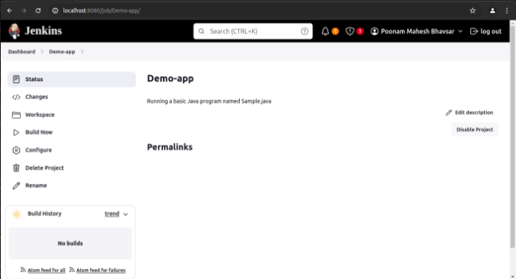

**Jenkins Basic Freestyle project**  

- Jenkins Dashboard

- By clicking on **New Item** we can create a new project and then we can see the following screen

- So here I have created this project named Demo\_app.

Then we can select which type of project it is whether it is Freestyle project or a Pipeline or a Multi- configuration project and so on.

Then we can click on **OK.**

- Then we will need to do configuration of our project.

Add a description for your project.

In source code management, add Git repository path

- We can add which branch do build 

- Build Triggers and schedule the build.

- Add **Build Environment** and **Build Steps**

- We can also add **post build actions** if needed. 

Then **Save.**

Once created a project you can build the project by clicking on **Build Now**

We can see the **Build History** of the project.

The **Build Status** of the project

**Console output**

- **We can also configure the project and build the project again.**

**Changed** the branch to **featured** and **updated** the **build trigger.**

Build history before changing the build trigger

Build history after changing build trigger.

**Console Output**

**Building a pipeline between 2 projects: Dev Compile & Dev Test** First created a **Dev Compile** project with a goal to **compile** the project

Added credentials for pulling a private git repo.

Added the Maven version and goal **compile** and to build steps
