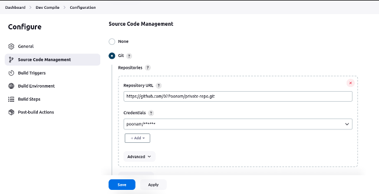
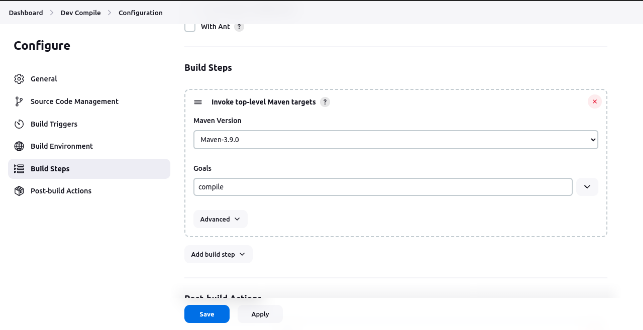
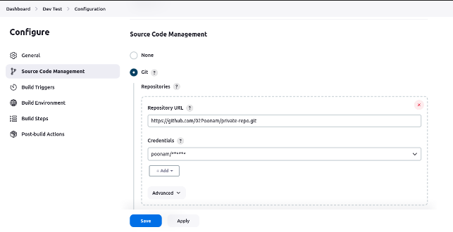
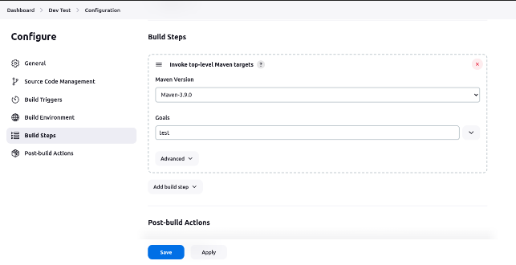
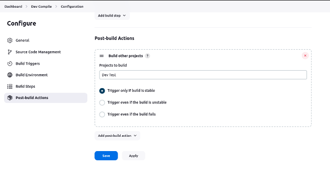
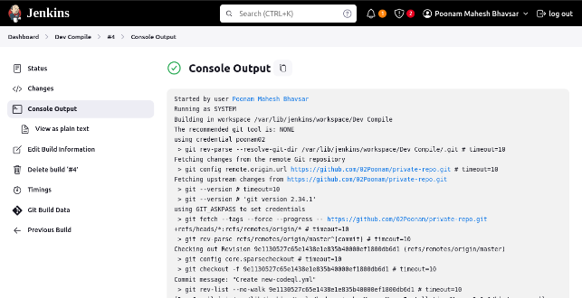
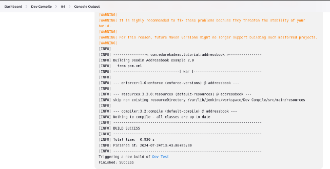
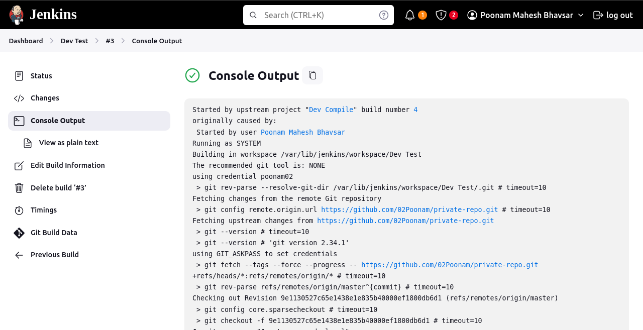
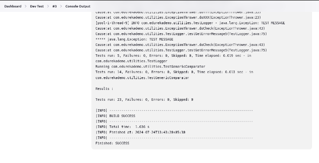

**Building a pipeline between 2 projects: Dev Compile & Dev Test** First created a **Dev Compile** project with a goal to **compile** the project

Added credentials for pulling a private git repo.

Added the Maven version and goal **compile** and to build steps

Then created a **Dev Test** project with a goal to **test** the project

Enter credentials for the same private git repo

Added the Maven version and goal test** and to build steps

Now again configure the **Dev Compile** project and add the **Post Build Actions ->** Select **Build other projects ->** Select **Dev Test**

**Console Output of Dev Compile**

**Console output of Dev Test**

