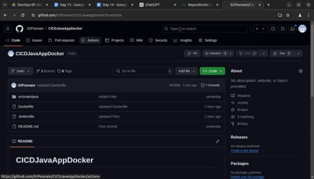
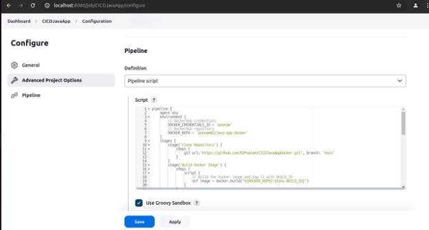
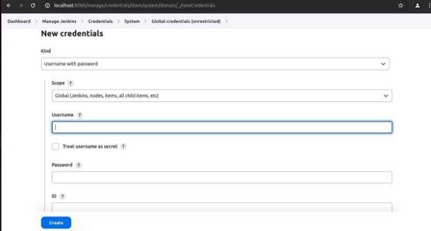
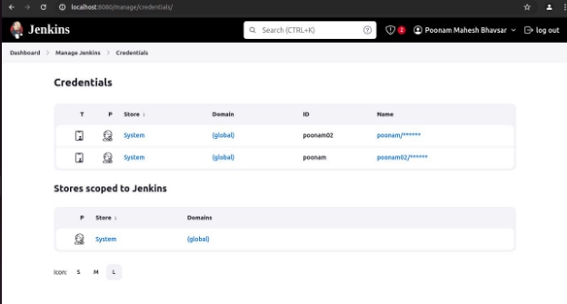
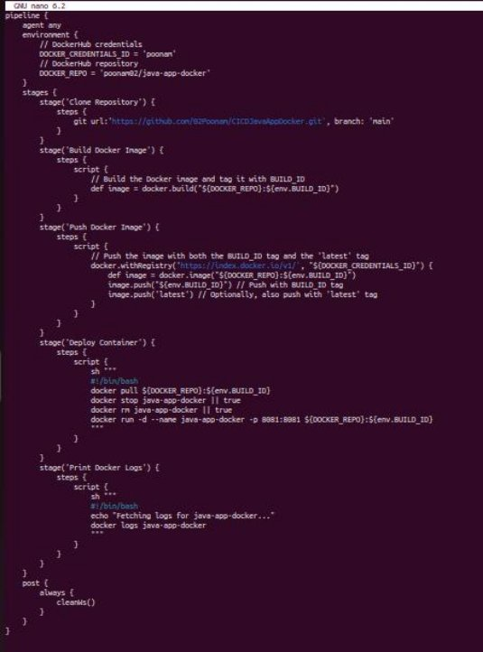
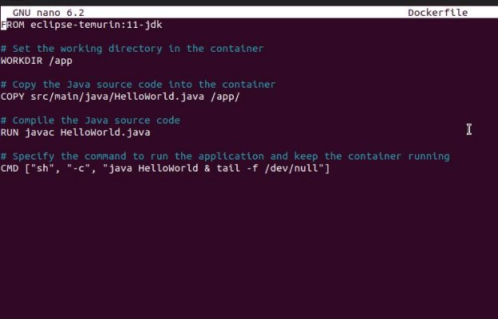
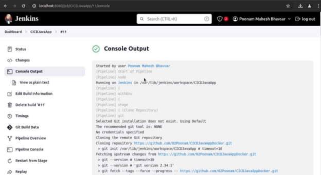
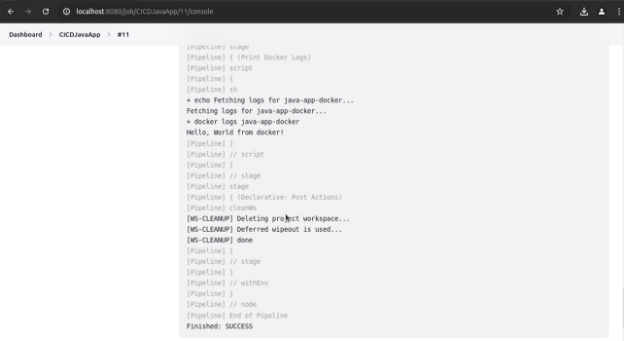

**Project 01**

**Problem Statement:**

You are tasked with setting up a CI/CD pipeline using Jenkins to streamline the deployment process of a simple Java application. The pipeline should accomplish the following tasks:

1. **Fetch the Dockerfile**: The pipeline should clone a GitHub repository containing the source code of the Java application and a Dockerfile. 
1. **Create a Docker Image**: The pipeline should build a Docker image from the fetched Dockerfile. 
1. **Push the Docker Image**: The pipeline should push the created Docker image to a specified DockerHub repository. 
1. **Deploy the Container**: The pipeline should deploy a container using the pushed Docker image. 

**Deliverables:**

5. **GitHub Repository**: A GitHub repository containing: 
   1. The source code of a simple Java application 
   1. A Dockerfile for building the Docker image 
5. **Jenkins Pipeline Script**: A Jenkinsfile (pipeline script) that: 
   1. Clones the GitHub repository. 
   1. Builds the Docker image. 
   1. Pushes the Docker image to DockerHub. 
   1. Deploys a container using the pushed image. 
5. **DockerHub Repository**: A DockerHub repository where the Docker images will be stored. 
5. **Jenkins Setup**: 
   1. Jenkins installed and configured on a local Ubuntu machine. 
   1. Required plugins installed (e.g., Git, Docker, Pipeline). 
5. **Documentation**: Detailed documentation explaining: 
- How to set up the local Jenkins environment. 
- Configuration steps for the pipeline. 
- Instructions for verifying the deployment. 

**Github Repository** 

Create a new Jenkins pipeline and configure it as follows 

Also set up the local Jenkins Environment by adding the required plugins and credentials of Dockerhub 

` `Manage Jenkins > Credentials > System > Global Credentials > Add Credentials

Add your Username, password and id of Dockerhub Then you will be able to see your Credentials as follows. 

**Jenkins Pipeline Script** 

Jenkinsfile (pipeline script) that clones the GitHub repository, builds the Docker image, pushes the Docker image to Dockerhub and deploys the container using the pushed image 

Dockerfile 

**Docker Hub Repository** 

Then build the job in Jenkins. 

Console Output 

