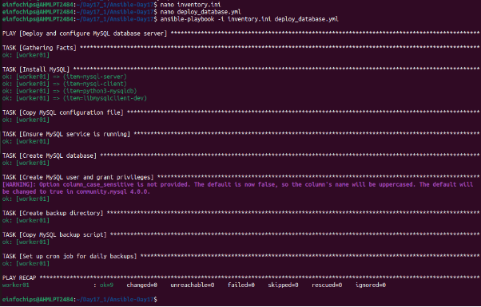

**Project 01**

**Deploy a Database Server with Backup Automation**

**Objective** : Automate the deployment and configuration of a PostgreSQL database server on an Ubuntu instance hosted on AWS, and set up regular backups.

**Problem Statement**

**Objective** : Automate the deployment, configuration, and backup of a PostgreSQL database server on an Ubuntu instance using Ansible.

1. **Ansible Inventory File**
   1. **Filename** : inventory.ini
   1. **Content** : Defines the AWS Ubuntu instance and connection details for Ansible.
1. **Ansible Playbook**
- **Filename** : deploy\_database.yml
- **Content** : Automates the installation of MySQL, sets up the database, creates a user, and configures a cron job for backups. It also includes variables for database configuration and backup settings.

3. **Jinja2 Template**
- **Filename** : templates/mysql.cnf.j2
- **Content** : Defines the MySQL configuration file ( mysql.conf ) using Jinja2 templates to manage access controls dynamically.

4. **Backup Script**
- **Filename** : scripts/backup.sh
- **Content** : A script to perform the backup of the MySQL database. This script should be referenced in the cron job defined in the playbook.

