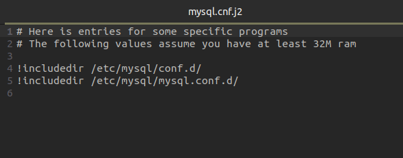
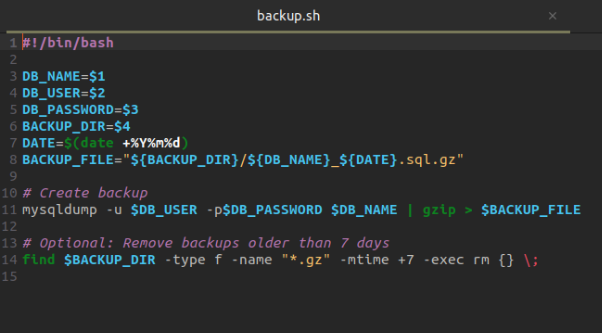

**Project 01**

**Deploy a Database Server with Backup Automation**

**Objective** : Automate the deployment and configuration of a MySQL database server on an Ubuntu instance hosted on AWS, and set up regular backups.

**Problem Statement**

**Objective** : Automate the deployment, configuration, and backup of a MySQL database server on an Ubuntu instance using Ansible.

1. **Ansible Inventory File**
   1. **Filename** : inventory.ini
   1. **Content** : Defines the AWS Ubuntu instance and connection details for Ansible.
1. **Ansible Playbook**
- **Filename** : deploy\_database.yml
- **Content** : Automates the installation of MySQL, sets up the database, creates a user, and configures a cron job for backups. It also includes variables for database configuration and backup settings.

3. **Jinja2 Template**
- **Filename** : templates/mysql.cnf.j2
- **Content** : Defines the MySQL configuration file ( mysql.conf ) using Jinja2 templates to manage access controls dynamically.

4. **Backup Script**
- **Filename** : scripts/backup.sh
- **Content** : A script to perform the backup of the MySQL database. This script should be referenced in the cron job defined in the playbook.

**Project 02**

**Objective** : Automate the setup of a multi-tier web application stack with separate database and application servers using Ansible.

**Problem Statement**

**Objective** : Automate the deployment and configuration of a multi-tier web application stack consisting of:

1. **Database Server** : Set up a MySQL database server on one Ubuntu instance.
1. **Application Server** : Set up a web server (e.g., Apache or Nginx) on another Ubuntu instance to host a web application.
1. **Application Deployment** : Ensure the web application is deployed on the application server and is configured to connect to the MySQL database on the database server.
1. **Configuration Management** : Use Ansible to automate the configuration of both servers, including the initialization of the database and the deployment of the web application.

**Deliverables**

1. **Ansible Inventory File**
- **Filename** : inventory.ini
- **Content** : Defines the database server and application server instances, including their IP addresses and connection details.

2. **Ansible Playbook**
- **Filename** : deploy\_multitier\_stack.yml
- **Content** : Automates:
- The deployment and configuration of the MySQL database server.
- The setup and configuration of the web server.
- The deployment of the web application and its configuration to connect to the database.

3. **Jinja2 Template**
- **Filename** : templates/app\_config.php.j2
- **Content** : Defines a configuration file for the web application that includes placeholders for dynamic values such as database connection details.

Output:

4. **Application Files**
- **Filename** : files/index.html (or equivalent application files)
- **Content** : Static or basic dynamic content served by the web application.

