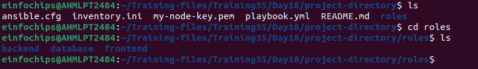
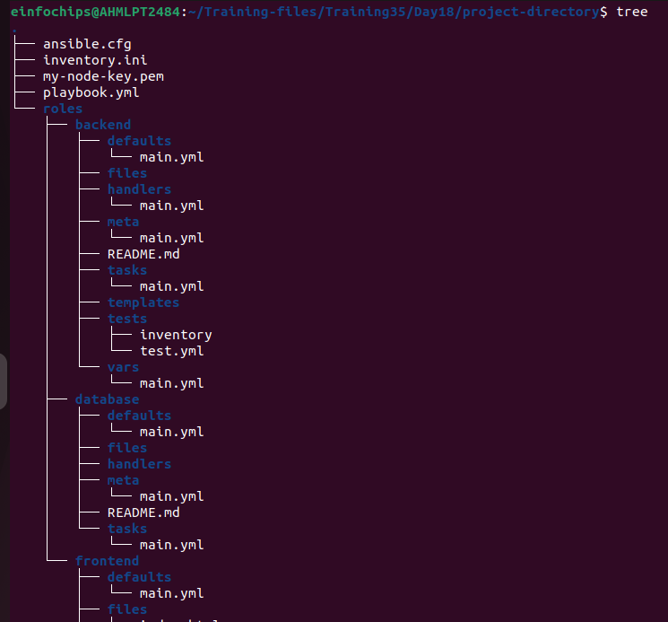
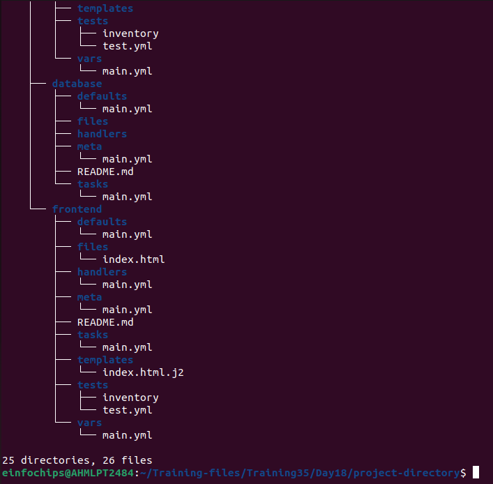
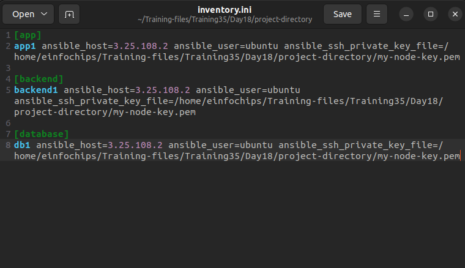
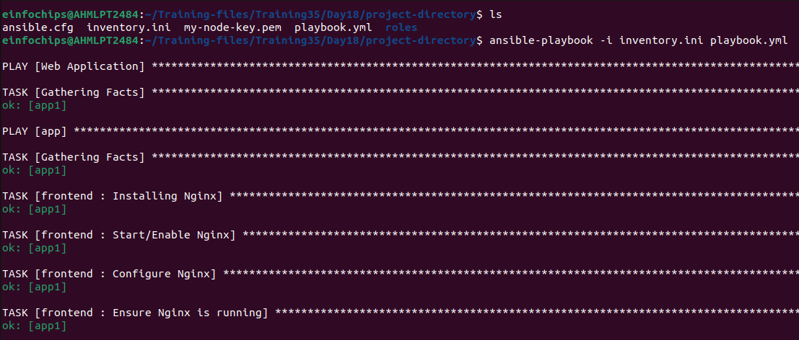
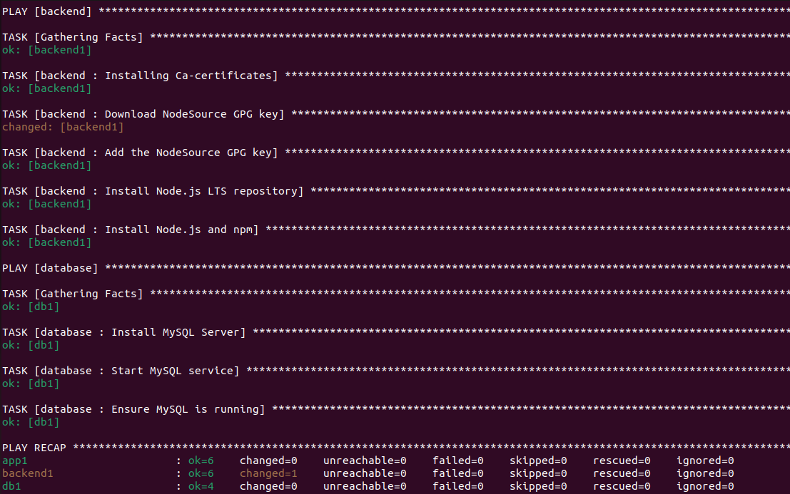

### Problem Statement
You are tasked with deploying a three-tier web application (frontend, backend, and database) using Ansible roles. The frontend is an Nginx web server, the backend is a Node.js application, and the database is a MySQL server. Your solution should use Ansible Galaxy roles where applicable and define appropriate role dependencies. The deployment should be automated to ensure that all components are configured correctly and can communicate with each other.

## Deliverables

**1. Ansible Project Directory Structure**
Organized directory structure with roles, playbooks, inventory, and configuration files.



**2. Role Definitions and Dependencies**
meta/main.yml files for each role defining dependencies.
Customized roles with necessary configurations.




**3. Inventory File**
Inventory file defining groups and hosts for frontend, backend, and database tiers.



```ini
[app]
app-node-01 ansible_host=**.***.***.** ansible_user=ubuntu ansible_ssh_private_key_file=/path/to/ansible.pem file

[backend]
backend-01 ansible_host=**.***.***.** ansible_user=ubuntu ansible_ssh_private_key_file=/path/to/ansible.pem file

[database]
db-01 ansible_host=**.***.***.** ansible_user=ubuntu ansible_ssh_private_key_file=/path/to/ansible.pem file
```

**4. Playbook for Deployment (main.yml)**
Playbook that orchestrates the deployment of the three-tier application.

```yml
---
- name: Full Stack Application
  hosts: app
  become: yes
  
- hosts: app
  become: true
  roles: 
    - frontend

- hosts: backend
  become: true
  roles: 
    - backend

- hosts: database
  become: true
  roles: 
    - database
```

**5. Playbook for Testing (test.yml)**
Playbook that verifies the deployment and functionality of each tier.




