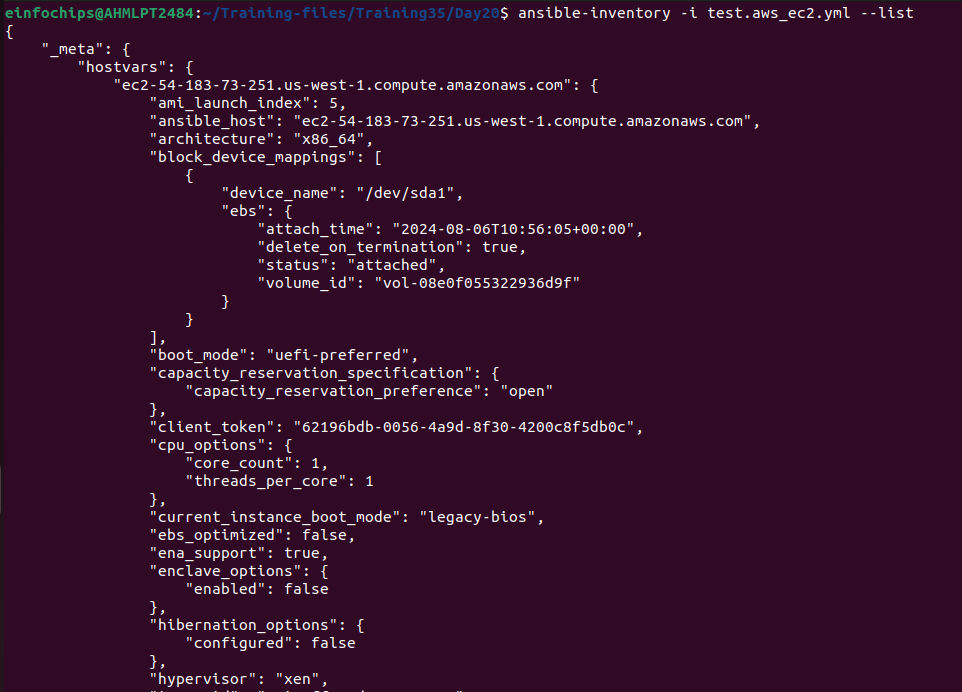
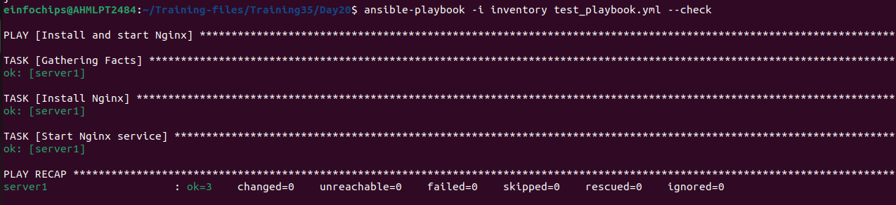
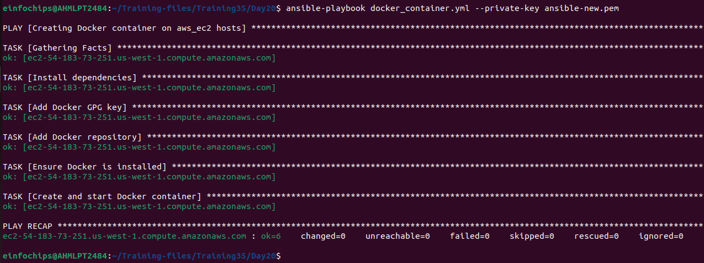

## **Project 01**
1. **Inventory Plugins**

    + Activity: Configure a dynamic inventory plugin to manage a growing number of web servers dynamically. Integrate the plugin with Ansible to automatically detect and configure servers in various environments.
    + Deliverable: Dynamic inventory configuration file or script, demonstrating the ability to automatically update the inventory based on real-time server data.


Create a test.aws_ec2.yml

```yaml
plugin: aws_ec2
regions:
  - us-west-1
filters:
  instance-state-name:
    - running
  tag:Name:
    - Poonam
hostnames:
  - dns-name
compose:
  ansible_host: public_dns_name
  ansible_user: 'ubuntu'
```


2. **Performance Tuning**

    + Activity: Tune Ansible performance by adjusting settings such as parallel execution (forks), optimizing playbook tasks, and reducing playbook run time.
    + Deliverable: Optimized ansible.cfg configuration file, performance benchmarks, and documentation detailing changes made for performance improvement.

ansible.cfg
```bash
[defaults]
remote_user = ubuntu
forks = 50
inventory = ./test.aws_ec2.yml

[ssh_connection]
ssh_args = -o ControlMaster=auto -o ControlPersist=60s
pipelining = True
```

3. **Debugging and Troubleshooting Playbooks**

    + Activity: Implement debugging strategies to identify and resolve issues in playbooks, including setting up verbose output and advanced error handling.
    + Deliverable: Debugged playbooks with enhanced error handling and logging, including a troubleshooting guide with common issues and solutions.
Create a simple test playbook

test_playbook.yml
```yaml
---
- name: Install and start Nginx
  hosts: all
  become: yes
  tasks:
  - name: Install Nginx
    apt:
      name: nginx
      state: present

  - name: Start Nginx service
    service:
      name: nginx
      state: started
      enabled: yes
```
Then run the following command

To check the Verbose mode:
```
ansible-playbook -i inventory test_playbook.yml -v
```
Increase the verbosity of playbook runs to get more detailed output.
Use the -v, -vv, -vvv, or -vvvv flags


Check Mode (--check):
```bash
ansible-playbook -i inventory test_playbook.yml --check
```


4. **Exploring Advanced Modules**

    + Activity: Use advanced Ansible modules such as docker_container to manage containerized applications and aws_ec2 for AWS infrastructure management, demonstrating their integration and usage.
    + Deliverable: Playbooks showcasing the deployment and management of Docker containers and AWS EC2 instances, along with documentation on the benefits and configurations of these advanced modules.


Create a docker_container.yml file as given
```yaml
- name: Creating Docker container on aws_ec2 hosts 
  hosts: aws_ec2
  become: yes
  tasks:
    - name: Install dependencies
      apt:
        name: 
          - apt-transport-https
          - ca-certificates
          - curl
          - software-properties-common
        state: present
        update_cache: yes

    - name: Add Docker GPG key
      apt_key:
        url: https://download.docker.com/linux/ubuntu/gpg
        state: present

    - name: Add Docker repository
      apt_repository:
        repo: deb https://download.docker.com/linux/ubuntu focal stable
        state: present
        
    - name: Ensure Docker is installed
      apt:
        name: docker-ce
        state: present

    - name: Create and start Docker container
      community.docker.docker_container:
        name: my_nginx
        image: nginx:latest
        state: started
        ports:
        - "8080:80"
```
Run:
```
ansible-playbook -i inventory docker_container.yml --private-key ~/.ssh/<filename.pem>
```


