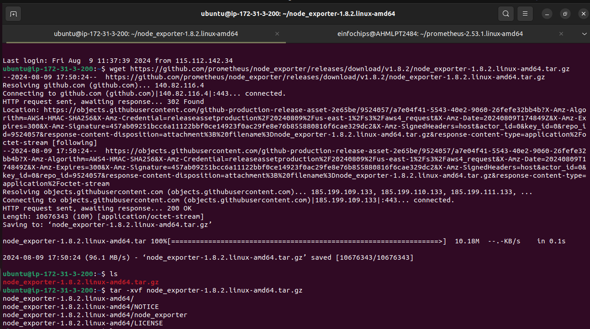

## **Project Overview:**
The goal of this capstone project is to combine shell scripting with system monitoring and log management practices. Create a set of automated tools using shell scripts to manage logs, monitor system performance using Prometheus and Node Exporter, and generate insights using PromQL queries. The project will require a systematic approach, covering scripting fundamentals, log management, and monitoring setup.

---
1. **Shell Scripts for Basic Operations:**

    + Task: Write shell scripts to perform basic system operations, such as checking disk usage, memory usage, and CPU load.
    + Deliverable:
        + A collection of scripts that output system performance metrics.
        + Scripts should include error handling and logging

#### Disk Usage Script (`disk-usage.sh`)


```bash
#!/bin/bash

# Define log file
LOG_FILE="/var/log/disk-usage.log"

# Timestamp
echo "Disk Usage Check - $(date)" >> $LOG_FILE

# Check disk usage
df -h >> $LOG_FILE 2>&1

# Check for errors
if [ $? -ne 0 ]; then
    echo "Error: Failed to retrieve disk usage" >> $LOG_FILE
fi

echo "-----------------------------" >> $LOG_FILE
```

#### Memory Usage Script (`memory-usage.sh`)


```bash
#!/bin/bash

# Define log file
LOG_FILE="/var/log/memory-usage.log"

# Timestamp
echo "Memory Usage Check - $(date)" >> $LOG_FILE

# Check memory usage
free -h >> $LOG_FILE 2>&1

# Check for errors
if [ $? -ne 0 ]; then
    echo "Error: Failed to retrieve memory usage" >> $LOG_FILE
fi

echo "-----------------------------" >> $LOG_FILE
```

#### CPU Load Script (`cpu-load.sh`)


```bash
#!/bin/bash

# Define log file
LOG_FILE="/var/log/cpu-load.log"

# Timestamp
echo "CPU Load Check - $(date)" >> $LOG_FILE

# Check CPU load
uptime >> $LOG_FILE 2>&1

# Check for errors
if [ $? -ne 0 ]; then
    echo "Error: Failed to retrieve CPU load" >> $LOG_FILE
fi

echo "-----------------------------" >> $LOG_FILE
```

To make these scripts executable, you need to set the correct permissions:

```bash
chmod +x disk-usage.sh memory-usage.sh cpu-load.sh
```

#### Automate `cron` Job

To run the disk usage script every hour, edit your cron jobs with:

```bash
crontab -e
```

Add the following line:

```bash
0 * * * * /path/to/disk-usage.sh
```


---
2. **Log Management Script:**
    + Task: Develop a script to automate log management tasks such as log rotation and archiving. This script should include the ability to compress old logs and delete logs older than a specified number of days.
    + Deliverable:
        + A shell script that performs log rotation based on predefined conditions (e.g., log size, log age).
        + A report generated by the script detailing which logs were rotated, compressed, or deleted.

#### (`log-management.sh`)

```bash
#!/bin/bash

# Configuration
LOG_DIR="/var/log/myapp"                # Directory where logs are stored
MAX_LOG_SIZE=1000000                   # Maximum log size in bytes (e.g., 1MB)
RETENTION_DAYS=30                     # Number of days to retain old logs
REPORT_FILE="/var/log/log_management_report.log"  # Report file location

# Create or clear the report file
echo "Log Management Report - $(date)" > $REPORT_FILE

# Function to rotate logs
rotate_logs() {
    echo "Checking log files in $LOG_DIR" >> $REPORT_FILE
    for log_file in $LOG_DIR/*.log; do
        if [ -f "$log_file" ]; then
            log_size=$(stat -c%s "$log_file")
            if [ $log_size -ge $MAX_LOG_SIZE ]; then
                echo "Rotating $log_file" >> $REPORT_FILE
                mv "$log_file" "$log_file.old"
                gzip "$log_file.old"
                echo "$log_file rotated and compressed" >> $REPORT_FILE
            fi
        fi
    done
}

# Function to delete old logs
delete_old_logs() {
    echo "Deleting logs older than $RETENTION_DAYS days" >> $REPORT_FILE
    find $LOG_DIR -name "*.log.gz" -type f -mtime +$RETENTION_DAYS -exec rm {} \; -exec echo "{} deleted" >> $REPORT_FILE \;
}

# Run the log rotation and deletion
rotate_logs
delete_old_logs

echo "Log management completed on $(date)" >> $REPORT_FILE
```

1. **Make the script executable**:

   ```bash
   chmod +x /path/to/log_management.sh
   ```

2. **Run the script manually**:

   ```bash
   /path/to/log_management.sh
   ```

3. **Automate with `cron`**:

   To run the script automatically (e.g., daily), edit your crontab:

   ```bash
   crontab -e
   ```

   Add the following line to schedule the script to run daily at midnight:

   ```bash
   0 0 * * * /path/to/log-management.sh
   ```


---
3. **Advanced Shell Scripting - Loops, Conditions, Functions, and Error Handling:**
    + Task: Refactor the previous scripts to include loops, conditionals, and functions for modularity. Implement error handling to manage potential issues during script execution.
    + Deliverable:
        + Modular shell scripts that use functions for repeatable tasks.
        + Error-handling mechanisms in place for scenarios like missing files, insufficient permissions, etc.
        + Logs that track script execution and any errors encountered.

#### Script (`refactored-system-monitoring.sh`)

```bash
#!/bin/bash

# Configuration
LOG_DIR="/var/log/myapp"
LOG_FILE="/var/log/refactored-system-monitoring.log"
MAX_LOG_SIZE=1000000
RETENTION_DAYS=30

# Create or clear the report file
echo "System Monitoring Report - $(date)" > $LOG_FILE

# Function to check disk usage
check_disk_usage() {
    echo "Disk Usage Check - $(date)" >> $LOG_FILE
    if ! df -h >> $LOG_FILE 2>&1; then
        echo "Error: Failed to retrieve disk usage" >> $LOG_FILE
    fi
    echo "-----------------------------" >> $LOG_FILE
}

# Function to check memory usage
check_memory_usage() {
    echo "Memory Usage Check - $(date)" >> $LOG_FILE
    if ! free -h >> $LOG_FILE 2>&1; then
        echo "Error: Failed to retrieve memory usage" >> $LOG_FILE
    fi
    echo "-----------------------------" >> $LOG_FILE
}

# Function to check CPU load
check_cpu_load() {
    echo "CPU Load Check - $(date)" >> $LOG_FILE
    if ! uptime >> $LOG_FILE 2>&1; then
        echo "Error: Failed to retrieve CPU load" >> $LOG_FILE
    fi
    echo "-----------------------------" >> $LOG_FILE
}

# Function to rotate logs
rotate_logs() {
    echo "Checking log files in $LOG_DIR" >> $LOG_FILE
    for log_file in "$LOG_DIR"/*.log; do
        if [ -f "$log_file" ]; then
            log_size=$(stat -c%s "$log_file")
            if [ $log_size -ge $MAX_LOG_SIZE ]; then
                echo "Rotating $log_file" >> $LOG_FILE
                if ! mv "$log_file" "$log_file.old"; then
                    echo "Error: Failed to rotate $log_file" >> $LOG_FILE
                    continue
                fi
                if ! gzip "$log_file.old"; then
                    echo "Error: Failed to compress $log_file.old" >> $LOG_FILE
                    continue
                fi
                echo "$log_file rotated and compressed" >> $LOG_FILE
            fi
        else
            echo "Warning: Log file $log_file does not exist" >> $LOG_FILE
        fi
    done
}

# Function to delete old logs
delete_old_logs() {
    echo "Deleting logs older than $RETENTION_DAYS days" >> $LOG_FILE
    find "$LOG_DIR" -name "*.log.gz" -type f -mtime +$RETENTION_DAYS -exec rm {} \; -exec echo "{} deleted" >> $LOG_FILE \;
}

# Main script execution
{
    check_disk_usage
    check_memory_usage
    check_cpu_load
    rotate_logs
    delete_old_logs
    echo "System monitoring and log management completed on $(date)" >> $LOG_FILE
} || {
    echo "Error: System monitoring script failed" >> $LOG_FILE
}
```

1. **Make the script executable**:

   ```bash
   chmod +x /path/to/refactored-system-monitoring.sh
   ```

2. **Run the script manually**:

   ```bash
   /path/to/refactored-system-monitoring.sh
   ```

3. **Automate with `cron`**:

   To schedule the script to run daily, add a cron job:

   ```bash
   crontab -e
   ```

   Add the following line to run the script at midnight:

   ```bash
   0 0 * * * /path/to/system_monitoring.sh
   ```


---
4. **Log Checking and Troubleshooting:**
    + Task: Write a script that reads through system and application logs, identifies common issues (e.g., out of memory, failed service starts), and provides troubleshooting steps based on log analysis.
    + Deliverable:
        + A script that parses logs for errors or warnings and outputs possible root causes.
        + Documentation on the types of logs checked and the issues identified.
        + A troubleshooting guide based on common errors found in the logs.

### (`logchecker.sh`)

```bash
#!/bin/bash

# log_checker.sh
LOGFILE="/var/log/syslog"
ERROR_LOG="/var/log/error_analysis.log"

grep -i "error" $LOGFILE | while read -r line; do
    echo "Found Error: $line" >> $ERROR_LOG
    # Simple pattern matching for troubleshooting
    if echo "$line" | grep -q "out of memory"; then
        echo "Troubleshooting: Check memory usage and consider increasing swap space." >> $ERROR_LOG
    fi
done
```

1. **Make the script executable**:

   ```bash
   chmod +x /path/to/logchecker.sh
   ```

2. **Run the script manually**:

   ```bash
   /path/to/logchecker.sh
   ```


---
5. **Installation and Setup of Prometheus and Node Exporter:**
    + Task: Install and configure Prometheus and Node Exporter on the system. Ensure that Node Exporter is properly configured to collect system metrics.
    + Deliverable:
        + A documented installation and configuration process for Prometheus and Node Exporter.
        + A running instance of Prometheus scraping metrics from Node Exporter.


#### Steps to install Prometheus:

Download Prometheus from the following link:
https://prometheus.io/download/

Download the zip file from:
```
wget https://github.com/prometheus/prometheus/releases/download/v2.53.1/prometheus-2.53.1.linux-amd64.tar.gz
```

Unzip the tar file
```
tar -xvf prometheus-2.53.1.linux-amd64.tar.gz
```
Go to the directory
```
cd prometheus-2.53.1.linux-amd64/
```
Run Prometheus
```
./prometheus 
```


#### Steps to install Node Exporter:
Download the zip file from:

```
wget https://github.com/prometheus/node_exporter/releases/download/v1.8.2/node_exporter-1.8.2.linux-amd64.tar.gz
```
Unzip the tar file
```
tar -xvf node_exporter-1.8.2.linux-amd64.tar.gz
```
Go to the directory
```
cd node_exporter-1.8.2.linux-amd64/
```
Run the file
```
./node_exporter
```




---
6. **Prometheus Query Language (PromQL) Basic Queries:**
    + Task: Create a series of PromQL queries to monitor system performance, such as CPU usage, memory usage, and disk I/O.
    + Deliverable:
        + A set of PromQL queries that can be used to monitor key system metrics.
        + A dashboard setup guide or configuration that visualizes these metrics in Prometheus or Grafana.


Open Prometheus Web UI: Open your web browser and navigate to the Prometheus web interface. The default URL is http://localhost:9090.

Navigate to the "Graph" Tab to view the graph.
### **Queries**:

**CPU Usage**: 
```
rate(node_cpu_seconds_total{mode="user"}[5m])
```
Output:


 **Memory Usage**: 
```    
node_memory_MemAvailable_bytes / node_memory_MemTotal_bytes
```


**Disk I/O**: 
```
rate(node_disk_io_time_seconds_total[5m])
```


