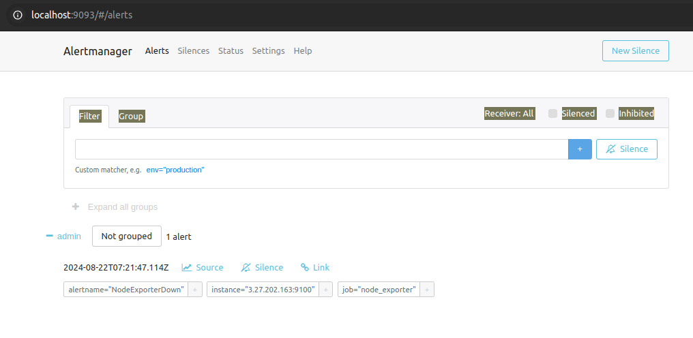

# Project Breakdown

## 1. Configuring Jobs and Targets

+ Task: Set up a Prometheus server to monitor multiple services running on different nodes.
+ Deliverables:

  + Configure Prometheus with jobs for monitoring different services like web servers, databases, and system metrics.

  + Define static and dynamic targets using file-based and service discovery methods (e.g., Consul or Kubernetes).

### Install and Run Prometheus:

```sh
wget https://github.com/prometheus/prometheus/releases/download/v2.53.1/prometheus-2.53.1.linux-amd64.tar.gz

```

```sh
tar -xvf prometheus-2.53.1.linux-amd64.tar.gz
```

```sh
cd prometheus-2.53.1.linux-amd64/
```

```sh
./prometheus 
```


## 2. Using Exporters (Node Exporter)

+ Task: Use Node Exporter to monitor system-level metrics like CPU, memory, disk usage, and network statistics.

+ Deliverables:
  + Install and configure Node Exporter on all nodes.
  
  + Ensure Node Exporter metrics are being correctly scraped by Prometheus.

### Installation of Node-Exporter :

+ Download the zip:

```sh
wget https://github.com/prometheus/node_exporter/releases/download/v1.8.2/node_exporter-1.8.2.linux-amd64.tar.gz
```

+ Unzip the file:

```sh
tar -xvf node_exporter-1.8.2.linux-amd64.tar.gz
```

+ Update the prometheus.yml file:

```yml
global:
  scrape_interval: 10s

scrape_configs:
  - job_name: 'node'
    static_configs:
      - targets: ['localhost:9100']
```


+ Change the directory:

```sh
cd node_exporter-1.8.2.linux-amd64/
```

+ Run the node-exporter

```sh
./node_exporter 
```

### Installation of Mysqld_exporter

+ To install mysqld_exporter on the node:

```sh
wget https://github.com/prometheus/mysqld_exporter/releases/download/v0.15.1/mysqld_exporter-0.15.1.linux-amd64.tar.gz

```

+ Unzip:

```sh
tar xvfz mysqld_exporter-0.15.1.linux-amd64.tar.gz
```


+ Move the binary to /usr/local/bin:

```sh
sudo mv mysqld_exporter-0.14.0.linux-amd64/mysqld_exporter /usr/local/bin/
```

+ Create a systemd service file for MySQL Exporter:

```sh
sudo nano /etc/systemd/system/mysqld_exporter.service
```

Add the following content to the file:

```conf
[Unit]
Description=MySQL Exporter
After=network.target

[Service]
User=mysql_exporter
Group=mysql_exporter
ExecStart=/usr/local/bin/mysqld_exporter --config.my-cnf /etc/mysql_exporter/my.cnf

[Install]
WantedBy=multi-user.target
```

## 3. Hands-on Exercise: Setting Up Exporters

+ Task: Configure at least two different types of exporters (e.g., Node Exporter and MySQL Exporter) and integrate them with Prometheus.

+ Deliverables:
  + Demonstrate successful data collection from both exporters.
  + Create a basic Prometheus dashboard to visualize key metrics from these exporters.

### Install mysql on the worker node:

```sh
sudo apt update
sudo apt install mysql-server
```

+ Create username and password

```sh
sudo mysql_secure_installation
```

+ Log in to the MySQL server as the root user:

```sh
sudo mysql -u root -p
```

+ Enter the root password you set earlier. Create a New User for the Exporter.

```sql
CREATE USER 'exporter_user'@'localhost' IDENTIFIED BY 'exporter_password';
```

+ Replace 'exporter_user' with your desired username and 'exporter_password' with a strong password 

Grant Permissions:

```sql
GRANT SELECT ON *.* TO 'exporter_user'@'localhost';
```

```sql
FLUSH PRIVILEGES;
```

+ Exit MySQL command-line interface


+ Create Configuration File that contains the MySQL user credentials

```sh
sudo mkdir /etc/mysql_exporter
sudo nano /etc/mysql_exporter/my.cnf
```

```sh 
[client]
user=<username>
password=exporter_password
```

+ Ensure that the configuration file has the correct permissions:

```sh
sudo chown root:root /etc/mysql_exporter/my.cnf
sudo chmod 600 /etc/mysql_exporter/my.cnf
```

+ Reload systemd to recognize the new service, then start and enable it:

```sh
sudo systemctl daemon-reload
sudo systemctl start mysqld_exporter
sudo systemctl enable mysqld_exporter
```

+ Verify the mysql exporter is running

```sh 
/usr/local/bin/mysqld_exporter --config.my-cnf /etc/mysql_exporter/my.cnf
```

+ Update prometheus.yml file:

```yml
    static_configs:
      - targets: ["localhost:9090"]
  - job_name: 'node_exporter'
    static_configs:
      - targets: ['<ip>:9100']
  - job_name: 'mysql_exporter'
      - targets: ['<ip>:9104']
```

+ Access Prometheus web UI at http://localhost:9090


## 4. Introduction to PromQL

+ Task: Learn and implement basic PromQL queries to extract meaningful data from the metrics collected.
+ Deliverables:
  + Write basic queries to retrieve metrics like average CPU usage, memory consumption, and disk I/O over time.


**Run basic queries:** 

1. Average CPU usage:

```sh
avg(rate(node_cpu_seconds_total[5m])) by (instance)
```


2. Memory consumption:

```sh
node_memory_MemAvailable_bytes / node_memory_MemTotal_bytes
```


3. Disk I/O:

```sh
rate(node_disk_io_time_seconds_total[5m])
```


## 5. Basic Queries (Selectors, Functions, Operators)

+ Task: Create PromQL queries using selectors, functions, and operators to filter and manipulate time-series data.
+ Deliverables:
  + Write PromQL queries to calculate the 95th percentile of CPU usage.
  + Use functions like rate(), increase(), and histogram_quantile() to perform more complex analysis.

**Using Selectors to filter data:**

```sh
node_cpu_seconds_total{mode="idle"}
```


**Applying functions:**

```sh
rate(node_cpu_seconds_total[1m])
```


**Increase in disk space:**

```sh
increase(node_filesystem_size_bytes[1h])
```


**Applying Operators:**

Calculate 95th percentile

```sh
histogram_quantile(0.95, rate(http_request_duration_seconds_bucket[5m]))
```


## 6. Advanced Queries and Aggregations

+ Task: Perform advanced data aggregation using PromQL.
+ Deliverables:
  + Write queries to calculate the total memory usage across all nodes.
  + Aggregate data to find the maximum disk space usage among all nodes.

**Total memory usage:**

```sh 
sum(node_memory_MemTotal_bytes - node_memory_MemAvailable_bytes)
```


**Maximum disk space usage:**

```
max(node_filesystem_size_bytes - node_filesystem_free_bytes)
```


## 7. Configuring Alertmanager

+ Task: Set up Alertmanager to handle alerts generated by Prometheus.
+ Deliverables:
  + Configure Alertmanager with Prometheus.
  + Create routing rules to manage alert notifications based on severity and service type.

### Install Alertmanager through the website 

https://prometheus.io/download/

```sh
wget https://github.com/prometheus/alertmanager/releases/download/v0.27.0/alertmanager-0.27.0.linux-amd64.tar.gz
```

```sh
tar -xvf alertmanager-0.27.0.linux-amd64.tar.gz
```

+ Add AlertManager in prometheus.yml file:

```yml
    alertmanagers:
      - static_configs:
          - targets:
              - alertmanager:9093
```

## 8. Writing Alerting Rules

+ Task: Write custom alerting rules in Prometheus to trigger alerts based on specific conditions.
+ Deliverables:
  + Create alerting rules for high CPU usage, memory leaks, and disk space running low.
  + Ensure alerts are correctly generated and sent to Alertmanager.

**Alerting Rules:** 

```rules/rules.yml:```

```yml
---
groups:
- name: NodeAlert
  rules:
    - alert: NodeExporterDown
      expr: up{job="node_exporter"}==0

- name: CPUAlert
  rules:
    - alert: HighCpuUsage
      expr: sum(rate(node_cpu_seconds_total{mode!="idle"}[5m])) by (instance) > 0.9
      for: 5m
      labels:
        severity: critical
      annotations:
        summary: "High CPU usage detected on {{ $labels.instance }}"
        description: "CPU usage is above 90% for more than 5 minutes."

- name: DiskSpaceAlert
  rules:
    - alert: DiskSpaceLow
      expr: 1 - (node_filesystem_free_bytes / node_filesystem_size_bytes) > 0.8
      for: 10m
      labels:
        severity: critical
      annotations:
        summary: "Low disk space on {{ $labels.instance }}"
        description: "Disk usage is above 80% for more than 10 minutes."
```

+ Add rules file in prometheus.yml file:

```yml
rule_files:
  - "rules/rules.yml"
```

+ Go to the alert manager directory and run alert manager:

```sh
cd alertmanager-0.27.0.linux-amd64/
```

```sh
./alertmanager
```

+ Access the alert manager on http://localhost:9093/#/alerts



+ Check for Rules in Prometheus:


## 9. Setting Up Notification Channels (Email, Slack, etc.)

+ Task: Integrate Alertmanager with multiple notification channels like Email and Slack.
+ Deliverables:
  + Set up Email notifications for critical alerts.
  + Integrate Slack for real-time alerts and notifications.
  
```alertmanager.yml```

```yml
route:
  receiver: 'admin'
  routes:
    - match:
        severity: 'critical'
      receiver: 'critical_alerts'
      continue: true

    - receiver: 'admin'

receivers:
  - name: 'critical_alerts'
    email_configs:
      - to: 'poonamb.022002@gmail.com'
        from: 'poonamb.022002@gmail.com'
        smarthost: 'smtp.gmail.com:587'
        auth_username: 'poonamb.022002@gmail.com'
        auth_identity: 'poonamb.022002@gmail.com'
        auth_password: '<password>'

  - name: 'admin'
    slack_configs:
      - api_url: '<slack-webhook-url>'
        channel: '#prometheus'
```

## 10. Hands-on Exercise: Creating Alerts

+ Task: Test the entire alerting pipeline by creating and triggering custom alerts.

