### Project Scenario:
You are tasked with creating and managing an S3 bucket for a fictional company, "TechVista Inc.," that hosts a static website for displaying their product portfolio. The website will have different types of content, including high-resolution images, which require careful storage management to optimize costs. Additionally, the company has strict security requirements for accessing the content.


#### 1. Create and Configure an S3 Bucket

**Bucket Creation:**
- **Bucket Name:** techvista-portfolio-poonam

**Steps:**
1. **Create the Bucket:**
   - Navigate to the S3 Management Console.
   - Click on "Create bucket."
   - Enter the bucket name
   - Click "Create"
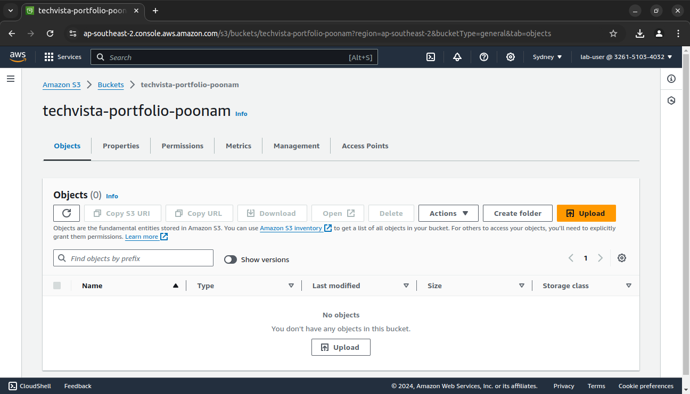

2. **Enable Versioning:**
   - Go to the bucket properties.
   - Select "Versioning" and enable it

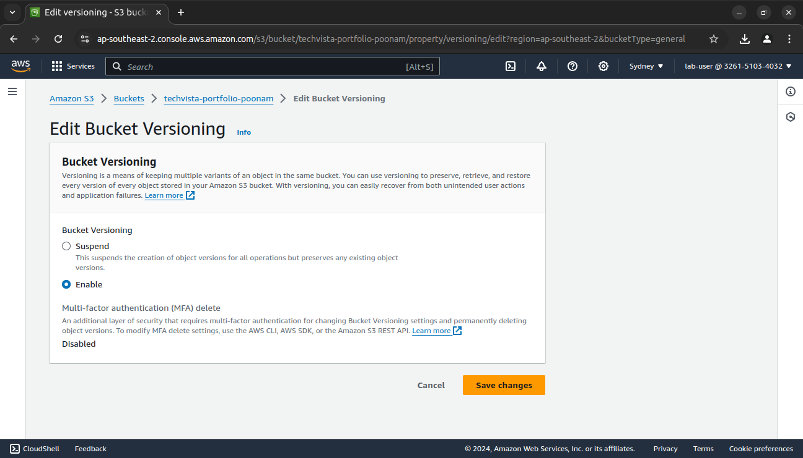

3. **Set Up for Static Website Hosting:**
   - Go to the "Properties" tab.
   - Select "Static website hosting."
   - Enable it and configure the index document (e.g., `index.html`) and optionally an error document.

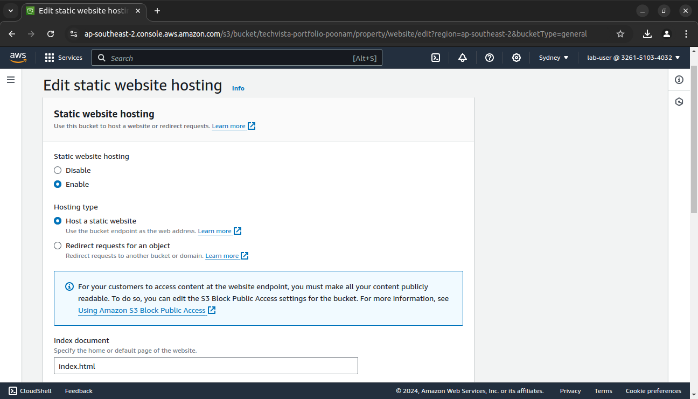

4. **Upload Static Website Files:**
   - Go to the "Objects" tab.
   - Click "Upload" and upload the HTML, CSS, and image files provided.

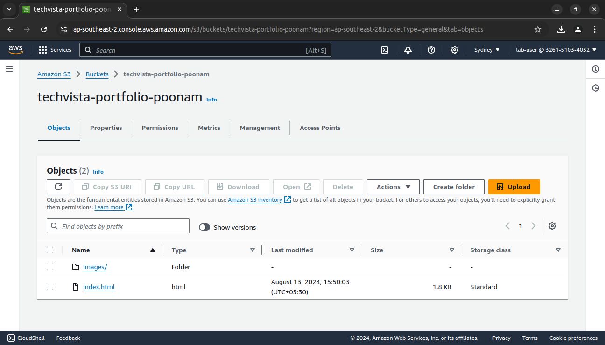

Uploaded image in /images folder

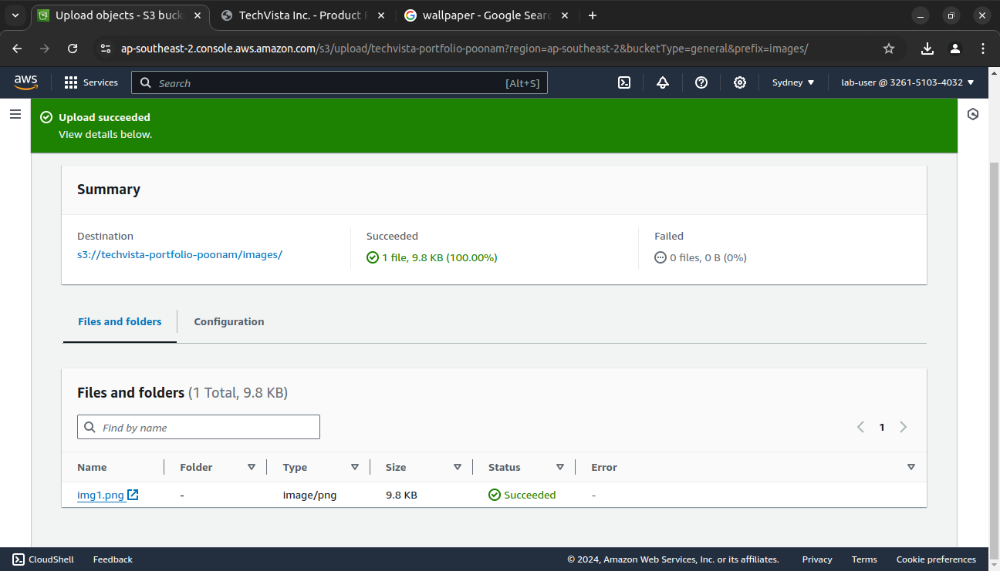

5. **Test Accessibility:**
   - Visit the S3 website endpoint URL to ensure the static website is accessible

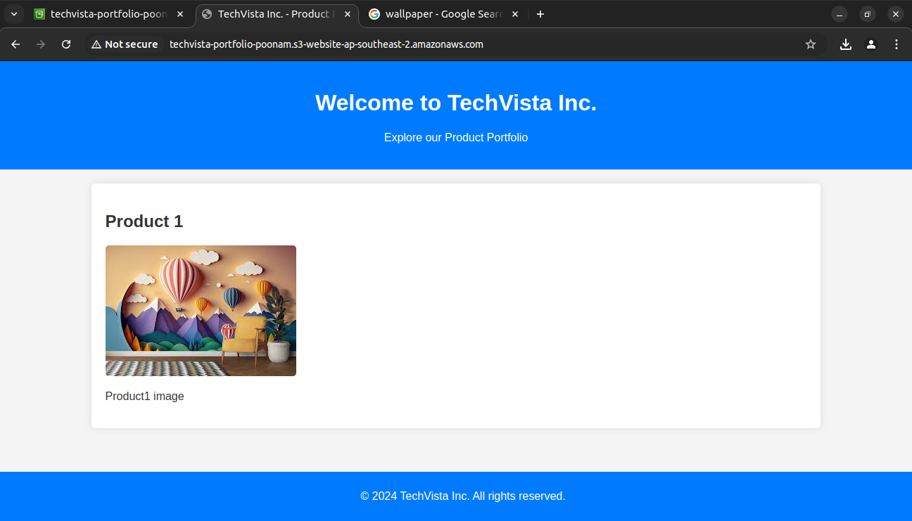

---
#### 2. Implement S3 Storage Classes

**Storage Class Classification:**
- **HTML Files:** Store in S3 Standard as these files are accessed frequently.

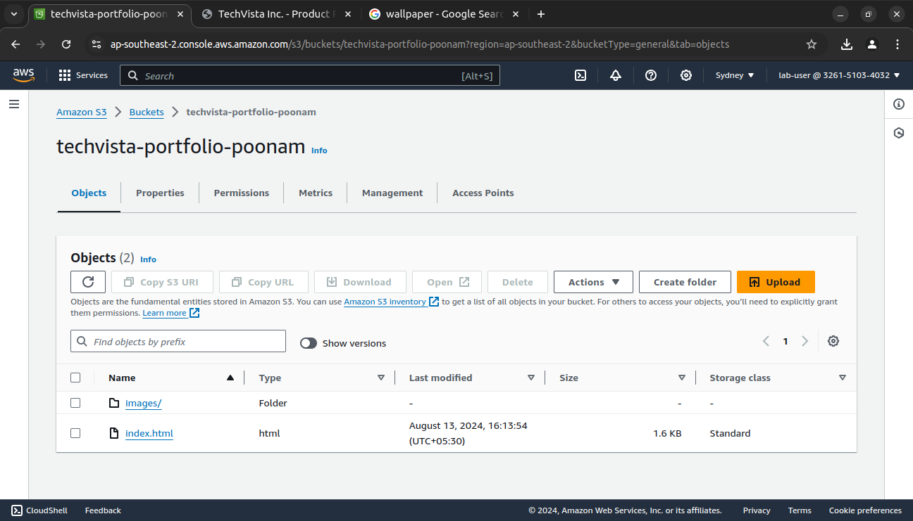

- **Images:** Use S3 Intelligent-Tiering to automatically move data between two access tiers when access patterns change.

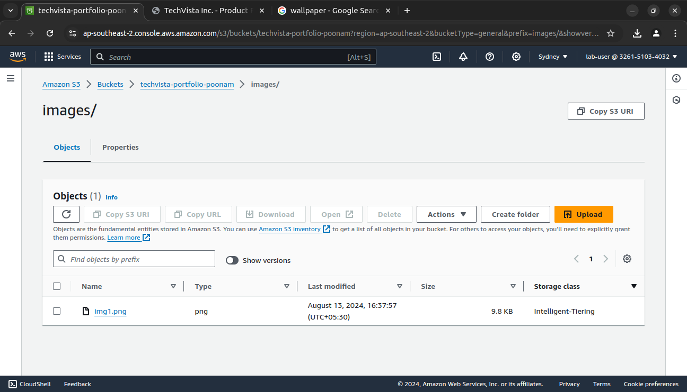

---
#### 3. Lifecycle Management

**Lifecycle Policy Creation:**
1. **Transition Policy:**
   - Navigate to the "Management" tab.

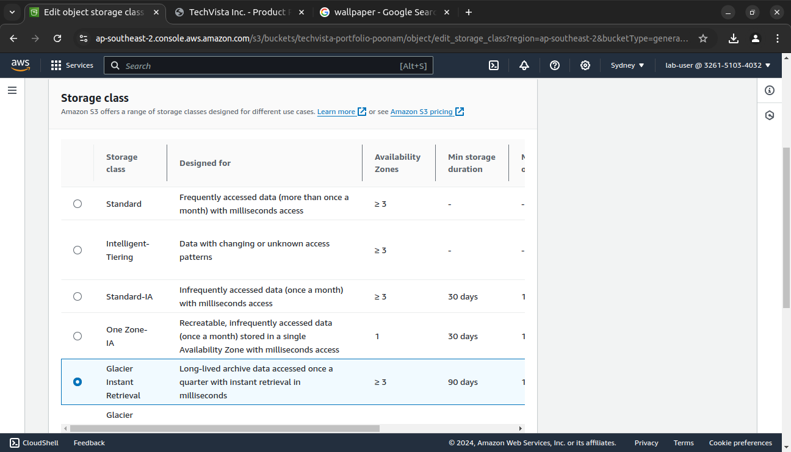

2. **Expiration Policy:**
   - Add a policy to delete non-current versions of objects after 90 days.

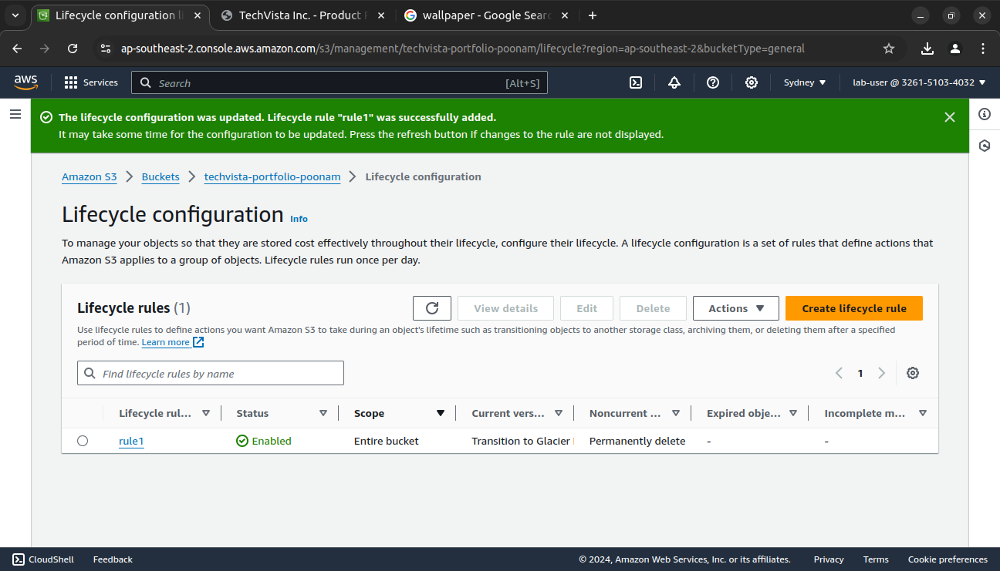

**Verification:**
- Check the "Management" tab to ensure lifecycle policies are listed and applied.
- Monitor the bucket to confirm that old versions transition and expire as per the policy.

---
#### 4. Configure Bucket Policies and ACLs

**Bucket Policy:**
1. **Public Read Access:**
   - Go to the "Permissions" tab.
   - Click on "Bucket Policy" and add the following JSON policy.
     ```json
     {
       "Version": "2012-10-17",
       "Statement": [
         {
           "Effect": "Allow",
           "Principal": "*",
           "Action": "s3:GetObject",
           "Resource": "arn:aws:s3:::techvista-portfolio-poonam/*"
         }
       ]
     }
     ```
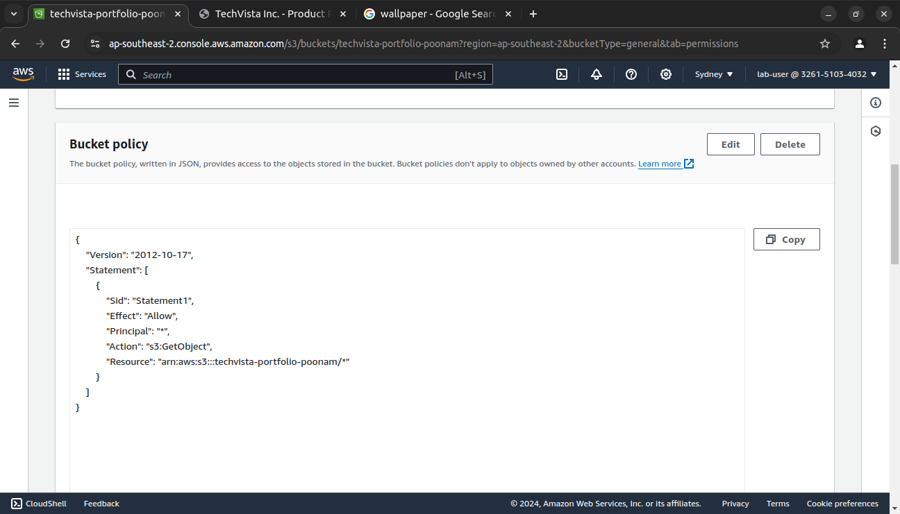

**ACL Configuration:**

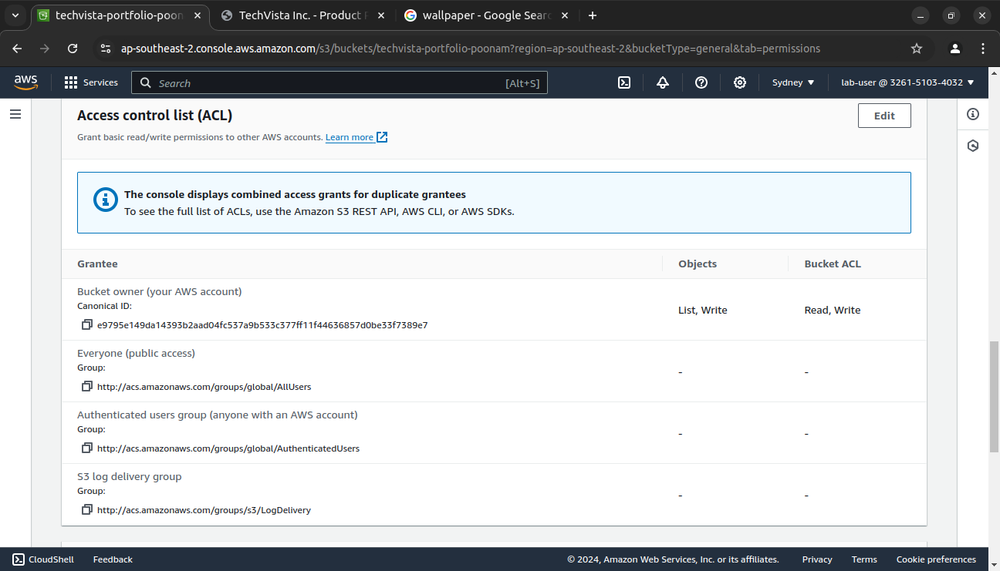

---
#### 5. Test and Validate the Configuration

**Testing:**
1. **Static Website URL:**
   - Ensure the website is live by visiting the S3 static website URL.


2. **Storage Class Transitions:**

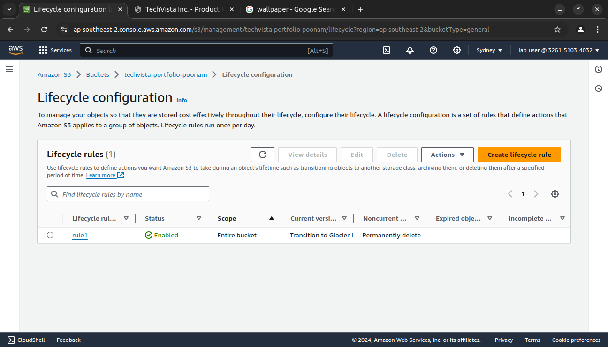

