# Deploying a Path-Based Routing Web Application on AWS

## Project Scenario:
A small company needs to deploy two lightweight web applications, "App1" and "App2," on AWS. The traffic to these applications should be routed through a single Application Load Balancer (ALB) based on the URL path. The company has opted for t2.micro instances for cost efficiency.

## Project Steps and Deliverables:
### 1. EC2 Instance Setup:

Launched Instance-1 named Poonam-App1

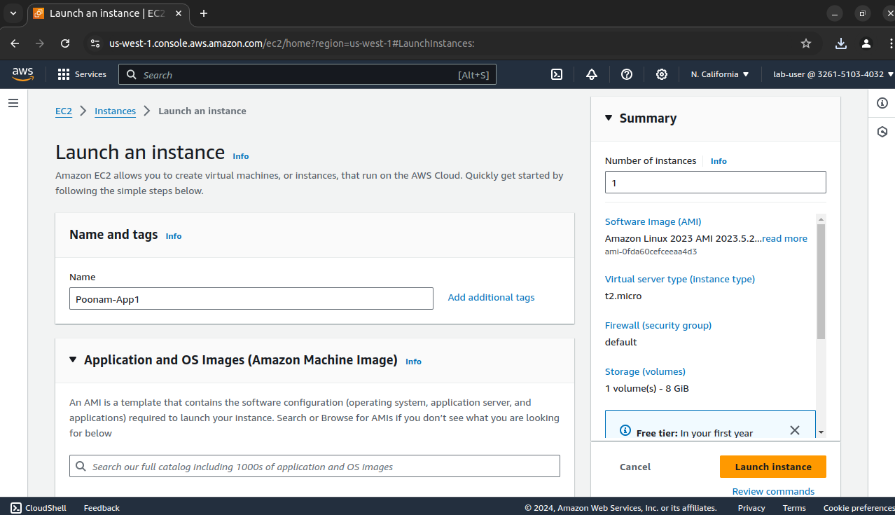
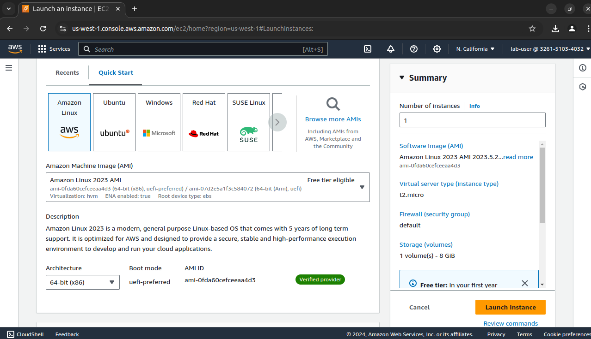
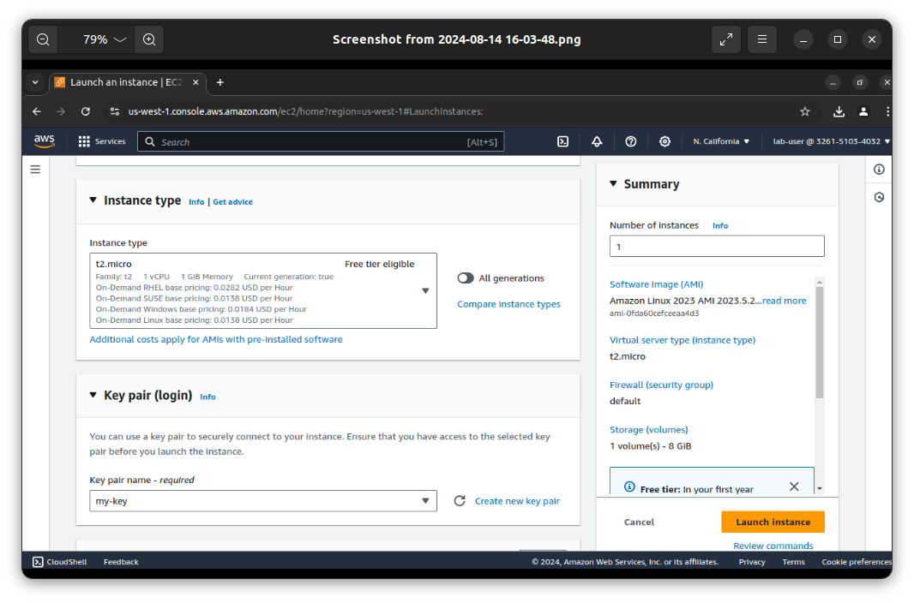
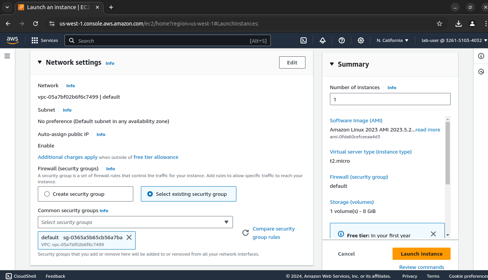

Launched Instance-2 named Poonam-App2
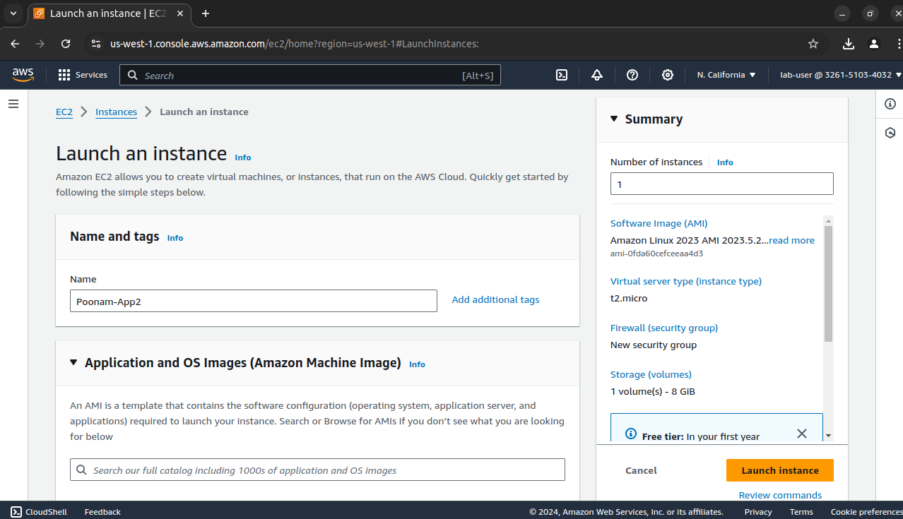

### 2. Security Group Configuration:
Inbound Rules:
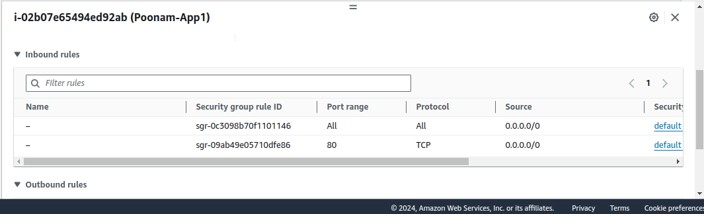

Outbound Rules:
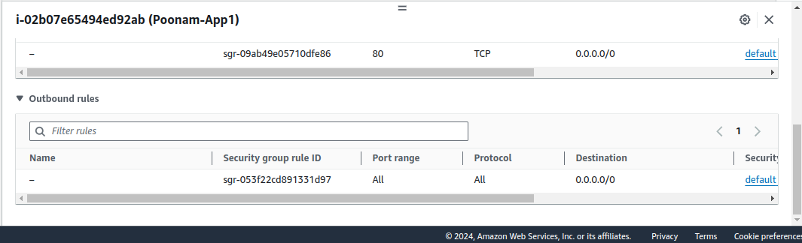

### 3. Application Load Balancer Setup with Path-Based Routing:
### Create an Application Load Balancer (ALB):

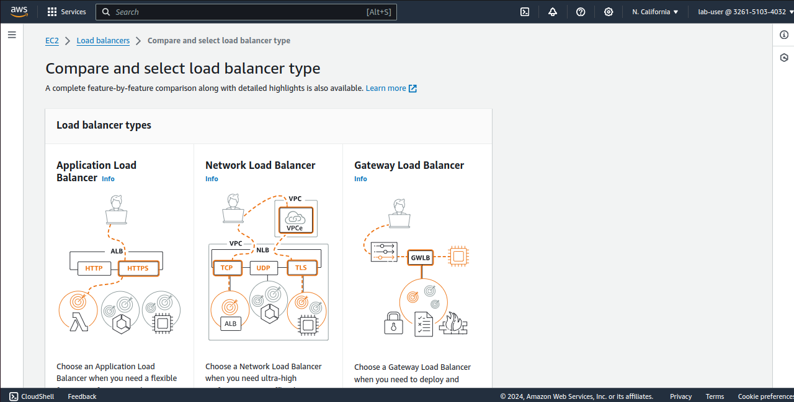
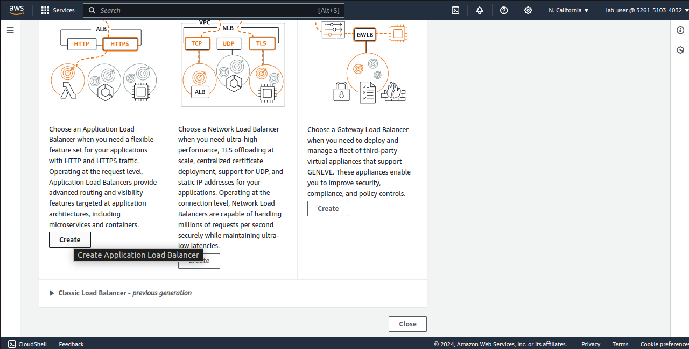
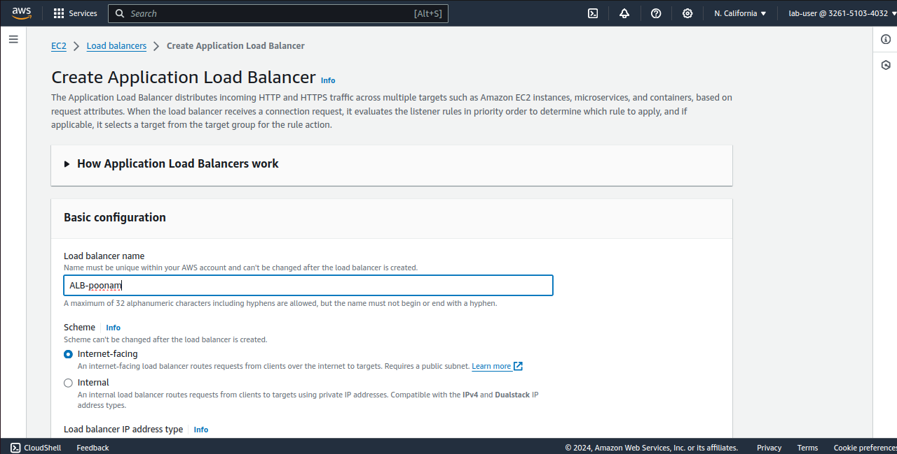
#### Set up an ALB in the same VPC and subnets as your EC2 instances.
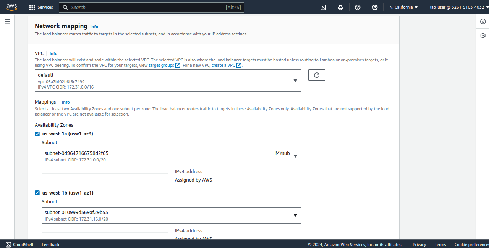

#### Configure the ALB with two target groups
Target Group 1: For "App1" instances.

Target Group 2: For "App2" instances.
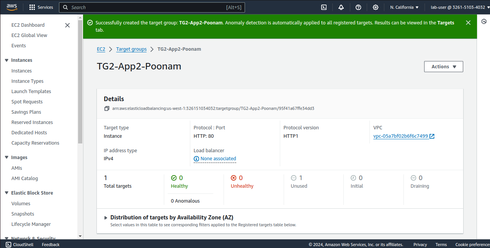

Register the appropriate EC2 instances with each target group.
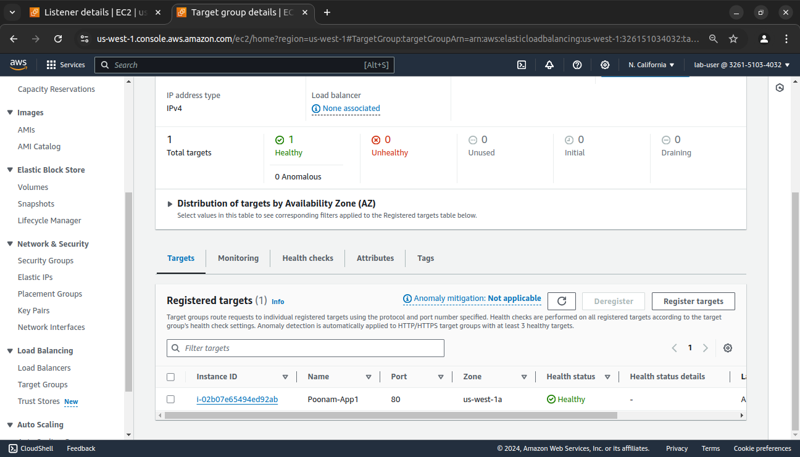

### Configure Path-Based Routing:
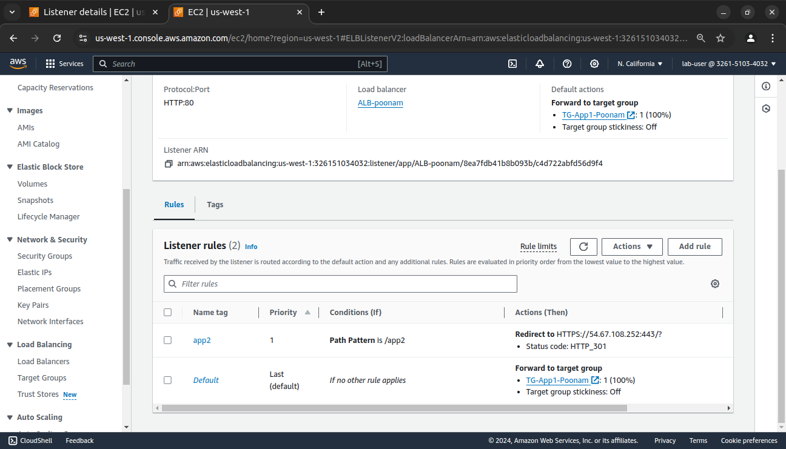

### 4. Testing and Validation:
Test Path-Based Routing:
Access the ALB's DNS name and validate that requests to /app2 are routed to the "App2" instances.
App1 instance output:

App2 instance output:
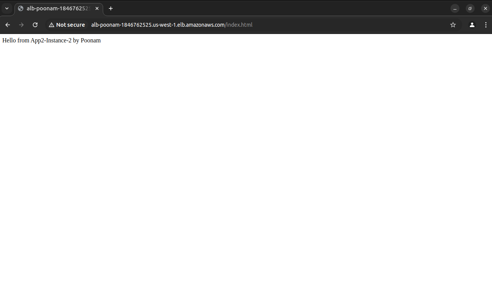

### 5. Resource Termination:

1. Stop and terminate all EC2 instances.

2. Delete the ALB and the associated target groups.

3. Delete the security groups created for the project.*

