# Project: Deploying a Multi-Tier Architecture Application using CloudFormation

## Project Objective:

This project will test your ability to deploy a multi-tier architecture application using AWS CloudFormation. The deployment should include an EC2 instance, an S3 bucket, a MySQL DB instance in RDS, and a VPC, all within the specified constraints.

### 1. Create a CloudFormation Template:

```template.yaml```

```yml
AWSTemplateFormatVersion: '2010-09-09'
Description: Deploying a multi-tier application with EC2, RDS, S3, and VPC without IAM roles in us-east-2

Parameters:
  VpcCIDR:
    Description: CIDR block for the VPC
    Type: String
    Default: "10.0.0.0/16"

  PublicSubnetCIDR1:
    Description: CIDR block for the first public subnet
    Type: String
    Default: "10.0.1.0/24"

  PublicSubnetCIDR2:
    Description: CIDR block for the second public subnet
    Type: String
    Default: "10.0.3.0/24"

  PrivateSubnetCIDR1:
    Description: CIDR block for the first private subnet
    Type: String
    Default: "10.0.2.0/24"

  PrivateSubnetCIDR2:
    Description: CIDR block for the second private subnet
    Type: String
    Default: "10.0.4.0/24"

  InstanceType:
    Description: EC2 instance type
    Type: String
    Default: t2.micro

  DBInstanceType:
    Description: RDS instance type
    Type: String
    Default: db.t3.micro

  AllowedIP:
    Description: IP range allowed for SSH access (CIDR notation)
    Type: String
    Default: "203.0.113.0/24"

  DBUsername:
    Description: The master username for the RDS instance
    Type: String
    NoEcho: true

  DBPassword:
    Description: The master password for the RDS instance
    Type: String
    NoEcho: true

Resources:
  # VPC
  MyVPC:
    Type: AWS::EC2::VPC
    Properties:
      CidrBlock: !Ref VpcCIDR
      Tags:
        - Key: Name
          Value: MyVPC

  # Public Subnet 1
  PublicSubnet1:
    Type: AWS::EC2::Subnet
    Properties:
      VpcId: !Ref MyVPC
      CidrBlock: !Ref PublicSubnetCIDR1
      AvailabilityZone: !Select [0, !GetAZs 'us-east-2']
      MapPublicIpOnLaunch: true
      Tags:
        - Key: Name
          Value: PublicSubnet1

  # Public Subnet 2
  PublicSubnet2:
    Type: AWS::EC2::Subnet
    Properties:
      VpcId: !Ref MyVPC
      CidrBlock: !Ref PublicSubnetCIDR2
      AvailabilityZone: !Select [1, !GetAZs 'us-east-2']
      MapPublicIpOnLaunch: true
      Tags:
        - Key: Name
          Value: PublicSubnet2

  # Private Subnet 1
  PrivateSubnet1:
    Type: AWS::EC2::Subnet
    Properties:
      VpcId: !Ref MyVPC
      CidrBlock: !Ref PrivateSubnetCIDR1
      AvailabilityZone: !Select [0, !GetAZs 'us-east-2']
      Tags:
        - Key: Name
          Value: PrivateSubnet1

  # Private Subnet 2
  PrivateSubnet2:
    Type: AWS::EC2::Subnet
    Properties:
      VpcId: !Ref MyVPC
      CidrBlock: !Ref PrivateSubnetCIDR2
      AvailabilityZone: !Select [1, !GetAZs 'us-east-2']
      Tags:
        - Key: Name
          Value: PrivateSubnet2

  # Internet Gateway
  MyInternetGateway:
    Type: AWS::EC2::InternetGateway
    Properties:
      Tags:
        - Key: Name
          Value: MyInternetGateway

  # Attach Internet Gateway to VPC
  VPCGatewayAttachment:
    Type: AWS::EC2::VPCGatewayAttachment
    Properties:
      VpcId: !Ref MyVPC
      InternetGatewayId: !Ref MyInternetGateway

  # Security Group for EC2
  EC2SecurityGroup:
    Type: AWS::EC2::SecurityGroup
    Properties:
      VpcId: !Ref MyVPC
      GroupDescription: Allow SSH and HTTP access
      SecurityGroupIngress:
        - IpProtocol: tcp
          FromPort: 22
          ToPort: 22
          CidrIp: !Ref AllowedIP
        - IpProtocol: tcp
          FromPort: 80
          ToPort: 80
          CidrIp: 0.0.0.0/0

  # Security Group for RDS
  RDSecurityGroup:
    Type: AWS::EC2::SecurityGroup
    Properties:
      VpcId: !Ref MyVPC
      GroupDescription: Allow MySQL access from EC2 only
      SecurityGroupIngress:
        - IpProtocol: tcp
          FromPort: 3306
          ToPort: 3306
          SourceSecurityGroupId: !Ref EC2SecurityGroup

  # EC2 Instance
  MyEC2Instance:
    Type: AWS::EC2::Instance
    Properties:
      InstanceType: !Ref InstanceType
      ImageId: ami-085f9c64a9b75eed5  
      SubnetId: !Ref PublicSubnet1
      SecurityGroupIds:
        - !Ref EC2SecurityGroup
      UserData:
        Fn::Base64: !Sub |
          #!/bin/bash
          apt-get update
          apt-get install -y awscli
          aws s3 cp s3://my-application-bucket/config-file /path/to/config-file

  # S3 Bucket
  MyS3Bucket:
    Type: AWS::S3::Bucket
    Properties:
      BucketName: pb-s3-bucket-d27

  # RDS MySQL DB Instance
  MyRDSDBInstance:
    Type: AWS::RDS::DBInstance
    Properties:
      DBInstanceClass: !Ref DBInstanceType
      Engine: MySQL
      EngineVersion: 8.0.35
      MasterUsername: !Ref DBUsername
      MasterUserPassword: !Ref DBPassword
      DBInstanceIdentifier: pb-db
      AllocatedStorage: 20
      VPCSecurityGroups:
        - !Ref RDSecurityGroup
      DBSubnetGroupName: !Ref DBSubnetGroup

  # RDS DB Subnet Group
  DBSubnetGroup:
    Type: AWS::RDS::DBSubnetGroup
    Properties:
      DBSubnetGroupDescription: Subnet group for RDS
      SubnetIds:
        - !Ref PrivateSubnet1
        - !Ref PrivateSubnet2

Outputs:
  EC2InstancePublicIP:
    Description: Public IP of the EC2 instance
    Value: !GetAtt MyEC2Instance.PublicIp

  S3BucketName:
    Description: Name of the S3 bucket
    Value: !Ref MyS3Bucket

  RDSInstanceEndpoint:
    Description: Endpoint of the RDS instance
    Value: !GetAtt MyRDSDBInstance.Endpoint.Address
```

### 2. Deploy the Application:

Deploy the CloudFormation stack using the template (template.yaml) created.

**Create the CloudFormation Stack:**

- Go to the AWS Management Console.
- Navigate to CloudFormation.
- Create a new stack and upload the template file.

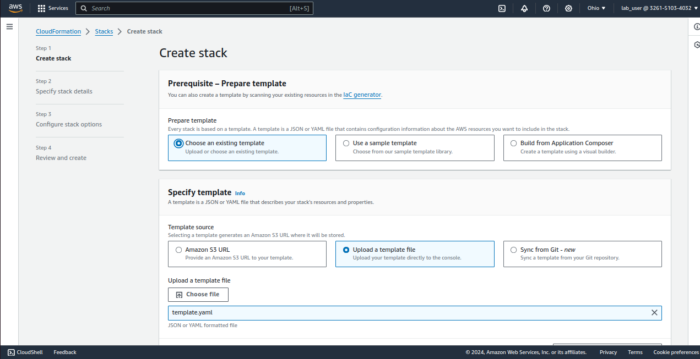

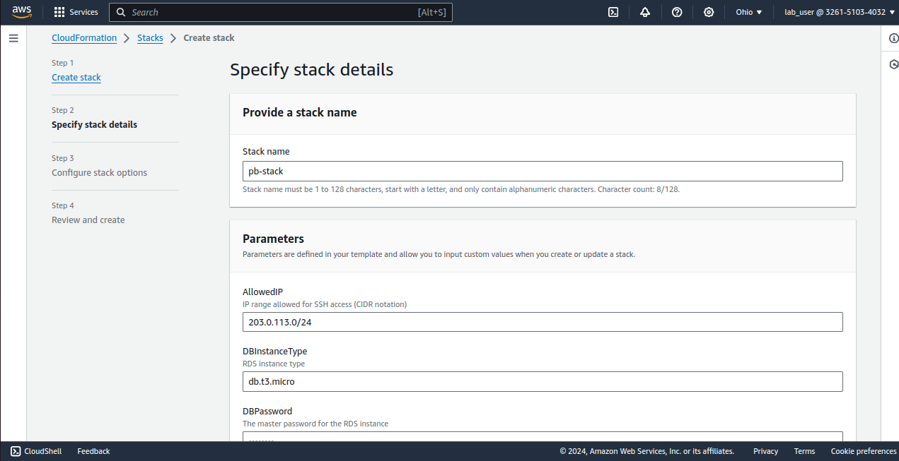

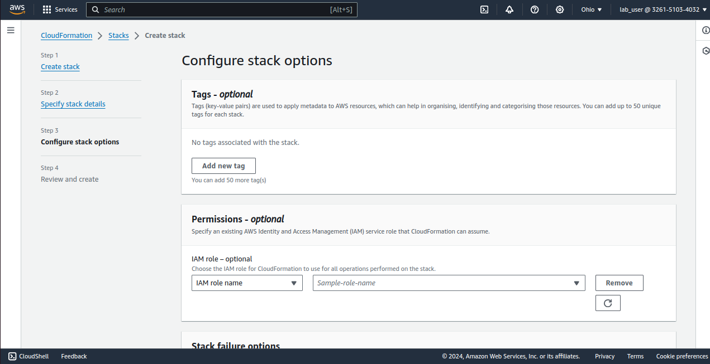

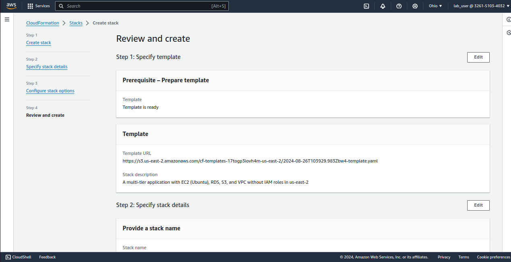

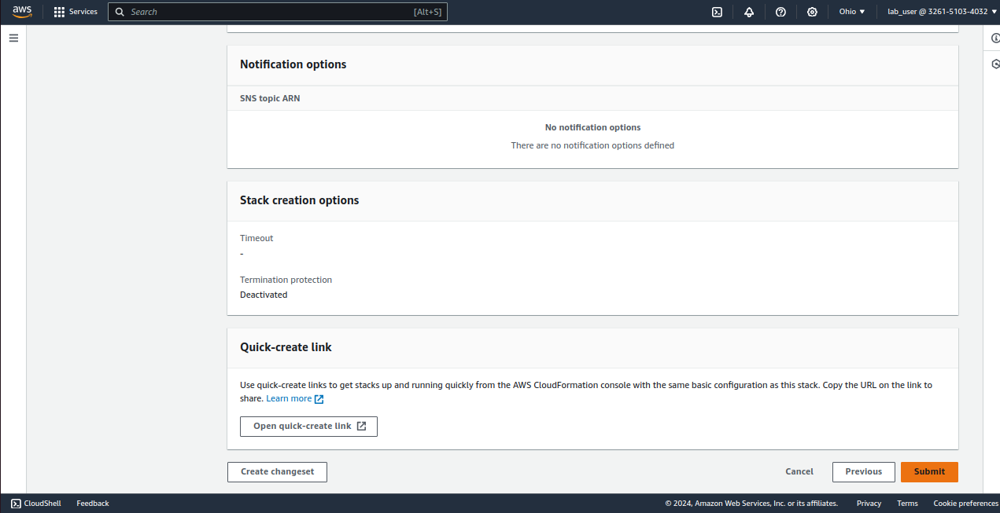

**Stack Created:**

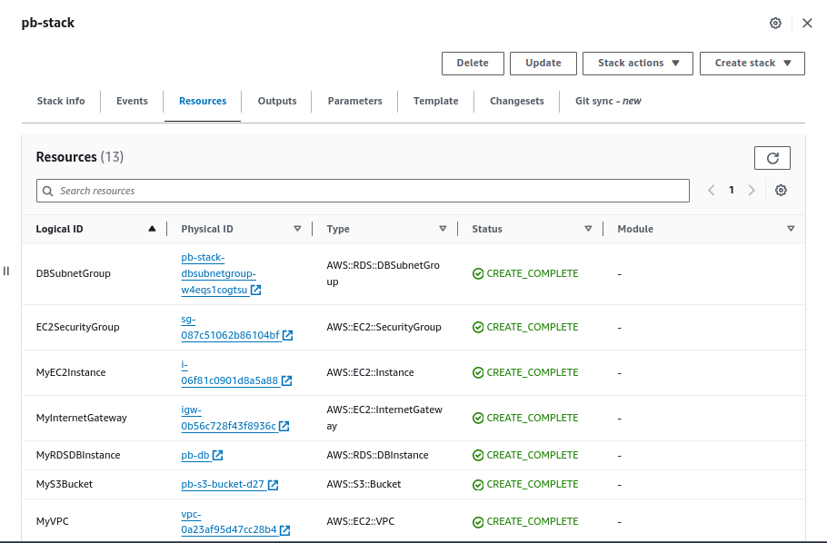

+ Verify that all components are correctly configured and operational.

EC2 Instance: 

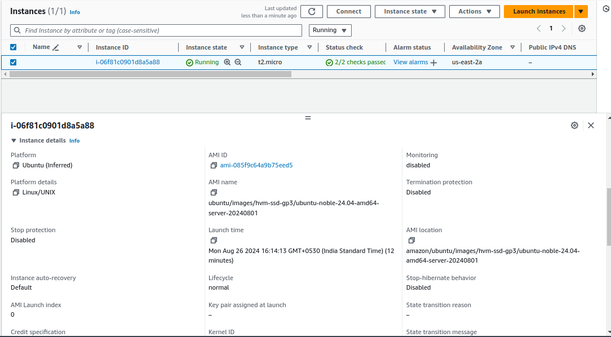

S3 Bucket:

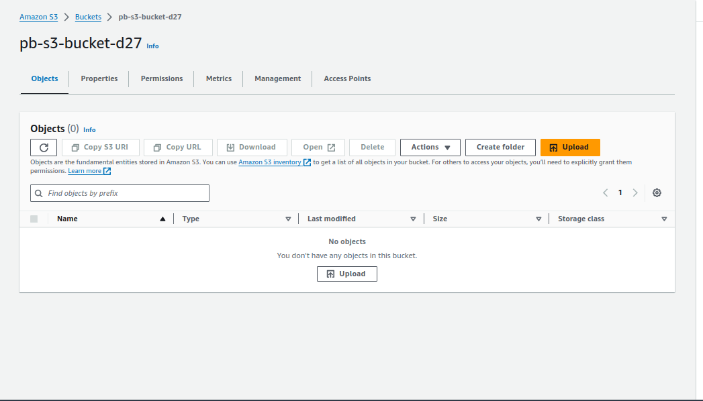

RDS MySQL DB Instance:

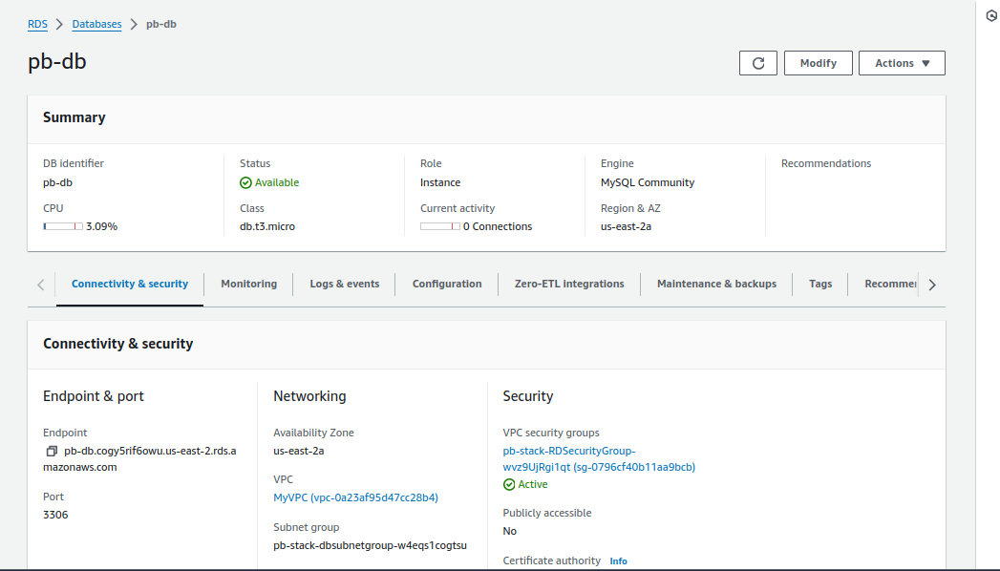

VPC:

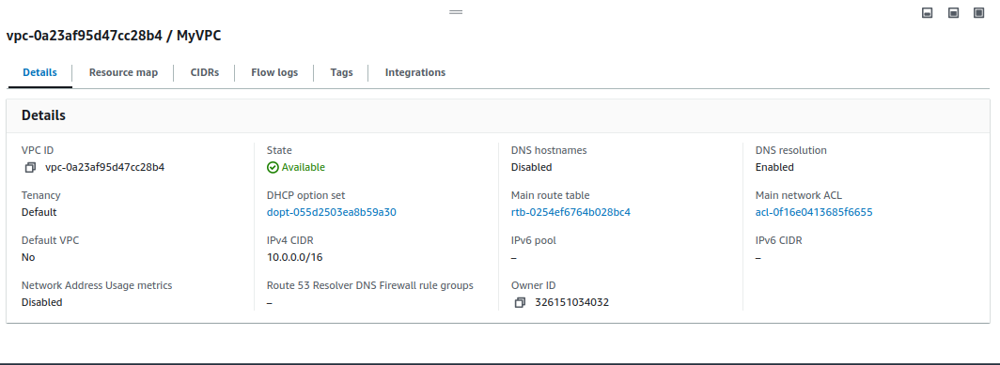

+ Ensure the EC2 instance can communicate with the RDS instance and access the S3 bucket.

### 3. Resource Termination:

+ Once the deployment and testing are complete, terminate all resources by deleting the CloudFormation stack.
+ Ensure that no resources, such as EC2 instances, RDS instances, or S3 buckets, are left running.

Stack Deleted:

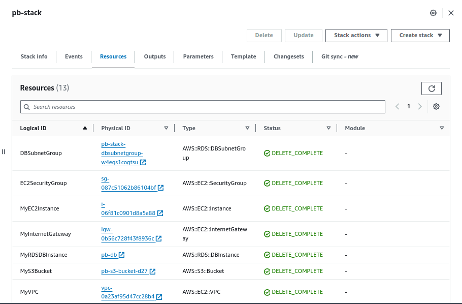

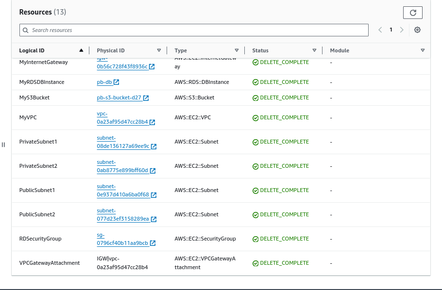
