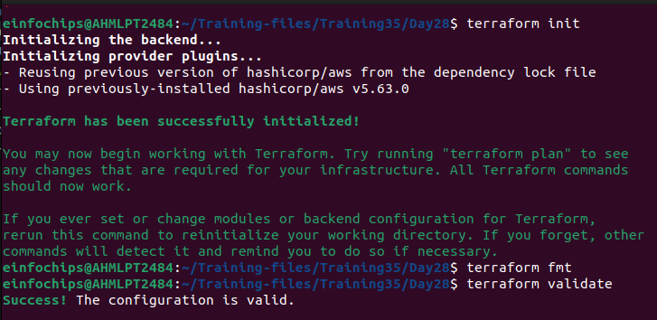
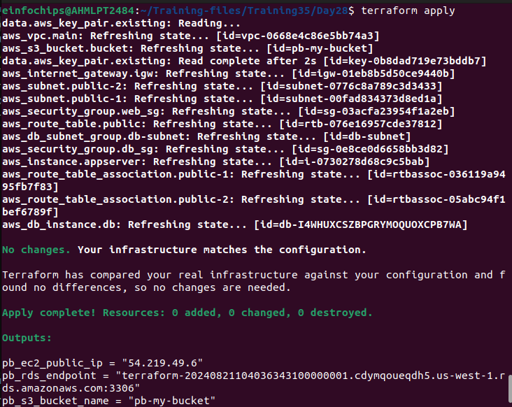
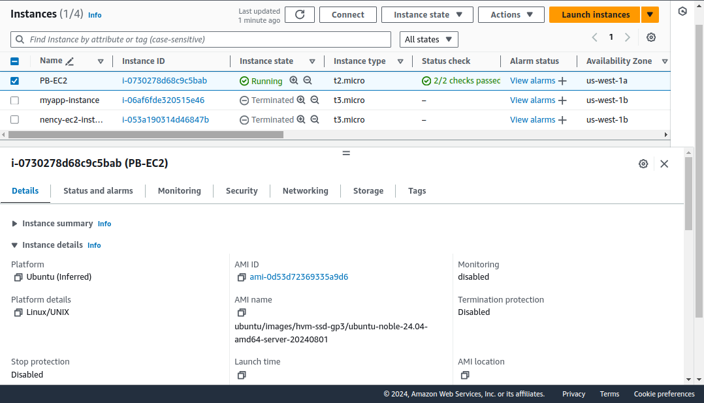
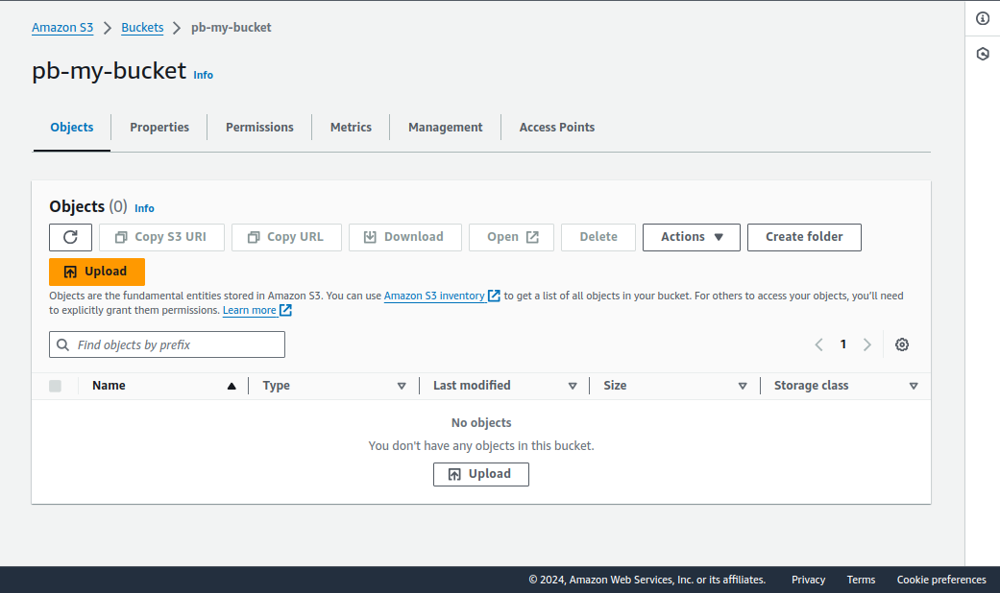
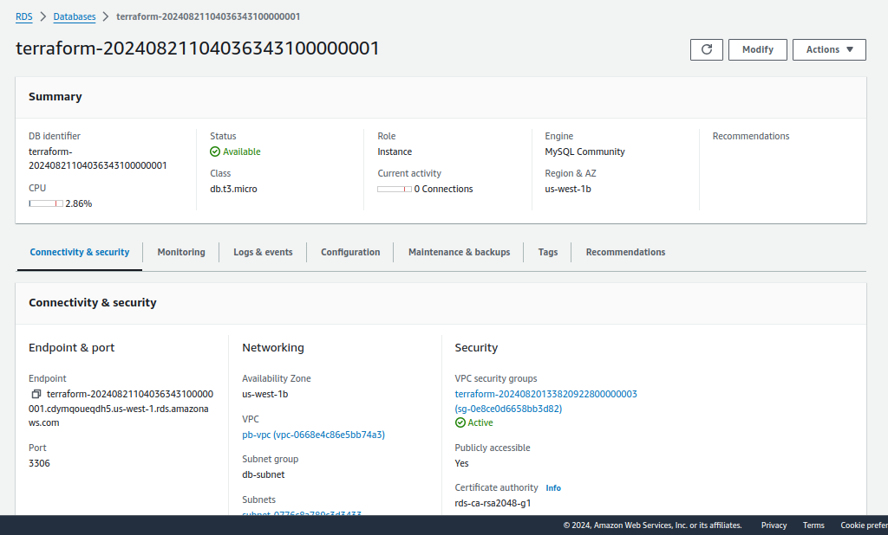
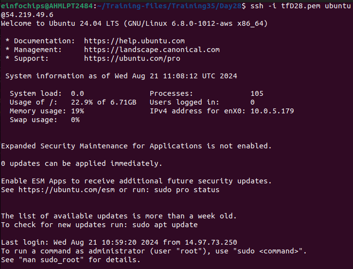
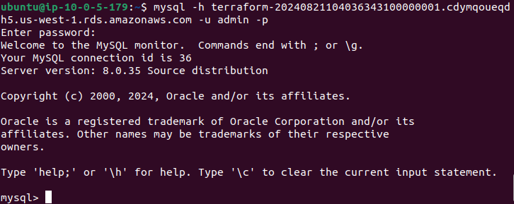
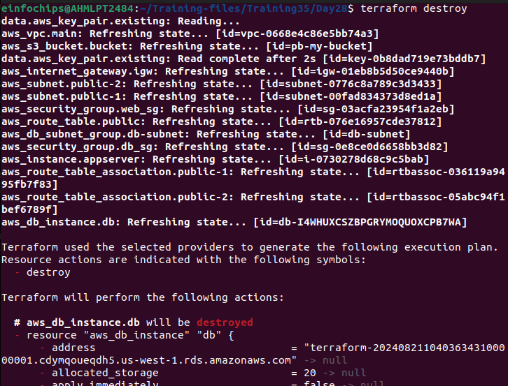

# Deploying a Multi-Tier Architecture Application on AWS using Terraform

## Project Objective:
This project will assess your ability to deploy a multi-tier architecture application on AWS using Terraform. The deployment will involve using Terraform variables, outputs, and change sets. The multi-tier architecture will include an EC2 instance, an RDS MySQL DB instance, and an S3 bucket.


### 1. Setup Terraform Configuration


Create a `main.tf` file and configure the AWS provider:

```hcl
# Specify the provider and region
provider "aws" {
  region = var.region
}

# Data source for existing Key Pair
data "aws_key_pair" "existing" {
  key_name = var.key_name
}

# Create a new VPC
resource "aws_vpc" "main" {
  cidr_block           = "10.0.0.0/16"
  enable_dns_support   = true
  enable_dns_hostnames = true
  tags = {
    Name = "pb-vpc"
  }
}

# Public Subnet in VPC
resource "aws_subnet" "public-1" {
  vpc_id                  = aws_vpc.main.id
  cidr_block              = "10.0.5.0/24"
  availability_zone       = "us-west-1a"
  map_public_ip_on_launch = true
  tags = {
    Name = "public-subnet1"
  }
}

resource "aws_subnet" "public-2" {
  vpc_id                  = aws_vpc.main.id
  cidr_block              = "10.0.3.0/24"
  availability_zone       = "us-west-1b"
  map_public_ip_on_launch = true
  tags = {
    Name = "public-subnet2"
  }
}

resource "aws_internet_gateway" "igw" {
  vpc_id = aws_vpc.main.id
  tags = {
    Name = "pb-igw"
  }
}

# Create a Route Table and associate it with the public subnet
resource "aws_route_table" "public" {
  vpc_id = aws_vpc.main.id

  route {
    cidr_block = "0.0.0.0/0"
    gateway_id = aws_internet_gateway.igw.id
  }

  tags = {
    Name = "pb-public-route-table"
  }
}

resource "aws_route_table_association" "public-1" {
  subnet_id      = aws_subnet.public-1.id
  route_table_id = aws_route_table.public.id
}

resource "aws_route_table_association" "public-2" {
  subnet_id      = aws_subnet.public-2.id
  route_table_id = aws_route_table.public.id
}

# Security Group for EC2 and RDS
resource "aws_security_group" "web_sg" {
  vpc_id = aws_vpc.main.id

  ingress {
    from_port   = 80
    to_port     = 80
    protocol    = "tcp"
    cidr_blocks = ["0.0.0.0/0"]
  }
  ingress {
    from_port   = 22
    to_port     = 22
    protocol    = "tcp"
    cidr_blocks = ["0.0.0.0/0"]
  }
  egress {
    from_port   = 0
    to_port     = 0
    protocol    = "-1"
    cidr_blocks = ["0.0.0.0/0"]
  }
}

#Security group for RDS
resource "aws_security_group" "db_sg" {
  vpc_id = aws_vpc.main.id

  ingress {
    from_port       = 3306
    to_port         = 3306
    protocol        = "tcp"
    security_groups = [aws_security_group.web_sg.id]
  }
  egress {
    from_port   = 0
    to_port     = 0
    protocol    = "-1"
    cidr_blocks = ["0.0.0.0/0"]
  }
}

# EC2 Instance
resource "aws_instance" "appserver" {
  ami                         = var.ami_id
  instance_type               = var.instance_type
  subnet_id                   = aws_subnet.public-1.id
  vpc_security_group_ids      = [aws_security_group.web_sg.id]
  associate_public_ip_address = true
  key_name      = data.aws_key_pair.existing.key_name
  tags = {
    Name = "PB-EC2"
  }
}

# DB Subnet Group
resource "aws_db_subnet_group" "db-subnet" {
  name        = "db-subnet"
  subnet_ids  = [aws_subnet.public-1.id, aws_subnet.public-2.id]
  description = "Main DB Subnet Group"

  tags = {
    Name = "Pb-DB-Subnet-Group"
  }
}

# RDS MySQL DB Instance
resource "aws_db_instance" "db" {
  allocated_storage      = 20
  engine                 = "mysql"
  engine_version         = "8.0"
  instance_class         = var.db_instance_class
  db_name                = var.db_name
  username               = var.db_username
  password               = var.db_password
  parameter_group_name   = "default.mysql8.0"
  publicly_accessible    = true
  vpc_security_group_ids = [aws_security_group.db_sg.id]
  db_subnet_group_name   = aws_db_subnet_group.db-subnet.name
  tags = {
    Name = "Pb-DB"
  }
}

# S3 Bucket
resource "aws_s3_bucket" "bucket" {
  bucket = "pb-my-bucket"
}

```

**Define Variables**

Create a `variables.tf` file:

```hcl
variable "region" {
  default = "us-west-1"
}

variable "ami_id" {
  description = "The AMI ID for the EC2 instance"
  type        = string
  default     = "ami-0d53d72369335a9d6"
}

variable "instance_type" {
  default = "t2.micro"
}

variable "key_name" {
  description = "The name of the existing SSH key pair"
  type        = string
  default     = "tfD28"
}

variable "db_instance_class" {
  default = "db.t3.micro"
}

variable "db_name" {
  default = "mydatabase"
}

variable "db_username" {
  default = "admin"
}

variable "db_password" {
  default   = "password"
  sensitive = true
}
```

**Define Outputs**

Defining outputs in `outputs.tf` file:

```hcl
output "pb_ec2_public_ip" {
  value = aws_instance.appserver.public_ip
}

output "pb_rds_endpoint" {
  value = aws_db_instance.db.endpoint
}

output "pb_s3_bucket_name" {
  value = aws_s3_bucket.bucket.bucket
}
```

### 2. Apply and Manage Infrastructure

#### 2.1. Initialize and Deploy

Run the following commands to deploy the infrastructure:

```sh
terraform init
terraform plan
terraform apply
```





EC2 instance:


S3 Bucket:


RDS:



#### 2.2. Make Changes and Manage

To demonstrate change sets, modify a configuration, e.g., update a tag or policy, then run:

```sh
terraform plan
terraform apply
```

For example, to update an EC2 instance tag, modify ```main.tf```:

```hcl
resource "aws_instance" "app_server" {
  # ... existing configuration
  tags = {
    Name = "appserver-updated"
  }
}
```
+ Review the Change Set
```
terraform plan
```
+ Apply the Change Set
```
terraform apply
```

### 4. Testing and Validation

1. **Access EC2**: SSH into the EC2 instance using the public IP.



2. **Connect to RDS**: From the EC2 instance, connect to the RDS instance using the provided endpoint.



### 5. Resource Termination

Once testing is complete, run:

```sh
terraform destroy
```
Confirm with ```yes``` when prompted.



Confirm that all resources are properly deleted.
