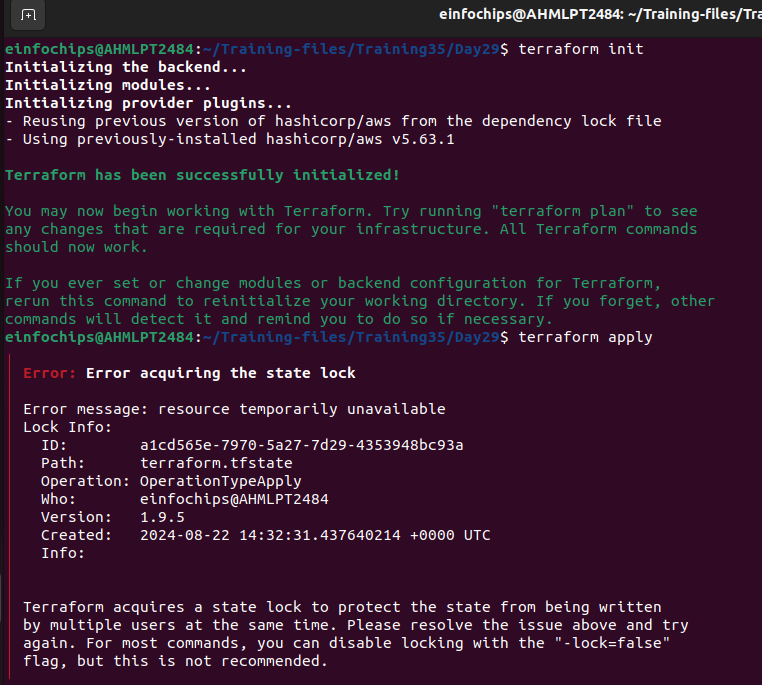
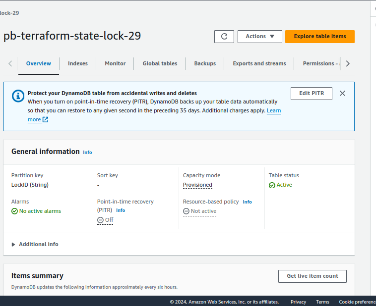
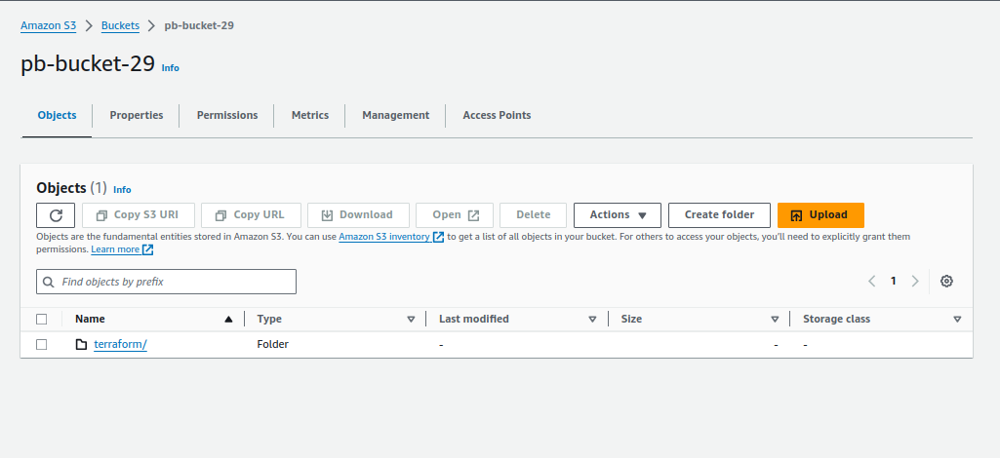
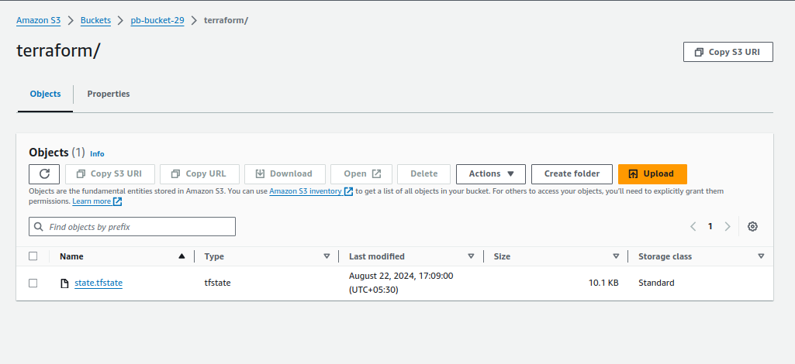
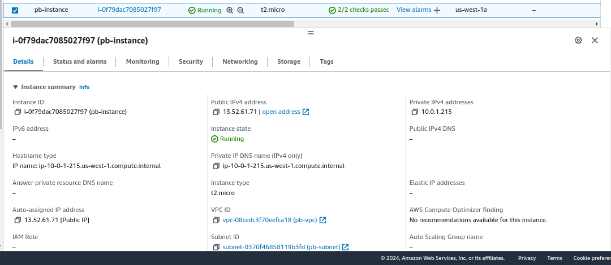

# Project: Advanced Terraform with Modules, Functions, State Locks, Remote State Management, and Variable Configuration

## Project Objective

This project will test your skills in using Terraform modules, functions, variables, state locks, and remote state management. The project requires deploying infrastructure on AWS using a custom Terraform module and managing the state remotely in an S3 bucket, while testing the locking mechanism with DynamoDB. Participants will also configure variables and outputs using functions.

## 1. Remote State Management

**S3 Bucket for State:**

**State Locking with DynamoDB:**

Create a DynamoDB table using Terraform (or manually if required) to store the state lock information.

Configure Terraform to use this DynamoDB table for state locking.


## 2. Terraform Module Creation

**Custom Module:**

Create a Terraform module to deploy the following AWS resources:

EC2 instance: Use an AMI for the region and allow SSH access using a security group.

S3 bucket: Create an S3 bucket for application data.

```modules/infrastructure/main.tf```

```
provider "aws" {
  region = var.region
}

# VPC
resource "aws_vpc" "pb_vpc" {
  cidr_block = "10.0.0.0/16"

  tags = {
    Name = "pb-vpc"
  }
}

# Subnet
resource "aws_subnet" "pb_subnet" {
  vpc_id            = aws_vpc.pb_vpc.id
  cidr_block        = "10.0.1.0/24"
  availability_zone = var.availability_zone  

  tags = {
    Name = "pb-subnet"
  }
}

# Internet Gateway
resource "aws_internet_gateway" "igw" {
  vpc_id = aws_vpc.pb_vpc.id
  tags = {
    Name = "pb-igw"
  }
}

# Create a Route Table and associate it with the public subnet
resource "aws_route_table" "public" {
  vpc_id = aws_vpc.pb_vpc.id

  route {
    cidr_block = "0.0.0.0/0"
    gateway_id = aws_internet_gateway.igw.id
  }

  tags = {
    Name = "pb-public-route-table"
  }
}

resource "aws_route_table_association" "pb_subnet" {
  subnet_id      = aws_subnet.pb_subnet.id
  route_table_id = aws_route_table.public.id
}

#Security group
resource "aws_security_group" "pb_sg" {
  vpc_id = aws_vpc.pb_vpc.id

  ingress {
    from_port   = 80
    to_port     = 80
    protocol    = "tcp"
    cidr_blocks = ["0.0.0.0/0"]
  }
  ingress {
    from_port   = 22
    to_port     = 22
    protocol    = "tcp"
    cidr_blocks = ["0.0.0.0/0"]
  }
  egress {
    from_port   = 0
    to_port     = 0
    protocol    = "-1"
    cidr_blocks = ["0.0.0.0/0"]
  }
}

# EC2 Instance
resource "aws_instance" "pb_infra_instance" {
  ami                  = var.ami_id
  instance_type        = var.instance_type
  vpc_security_group_ids = [aws_security_group.pb_sg.id]
  subnet_id            = aws_subnet.pb_subnet.id
  associate_public_ip_address = true
  tags = {
    Name = "pb-instance"
  }
}

# S3 Bucket
resource "aws_s3_bucket" "pb_bucket1" {
  bucket = var.bucket_name
  tags = {
    Name = "pb-bucket1"
  }
}

# DynamoDB Table for state locking
resource "aws_dynamodb_table" "pb_terraform_lock" {
  name           = var.dynamodb_table_name
  read_capacity  = 1
  write_capacity = 1
  hash_key       = "LockID"

  attribute {
    name = "LockID"
    type = "S"
  }

  tags = {
    Name = "pb-terraform-lock-table1"
  }
}

```

```modules/infrastructure/variables.tf```

```
variable "region" {
  description = "The AWS region to deploy resources"
  type        = string
}

variable "availability_zone" {
  description = "The availability zone for the subnet"
  type        = string
}

variable "ami_id" {
  description = "The AMI ID for the EC2 instance"
  type        = string
}

variable "instance_type" {
  description = "The type of the EC2 instance"
  type        = string
}

variable "bucket_name" {
  description = "The name of the S3 bucket"
  type        = string
  default = "pb-bucket29"
}

variable "dynamodb_table_name" {
  description = "The name of the DynamoDB table for state locking"
  type        = string
}
```

```modules/infrastructure/outputs.tf```

```
output "instance_public_ip" {
  description = "The public IP address of the EC2 instance"
  value       = aws_instance.pb_infra_instance.public_ip
}

output "bucket_name" {
  description = "The name of the S3 bucket"
  value       = aws_s3_bucket.pb_bucket1.bucket
}

output "dynamodb_table_name" {
  description = "The name of the DynamoDB table"
  value       = aws_dynamodb_table.pb_terraform_lock.name
}
```

**Use Terraform variables (txvars) to parameterize important aspects:**

Instance Type: Allow the instance type to be configurable (e.g., t2.micro).

Region: Parameterize the AWS region so that the module can be reused across regions.

Bucket Name: Use a variable to set the S3 bucket name.

```terraform.tfvars```

```sh
region              = "us-west-1"
availability_zone   = "us-west-1a"
ami_id              = "ami-0d53d72369335a9d6"
instance_type       = "t2.micro"
bucket_name         = "pb-bucket29"
dynamodb_table_name = "pb-terraform-state-lock-29"

```

## 3. Input Variables and Configuration (txvars)

**Define input variables to make the infrastructure flexible:**

```main.tf ```

```
provider "aws" {
  region = var.region
}

module "pb-app" {
  source              = "./modules/infrastructure"
  region              = var.region
  availability_zone   = var.availability_zone
  ami_id              = var.ami_id
  instance_type       = var.instance_type
  bucket_name         = var.bucket_name
  dynamodb_table_name = var.dynamodb_table_name
}
```

```variables.tf```

```hcl
variable "region" {
  description = "The AWS region to deploy resources"
  type        = string
}

variable "availability_zone" {
  description = "The availability zone for the subnet"
  type        = string
}

variable "ami_id" {
  description = "The AMI ID for the EC2 instance"
  type        = string
}

variable "instance_type" {
  description = "The type of the EC2 instance"
  type        = string
}

variable "bucket_name" {
  description = "The name of the S3 bucket"
  type        = string
}

variable "dynamodb_table_name" {
  description = "The name of the DynamoDB table for state locking"
  type        = string
}
```

## 4. Output Configuration

Set up Terraform outputs to display key information after the infrastructure is created

```outputs.tf```

```hcl
output "instance_public_ip" {
  value = module.pb-app.instance_public_ip
}

output "bucket_name" {
  value = module.pb-app.bucket_name
}

output "dynamodb_table_name" {
  value = module.pb-app.dynamodb_table_name
}
```

## 5. Testing State Locking and Remote State

**State Locking:**

Attempt to run ```terraform apply``` from two different terminals simultaneously to test state locking.

Confirm that DynamoDB properly handles the state lock, preventing concurrent updates.





**Remote State Management:**

Verify that Terraform state is being stored in the S3 bucket and that updates are reflected in the remote state file.





## 6. Apply and Modify Infrastructure

**Initial Deployment:**

Use terraform plan and terraform apply to deploy the infrastructure.

Verify that the EC2 instance, S3 bucket, and all configurations are properly set up.

EC2:



S3:


## 7. Resource Termination

Once the deployment is complete and tested, tear down all the resources created by Terraform.

```terraform destroy```

Ensure that the S3 bucket, EC2 instance, and DynamoDB table (if not reused) are deleted.