# Project: Advanced Terraform with Provisioners, Modules, and Workspaces

## Project Objective

+ This project is designed to evaluate participants' understanding of Terraform provisioners, modules, and workspaces.
+ The project involves deploying a basic infrastructure on AWS using Terraform modules, executing remote commands on the provisioned resources using provisioners, and managing multiple environments using Terraform workspaces.
+ All resources should be within the AWS Free Tier limits.

## Project Overview

+ Participants will create a Terraform configuration that deploys an EC2 instance and an S3 bucket using a custom Terraform module.

+ The project will also require the use of Terraform provisioners to execute scripts on the EC2 instance.

+ Finally, participants will manage separate environments (e.g., dev and prod) using Terraform workspaces.

### Key Tasks

### Project Directories

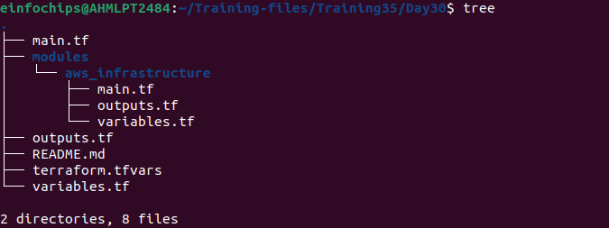

### 1. Module Development

+ **Module Setup:** Create a directory for the module (e.g., modules/aws_infrastructure).

```css
.
└── aws_infrastructure
    ├── main.tf
    ├── outputs.tf
    └── variables.tf
```

+ **Resource Definitions:** Define the resources for an EC2 instance and an S3 bucket within the module.

```modules/aws_infrastructure/main.tf```

```hcl
provider "aws" {
  region = var.region
}

resource "aws_instance" "pb_instance" {
  ami           = var.ami_id
  instance_type = var.instance_type
  key_name      = var.key_pair_name
  associate_public_ip_address = true  

  tags = {
    Name = "pb-instance"
  }

  provisioner "remote-exec" {
    inline = [
      "sudo apt-get update -y",
      "sudo apt-get install -y apache2",
      "sudo systemctl start apache2",
      "sudo systemctl enable apache2"
    ]
    connection {
      type        = "ssh"
      user        = "ubuntu"
      private_key = file(var.private_key)
      host        = self.public_ip
    }
  }

  provisioner "local-exec" {
    command = "echo 'EC2 instance successfully provisioned with Apache' > provision_status.txt"
  }
}

resource "aws_s3_bucket" "pb_bucket" {
  bucket = var.bucket_name

  tags = {
    Name = "${var.name}-bucketd30"
  }
}
```

+ **Variable Inputs:** Define input variables for instance type, AMI ID, key pair name, and S3 bucket name.

```modules/aws_infrastructure/variables.tf```

```hcl
variable "region" {
  type = string
  default = "us-west-1"
}
variable "instance_type" {
  description = "EC2 instance type"
  type        = string
  default     = "t2.micro"
}

variable "ami_id" {
  description = "AMI ID for EC2"
  type        = string
}

variable "key_pair_name" {
  description = "Key pair name for SSH"
  type        = string
  default     = "pbd30"
}

variable "bucket_name" {
  description = "S3 bucket name"
  type        = string
  default     = "pb-bucketd30"
}

variable "private_key" {
  description = "Path to SSH private key"
  type        = string
  default     = "~/.ssh/pbd30.pem"
}

variable "name" {
  description = "Name prefix for resources"
  type        = string
  default     = "pb"
}
```

+ **Outputs:** Define outputs for the EC2 instance's public IP and the S3 bucket's ARN.

```modules/aws_infrastructure/outputs.tf```

```hcl
output "instance_public_ip" {
  value = aws_instance.pb_instance.public_ip
}

output "bucket_arn" {
  value = aws_s3_bucket.pb_bucket.arn
}
```

### 2. Terraform Configuration

+ **Main Config Setup:** In the root directory, create a Terraform configuration that calls the custom module.

```main.tf```

```hcl
provider "aws" {
  region = var.region
}

module "aws_infrastructure" {
  source        = "./modules/aws_infrastructure/"
  instance_type = var.instance_type
  ami_id        = var.ami_id
  key_pair_name = var.key_pair_name
  bucket_name   = var.bucket_name
  private_key   = var.private_key
  name          = var.name
}
```

```variables.tf```

```hcl
variable "region" {
  type    = string
  default = "us-west-1"
}

variable "instance_type" {
  description = "EC2 instance type"
  type        = string
}

variable "ami_id" {
  description = "AMI ID for EC2"
  type        = string
}

variable "key_pair_name" {
  description = "Key pair name for SSH"
  type        = string
}

variable "bucket_name" {
  description = "S3 bucket name"
  type        = string
}

variable "private_key" {
  description = "Path to SSH private key"
  type        = string
  default     = "~/.ssh/pbd30.pem"
}

variable "name" {
  description = "Name prefix for resources"
  type        = string
  default     = "pb"
}
```

```outputs.tf```

```hcl
output "instance_public_ip" {
  value = module.aws_infrastructure.instance_public_ip
}

output "bucket_arn" {
  value = module.aws_infrastructure.bucket_arn
}
```

```terraform.tfvars```

```hcl
instance_type = "t2.micro"
ami_id        = "ami-0d53d72369335a9d6"
key_pair_name = "pbd30"
bucket_name   = "pb-bucketd30"
private_key   = "~/.ssh/pbd30.pem"
name          = "pb"
```

**EC2 Instance:**

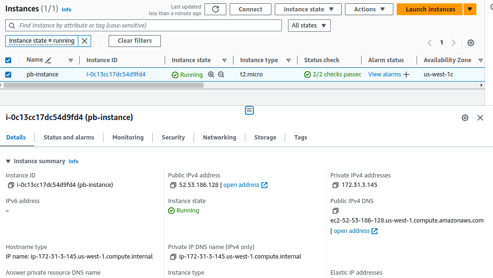

**S3 Bucket:**
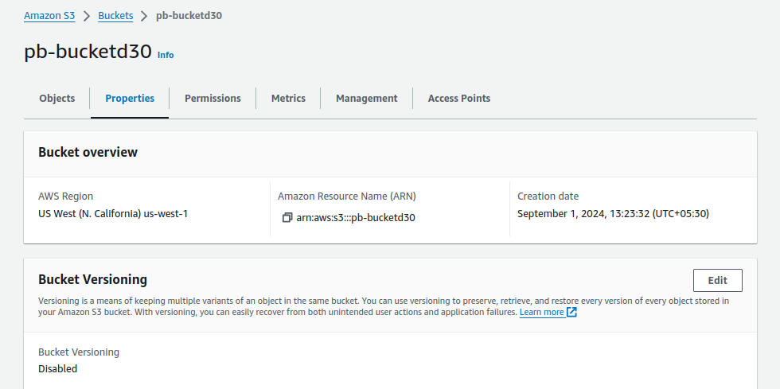

### 3. Provisioner Implementation

+ **Remote Execution:** Use the remote-exec provisioner to SSH into the EC2 instance and execute a script that installs Apache.

```hcl
  provisioner "remote-exec" {
    inline = [
      "sudo apt-get update -y",
      "sudo apt-get install -y apache2",
      "sudo systemctl start apache2",
      "sudo systemctl enable apache2"
    ]
    connection {
      type        = "ssh"
      user        = "ubuntu"
      private_key = file(var.private_key)
      host        = self.public_ip
    }
  }
```

+ **Local Execution:** Use the local-exec provisioner to print a confirmation message on the local machine after successful deployment.

```hcl
  provisioner "local-exec" {
    command = "echo 'EC2 instance successfully provisioned with Apache' > provision_status.txt"
  }
```

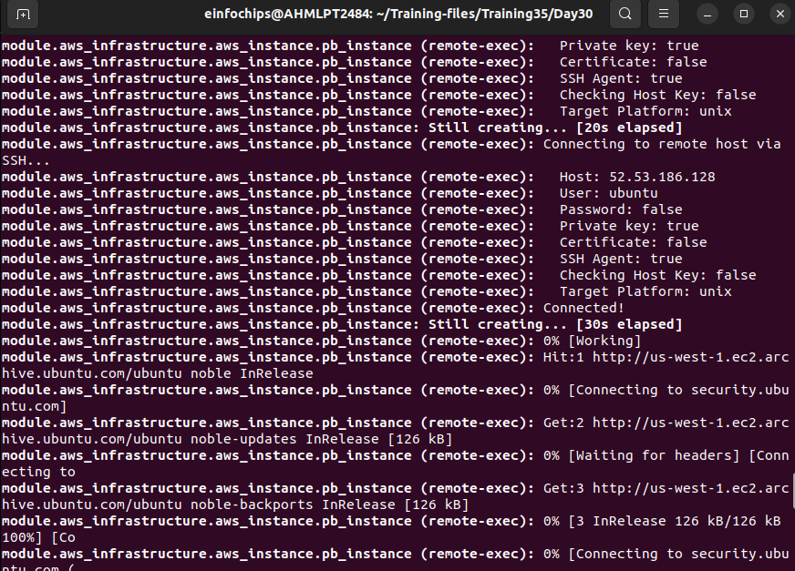

### 4. Workspace Management:

+ **Workspace Creation:** Create Terraform workspaces for development and production.

+ **Workspace Deployment:** Deploy the infrastructure separately in the dev and prod workspaces.

**Create and deploy infrastructure to the development workspace:**
```sh
terraform workspace new development
terraform apply
```

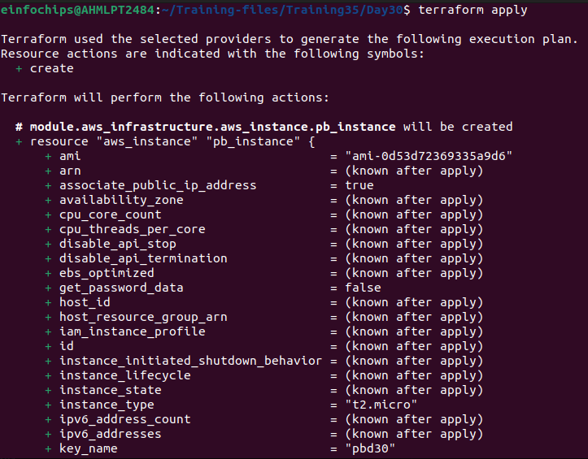

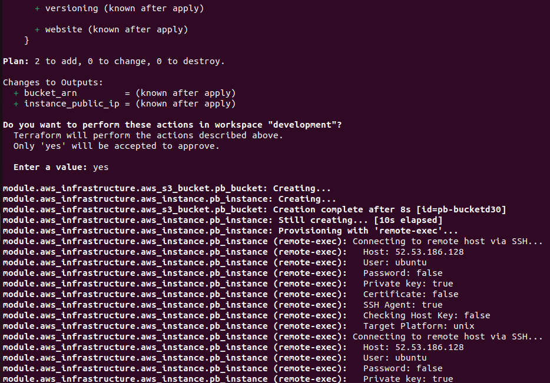

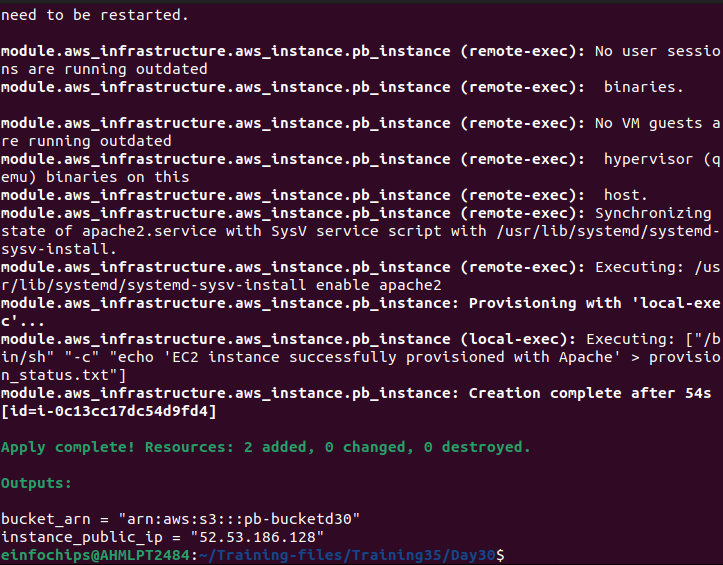

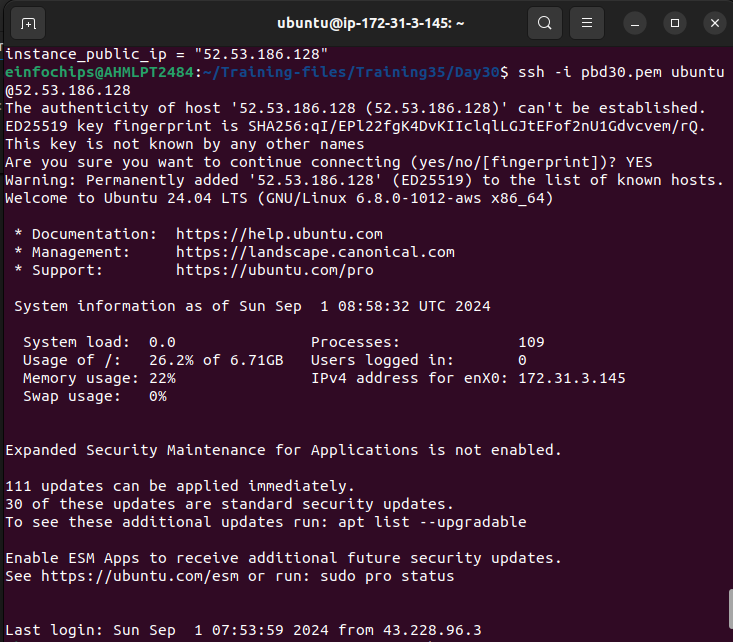

**Similarly, create and deploy infrastructure to the production workspace:**

```sh
terraform workspace new production
terraform apply
```

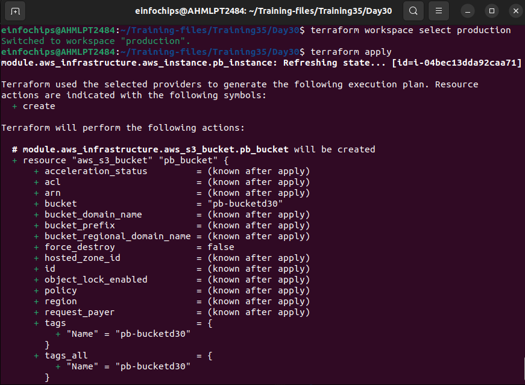

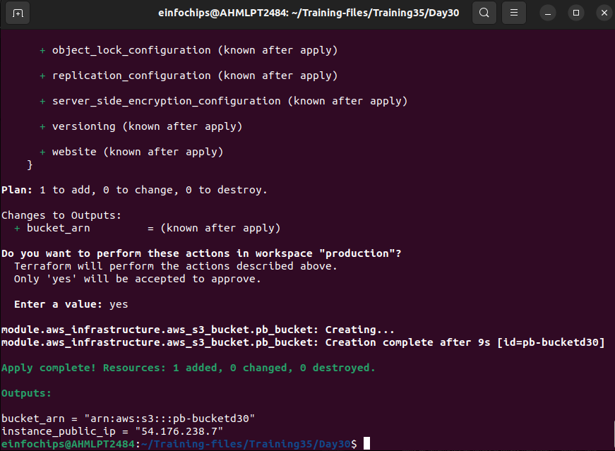

### 5. Validation and Testing

+ **Apache Installation Verification:** After the deployment, verify that Apache is installed and running on the EC2 instance by accessing the public IP address in a web browser.

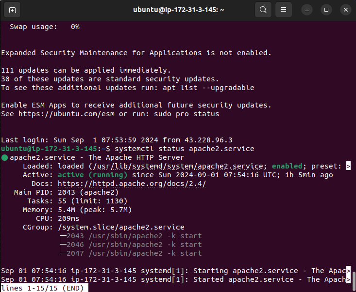

+ **Provisioner Logs:** Review the output from the local-exec provisioner to ensure it indicates successful deployment.

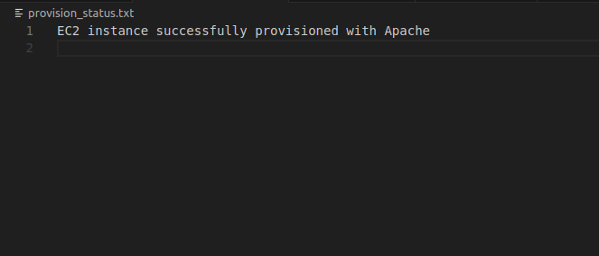

### 6. Resource Cleanup

+ Destroy Resources: Use terraform destroy to remove the resources in both workspaces.

```sh
terraform workspace select development
terraform destroy
```

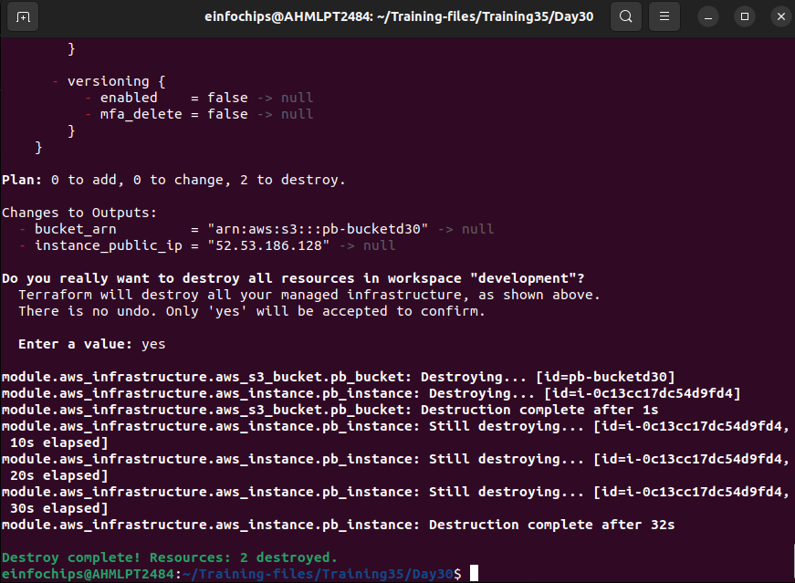


```sh
terraform workspace select production
terraform destroy
```

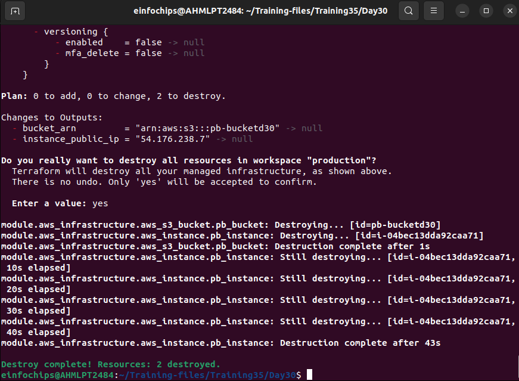
