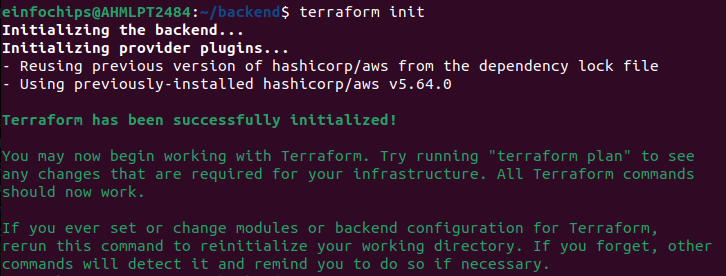
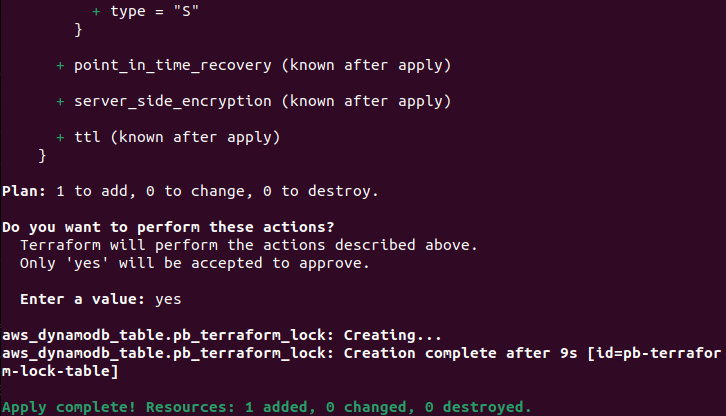
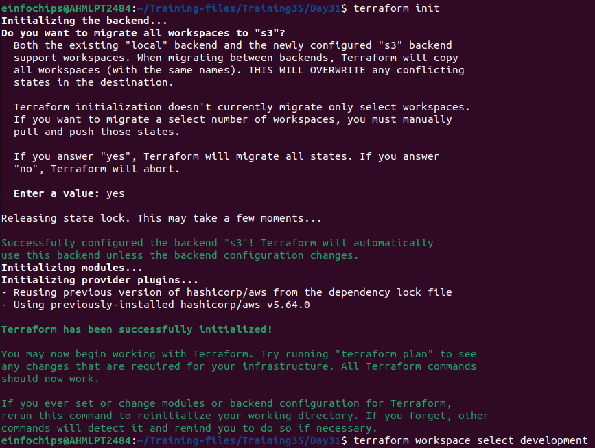
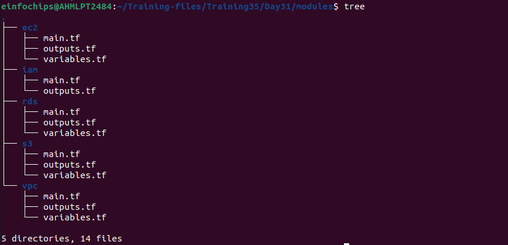
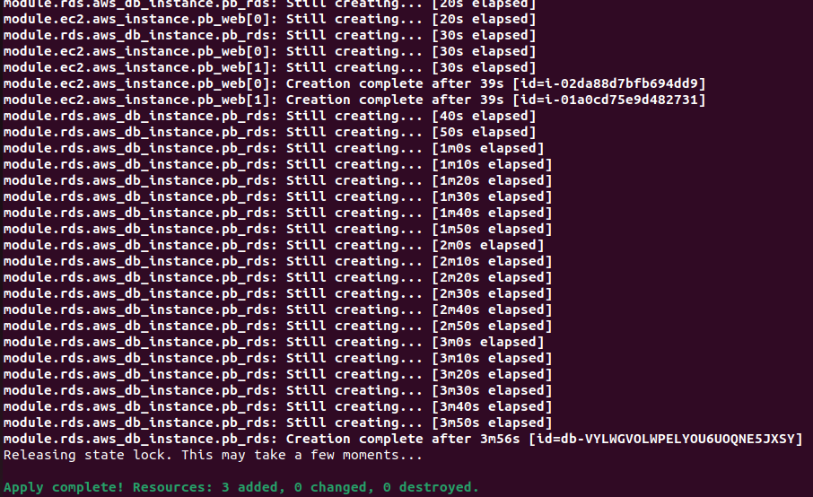
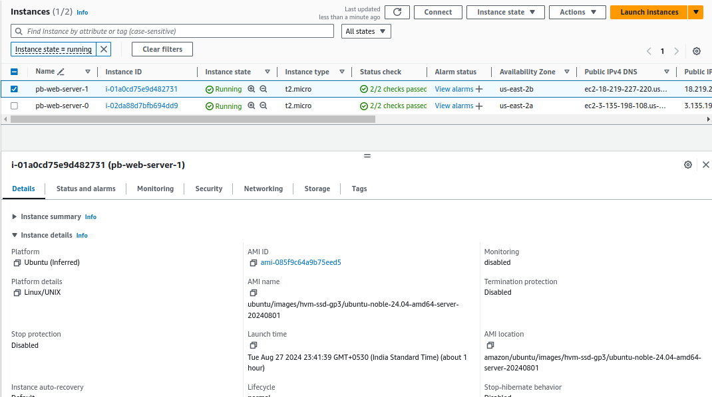
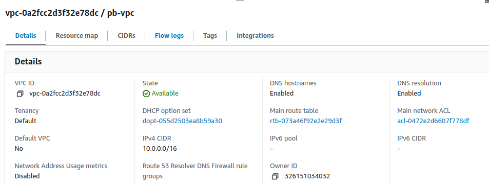
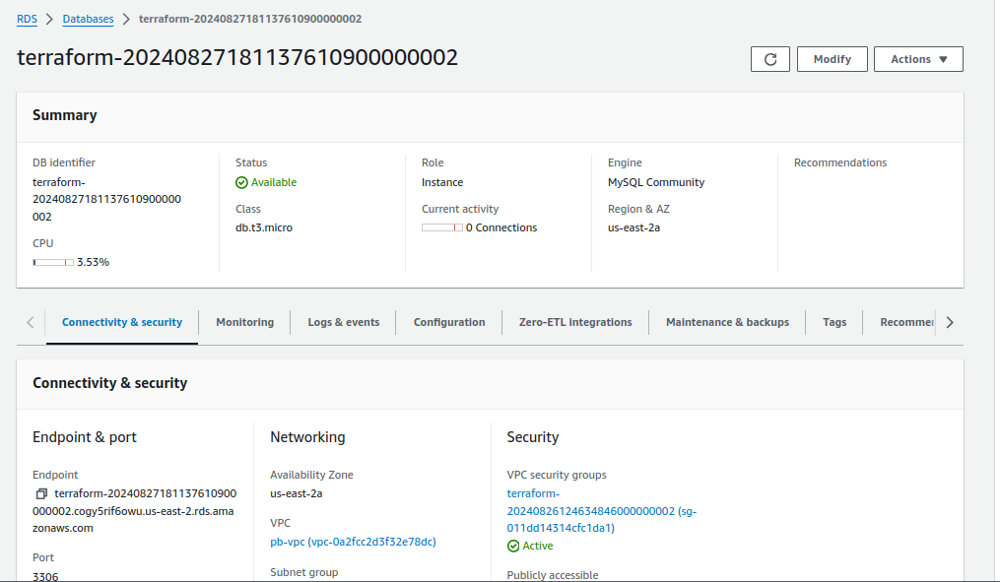
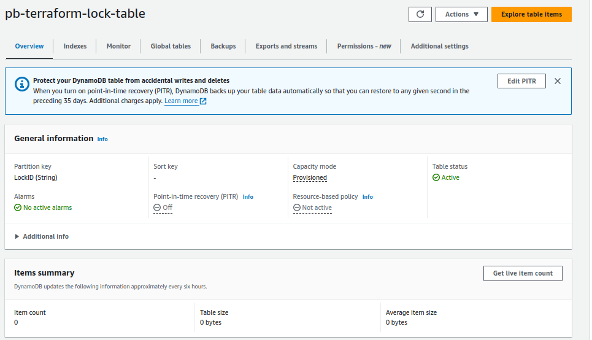
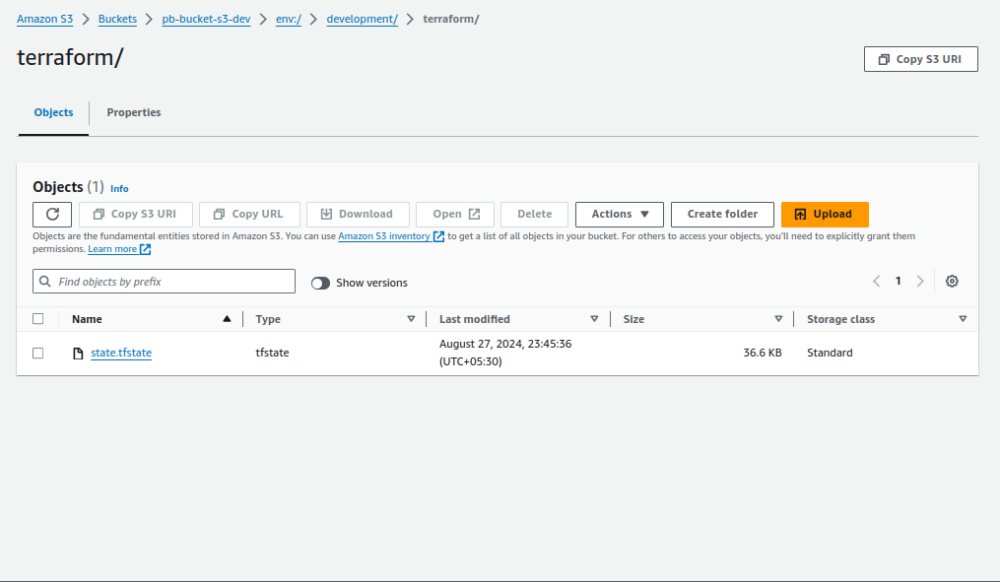

# Automation (IaaC) Terraform on AWS Assessment Project

## Project Overview

This capstone project is designed to assess participants' knowledge and practical skills with Terraform, specifically focusing on AWS. The project will require deploying a complete infrastructure using Terraform, emphasizing the usage of state lock, variables, .tfvars files, modules, functions, workspaces, and lifecycle rules. The deployment will be restricted to AWS Free Tier resources to avoid unnecessary costs.

## Project Objectives

- Deploy a multi-tier architecture on AWS using Terraform.
- Implement state locking to manage concurrent changes.
- Use variables and .tfvars files to parameterize configurations.
- Create and use Terraform modules to promote reusability and organization.
- Utilize functions to dynamically configure resources.
- Manage multiple environments using Terraform workspaces.
- Implement lifecycle rules to control resource creation, updates, and deletion.

## Project Steps

### 1. Setup Remote State and Locking

- Create an S3 bucket for storing Terraform state.

- Create a DynamoDB table for state locking.





- Configure the backend in Terraform to use the S3 bucket and DynamoDB table.



### 2. Develop and Organize Modules

- Develop separate modules for VPC, EC2, RDS, S3, and IAM.

- Place each module in a separate directory with main.tf, variables.tf, and outputs.tf.



**For EC2**

```modules/ec2/main.tf```

```js
resource "aws_instance" "pb_web" {
  count = 2
  ami           = "ami-085f9c64a9b75eed5"  
  instance_type = var.instance_type
  subnet_id     = element(var.subnet_ids, count.index)
  associate_public_ip_address = true
  iam_instance_profile = var.iam_instance_profile_id

  tags = {
    Name = "pb-web-server-${count.index}"
  }
}
```

**For IAM**

```modules/iam/main.tf```

```js
resource "aws_iam_role" "pb_ec2_role" {
  name = "pb-role"

  assume_role_policy = jsonencode({
    Version = "2012-10-17",
    Statement = [
      {
        Action = "sts:AssumeRole",
        Effect = "Allow",
        Principal = {
          Service = "ec2.amazonaws.com",
        },
      },
    ],
  })
}

resource "aws_iam_policy" "pb_ec2_policy" {
  name        = "pb-policy"
  description = "Policy for EC2 instances"
  policy      = jsonencode({
    Version = "2012-10-17",
    Statement = [
      {
        Action = "s3:*",
        Effect = "Allow",
        Resource = "*",
      },
    ],
  })
}

resource "aws_iam_role_policy_attachment" "pb_ec2_policy_attachment" {
  role       = aws_iam_role.pb_ec2_role.name
  policy_arn = aws_iam_policy.pb_ec2_policy.arn
}

resource "aws_iam_instance_profile" "pb_ec2_profile" {
  name = "pb-ec2-instance-profile"
  role = aws_iam_role.pb_ec2_role.name
}
```

**For RDS**

```modules/rds/main.tf```

```js
resource "aws_db_instance" "pb_rds" {
  allocated_storage    = 20
  storage_type         = "gp2"
  engine               = "mysql"
  engine_version       = "8.0"
  instance_class       = "db.t3.micro"
  db_name              = "pbdata"
  username             = var.db_username
  password             = var.db_password
  parameter_group_name   = "default.mysql8.0"
  publicly_accessible    = true
  vpc_security_group_ids = [aws_security_group.db_sg.id]
  db_subnet_group_name = aws_db_subnet_group.pb_subnet_group.name
  skip_final_snapshot  = true

  tags = {
    Name = "PBdbinstance"
  }
}

resource "aws_db_subnet_group" "pb_subnet_group" {
  name        = "pb-subnets"
  description = "Subnet group for RDS"

  subnet_ids = var.db_subnet_ids

  tags = {
    Name = "pb-subnet-group"
  }
}

resource "aws_security_group" "db_sg" {
  vpc_id = var.vpc_id

  egress {
    from_port   = 0
    to_port     = 0
    protocol    = "-1"
    cidr_blocks = ["0.0.0.0/0"]
  }

  ingress {
    from_port   = 3306
    to_port     = 3306
    protocol    = "tcp"
    cidr_blocks = ["10.0.0.0/16"]  
  }

  tags = {
    Name = "db-sg"
  }
}
```

**For S3**

```modules/s3/main.tf```

```js
resource "aws_s3_bucket" "bucket_pb_31" {
  bucket = var.bucket_name

  tags = {
    Name = "s3-bucket"
  }
}

resource "aws_s3_bucket_versioning" "bucket_pb_31_versioning" {
  bucket = aws_s3_bucket.bucket_pb_31.id

  versioning_configuration {
    status = "Enabled"
  }
}
```

**For VPC**

```modules/vpc/main.tf```

```js
data "aws_availability_zones" "available" {}

resource "aws_vpc" "pb_vpc" {
  cidr_block = "10.0.0.0/16"
  enable_dns_support = true
  enable_dns_hostnames = true
  tags = {
    Name = "pb-vpc"
  }
}

resource "aws_subnet" "public" {
  count = 2
  
  vpc_id     = aws_vpc.pb_vpc.id
  cidr_block = element(["10.0.1.0/24", "10.0.2.0/24"], count.index)
  availability_zone = element(data.aws_availability_zones.available.names, count.index)
  
  tags = {
    Name = "pb-public-subnet-${count.index}"
  }
}

resource "aws_subnet" "private" {
  count = 2

  vpc_id     = aws_vpc.pb_vpc.id
  cidr_block = element(["10.0.3.0/24", "10.0.4.0/24"], count.index)
  availability_zone = element(data.aws_availability_zones.available.names, count.index)
  
  tags = {
    Name = "pb-private-subnet-${count.index}"
  }
}

resource "aws_internet_gateway" "pb_igw" {
  vpc_id = aws_vpc.pb_vpc.id
  tags = {
    Name = "pb-internet-gateway"
  }
}

resource "aws_route_table" "pb_public_rtb" {
  vpc_id = aws_vpc.pb_vpc.id
  route {
    cidr_block = "0.0.0.0/0"
    gateway_id = aws_internet_gateway.pb_igw.id
  }
  tags = {
    Name = "pb-public-route-table"
  }
}
```

### 3. Define Variables and tfvars Files

- **Define variables in variables.tf files within each module.**

**For EC2**

```modules/ec2/variables.tf```

```js
variable "instance_type" {
  description = "EC2 instance type"
  type        = string
}

variable "subnet_ids" {
  description = "List of subnet IDs for EC2 instances"
  type        = list(string)
}

variable "iam_role_arn" {
  description = "IAM role ARN to attach to EC2 instances"
  type        = string
}

variable "iam_instance_profile_id" {
  description = "IAM instance profile ID to attach to EC2 instances"
  type        = string
}
```

**For RDS**

```modules/rds/variables.tf```

```js
variable "db_username" {
  description = "Database username"
  type        = string
}

variable "db_password" {
  description = "Database password"
  type        = string
  sensitive = true
}

variable "vpc_id" {
  description = "VPC ID"
  type        = string
}

variable "db_subnet_ids" {
  description = "List of subnet IDs for RDS"
  type        = list(string)
}
```

**For S3**

```modules/s3/variables.tf```

```js
variable "bucket_name" {
  description = "S3 bucket name"
  type        = string
  default = "pb-bucket-d31"
}
```

**For VPC**

```modules/vpc/variables.tf```

```js
variable "cidr_block" {
  description = "The CIDR block for the VPC"
  type        = string
}

variable "public_subnet_cidrs" {
  description = "List of CIDR blocks for public subnets"
  type        = list(string)
}

variable "private_subnet_cidrs" {
  description = "List of CIDR blocks for private subnets"
  type        = list(string)
}
```


- **Create a terraform.tfvars file with default values.**

```terraform.tfvars```

```js
vpc_cidr             = "10.0.0.0/16"
public_subnet_cidrs  = ["10.0.1.0/24", "10.0.2.0/24"]
private_subnet_cidrs = ["10.0.3.0/24", "10.0.4.0/24"]
instance_type        = "t2.micro"
db_username          = "pbdbuser"
db_password          = "password"
s3_bucket_name       = "pb-bucket"
```

- **Create separate environment-specific .tfvars files (e.g., dev.tfvars, prod.tfvars).**

```dev.tfvars```

```js
vpc_cidr             = "10.0.0.0/16"
public_subnet_cidrs  = ["10.0.1.0/24", "10.0.2.0/24"]
private_subnet_cidrs = ["10.0.3.0/24", "10.0.4.0/24"]
instance_type        = "t2.micro"
db_username          = "pbdevuser"
db_password          = "dev-1234"
s3_bucket_name       = "pb-bucket-s3-dev"
```

```prod.tfvars```

```js
vpc_cidr             = "10.1.0.0/16"
public_subnet_cidrs  = ["10.1.1.0/24", "10.1.2.0/24"]
private_subnet_cidrs = ["10.1.3.0/24", "10.1.4.0/24"]
instance_type        = "t3.micro"
db_username          = "pbproduser"
db_password          = "prod-1234"
s3_bucket_name       = "pb-becket-s3-prod"
```

### 4 Implement Workspaces

- Initialize Terraform and create workspaces (development, staging, production).

```sh
terraform workspace new development
terraform workspace new production
```

- Deploy infrastructure in each workspace using the appropriate .tfvars file.

```sh
terraform workspace select development
terraform apply -var-file=dev.tfvars -var="aws_profile=development"
```

```sh
terraform workspace select production
terraform apply -var-file=prod.tfvars -var="aws_profile=production"
```

### 5. Deploy the Infrastructure

- Use the terraform apply command to deploy the infrastructure in each workspace.



- Verify the deployment by accessing the EC2 instances and ensuring the application is running.




**Outputs:**










### 6. Implement Lifecycle Rules

1. Modify the Terraform code to add lifecycle rules for critical resources.
2. Apply the changes and verify that the lifecycle rules are in effect.

### 7. Cleanup

- Destroy the infrastructure in each workspace using terraform destroy.

- Ensure that resources marked with prevent_destroy are not deleted.

