# Deploying a Multi-Tier Application Using Helm on Kubernetes and AWS Free Tier Services

This activity combines the use of Helm in Kubernetes with deploying and integrating free-tier AWS services. You will deploy a multi-tier application on Minikube using Helm, manage Helm charts, secrets, and RBAC, and integrate AWS services like S3 for storage and RDS (MySQL) for the database. The project will focus on versioning, packaging, rollback, and proper management of cloud resources.

### Project Objectives

+ Deploy a multi-tier application using Helm on Minikube.
+ Integrate AWS free-tier services (S3 and RDS).
+ Manage Helm charts, including versioning, packaging, and rollbacks.
+ Implement Helm secrets management and RBAC.
+ Handle dependencies between different components of the application.

## 1. Setup Helm and Minikube

Ensure Minikube is running.
Install and configure Helm on the local machine.

+ **Ensure Minikube is running**

1. Start Minikube

```sh
minikube start
```

2. Verify Minikube status

```sh
minikube status
```

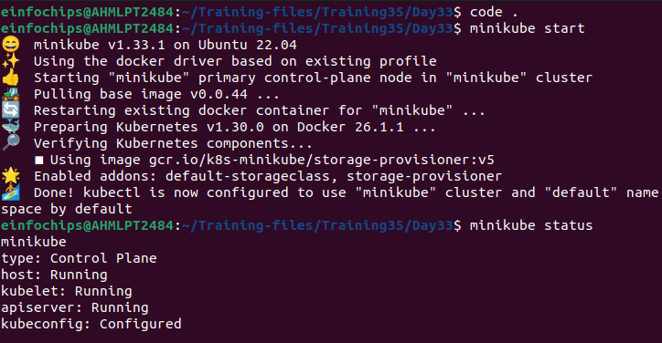

+ **Install and Configure Helm**

Run the below commands:

```sh
curl -fsSL -o get_helm.sh https://raw.githubusercontent.com/helm/helm/main/scripts/get-helm-3
```

```sh
chmod 700 get_helm.sh
```

```sh
./get_helm.sh
```

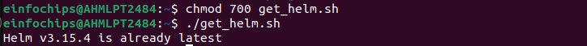

## 2. AWS Services Setup

**S3 Bucket:**

Create an S3 bucket for storing application assets (e.g., static files for the frontend).

+ Create bucket

```bash
aws s3api create-bucket --bucket bucket3308 --region ap-south-1 --create-bucket-configuration LocationConstraint=ap-south-1
```

+ Upload files to the S3 Bucket

```bash
aws s3 cp /path/to/static/files/ s3://bucket3308/ --recursive
```

**RDS Instance:** 

Set up an Amazon RDS MySQL instance in the free tier.

```bash
aws rds create-db-instance \
    --db-instance-identifier db-instance \
    --allocated-storage 20 \
    --db-instance-class db.t3.micro \
    --engine mysql \
    --master-username admin \
    --master-user-password Pmb2002 \
    --backup-retention-period 7 \
    --availability-zone ap-south-1a \
    --no-multi-az \
    --engine-version 8.0 \
    --auto-minor-version-upgrade \
    --publicly-accessible \
    --storage-type gp2 \
    --db-name mydatabase \
    --region ap-south-1
```

## 3. Create Helm Charts

**Frontend Chart**: 

Create a Helm chart for a frontend service (e.g., NGINX) that pulls static files from the S3 bucket.

```bash
helm create frontend
```

```frontend/values.yaml```

```bash
# Default values for frontend.
# This is a YAML-formatted file.
# Declare variables to be passed into your templates.

replicaCount: 1

image:
  repository: nginx
  pullPolicy: IfNotPresent
  # Overrides the image tag whose default is the chart appVersion.
  tag: "latest"

imagePullSecrets: []
nameOverride: ""
fullnameOverride: ""

serviceAccount:
  # Specifies whether a service account should be created
  create: true
  # Automatically mount a ServiceAccount's API credentials?
  automount: true
  # Annotations to add to the service account
  annotations: {}
  # The name of the service account to use.
  # If not set and create is true, a name is generated using the fullname template
  name: ""

podAnnotations: {}
podLabels: {}

podSecurityContext: {}
  # fsGroup: 2000

securityContext: {}
  # capabilities:
  #   drop:
  #   - ALL
  # readOnlyRootFilesystem: true
  # runAsNonRoot: true
  # runAsUser: 1000

service:
  type: ClusterIP
  port: 80

ingress:
  enabled: false
  className: ""
  annotations: {}
    # kubernetes.io/ingress.class: nginx
    # kubernetes.io/tls-acme: "true"
  hosts:
    - host: chart-example.local
      paths:
        - path: /
          pathType: ImplementationSpecific
  tls: []
  #  - secretName: chart-example-tls
  #    hosts:
  #      - chart-example.local

resources: {}
  # We usually recommend not to specify default resources and to leave this as a conscious
  # choice for the user. This also increases chances charts run on environments with little
  # resources, such as Minikube. If you do want to specify resources, uncomment the following
  # lines, adjust them as necessary, and remove the curly braces after 'resources:'.
  # limits:
  #   cpu: 100m
  #   memory: 128Mi
  # requests:
  #   cpu: 100m
  #   memory: 128Mi

livenessProbe:
  httpGet:
    path: /
    port: http
readinessProbe:
  httpGet:
    path: /
    port: http

autoscaling:
  enabled: false
  minReplicas: 1
  maxReplicas: 100
  targetCPUUtilizationPercentage: 80
  # targetMemoryUtilizationPercentage: 80

# Additional volumes on the output Deployment definition.
volumes: []
# - name: foo
#   secret:
#     secretName: mysecret
#     optional: false

# Additional volumeMounts on the output Deployment definition.
volumeMounts: []
# - name: foo
#   mountPath: "/etc/foo"
#   readOnly: true

nodeSelector: {}

tolerations: []

affinity: {}

files:
  staticUrl: "https://bucket3308.s3.ap-southeast-1.amazonaws.com"
```

**Backend Chart**: 

Create a Helm chart for a backend service (e.g., a Python Flask API) that connects to the RDS MySQL database.

```backend/values.yaml```

```bash
# Default values for backend.
# This is a YAML-formatted file.
# Declare variables to be passed into your templates.

replicaCount: 1

image:
  repository: poonam02/test3308
  pullPolicy: IfNotPresent
  # Overrides the image tag whose default is the chart appVersion.
  tag: tagname

imagePullSecrets: []
nameOverride: ""
fullnameOverride: ""

serviceAccount:
  # Specifies whether a service account should be created
  create: true
  # Automatically mount a ServiceAccount's API credentials?
  automount: true
  # Annotations to add to the service account
  annotations: {}
  # The name of the service account to use.
  # If not set and create is true, a name is generated using the fullname template
  name: ""

podAnnotations: {}
podLabels: {}

podSecurityContext: {}
  # fsGroup: 2000

securityContext: {}
  # capabilities:
  #   drop:
  #   - ALL
  # readOnlyRootFilesystem: true
  # runAsNonRoot: true
  # runAsUser: 1000

service:
  type: ClusterIP
  port: 5000

ingress:
  enabled: false
  className: ""
  annotations: {}
    # kubernetes.io/ingress.class: nginx
    # kubernetes.io/tls-acme: "true"
  hosts:
    - host: chart-example.local
      paths:
        - path: /
          pathType: ImplementationSpecific
  tls: []
  #  - secretName: chart-example-tls
  #    hosts:
  #      - chart-example.local

resources: {}
  # We usually recommend not to specify default resources and to leave this as a conscious
  # choice for the user. This also increases chances charts run on environments with little
  # resources, such as Minikube. If you do want to specify resources, uncomment the following
  # lines, adjust them as necessary, and remove the curly braces after 'resources:'.
  # limits:
  #   cpu: 100m
  #   memory: 128Mi
  # requests:
  #   cpu: 100m
  #   memory: 128Mi

livenessProbe:
  httpGet:
    path: /
    port: http
readinessProbe:
  httpGet:
    path: /
    port: http

autoscaling:
  enabled: false
  minReplicas: 1
  maxReplicas: 100
  targetCPUUtilizationPercentage: 80
  # targetMemoryUtilizationPercentage: 80

# Additional volumes on the output Deployment definition.
volumes: []
# - name: foo
#   secret:
#     secretName: mysecret
#     optional: false

# Additional volumeMounts on the output Deployment definition.
volumeMounts: []
# - name: foo
#   mountPath: "/etc/foo"
#   readOnly: true

nodeSelector: {}

tolerations: []

affinity: {}

database:
  host: "db-instance.cl0acy8mwg74.ap-southeast-1.rds.amazonaws.com"
  name: "db-instance"
  user: "admin"
  password: "<password>"
  port: 3306
```

## 4. Package Helm Charts

Package each Helm chart into a .tgz file.
Ensure charts are properly versioned.

```bash
cd frontend/
helm package .
mv frontend-0.1.0.tgz ../
```

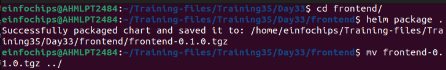

```bash
cd backend/
helm package .
mv backend-0.1.0.tgz ../
```

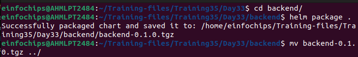

## 5. Deploy Multi-Tier Application Using Helm

+ Deploy the database chart (connected to the RDS instance).
+ Deploy the backend chart with dependency on the database chart.
+ Deploy the frontend chart with dependency on the backend service, ensuring it pulls assets from the S3 bucket.

```bash
helm install frontend ./frontend-0.1.0.tgz
```

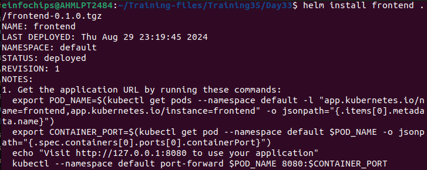

```bash
helm install backend ./backend-0.1.0.tgz
```

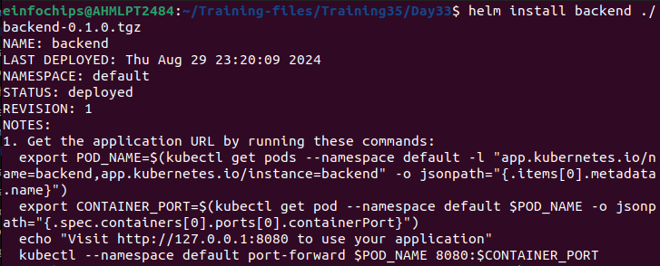

## 6. Manage Helm Secrets

+ Implement Helm secrets for managing sensitive data such as database credentials and S3 access keys.

```bash
helm plugin install https://github.com/jkroepke/helm-secrets
```

+ Update the backend chart to use these secrets for connecting to the RDS instance and S3.

```secrets.yaml```

```bash
database:
  password: "<password>"
aws:
  access_key: "your-access-key"
  secret_key: "your-secret-key"
```

## 7. Implement RBAC

+ Define RBAC roles and role bindings to manage permissions for Helm deployments.

```rbac.yaml```

```bash
kind: Role
apiVersion: rbac.authorization.k8s.io/v1
metadata:
  namespace: default
  name: helm-role
rules:
- apiGroups: ["", "apps", "extensions"]
  resources: ["pods", "deployments", "services", "secrets", "configmaps"]
  verbs: ["get", "list", "watch", "create", "delete", "patch", "update"]
---
kind: RoleBinding
apiVersion: rbac.authorization.k8s.io/v1
metadata:
  name: helm-rolebinding
  namespace: default
subjects:
- kind: User
  name: helm-user
  apiGroup: rbac.authorization.k8s.io
roleRef:
  kind: Role
  name: helm-role
  apiGroup: rbac.authorization.k8s.io
```

+ Ensure that only authorized users can deploy or modify the Helm releases.

Then run:

```bash
kubectl get role
```

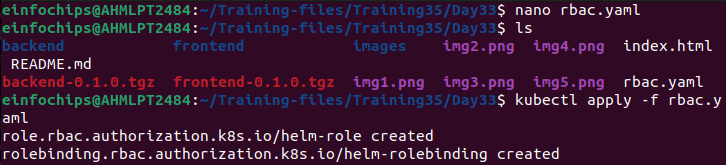

## 8. Versioning and Rollback

+ Upgrade the version of one of the Helm charts (e.g., update the frontend service).

```bash
helm upgrade frontend ./frontend-0.1.0.tgz
```

+ Perform a rollback if necessary and validate the application functionality.

```bash
helm rollback frontend 1
```

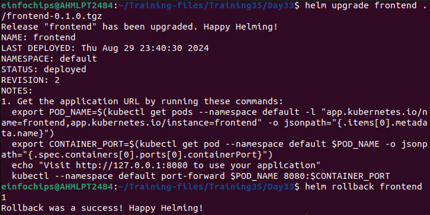

## 9. Validate Deployment

+ Ensure the frontend service is serving files from the S3 bucket.
+ Validate that the backend service is successfully communicating with the RDS MySQL database.
+ Test the overall functionality of the deployed application.

**S3 Bucket:**

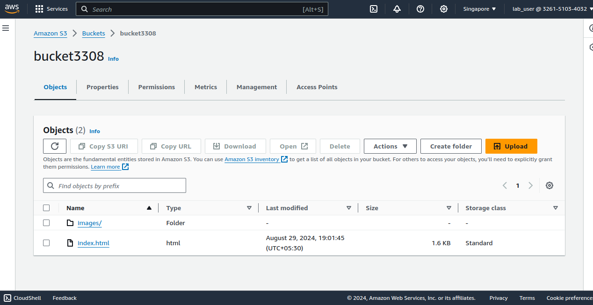

**RDS**

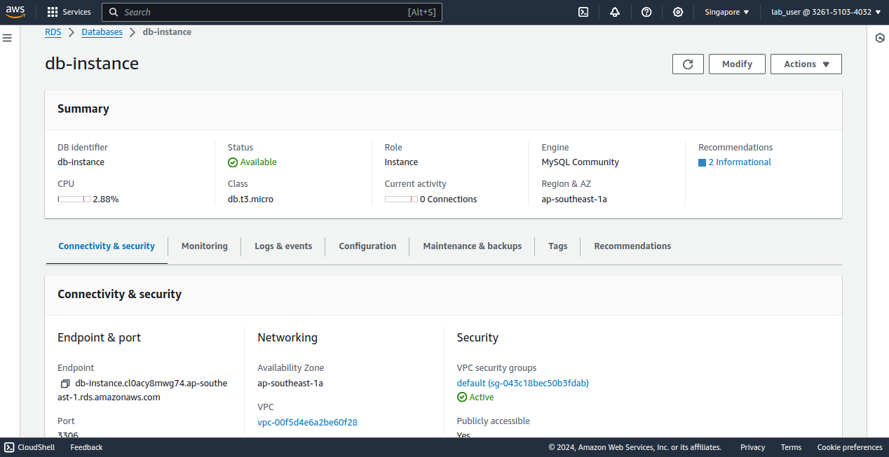

## 10. Cleanup

+ Delete all Helm releases and Kubernetes resources created during the project.

```bash
helm uninstall frontend
helm uninstall backend
```

+ Stop Minikube if no longer needed.

```bash
minikube stop
```

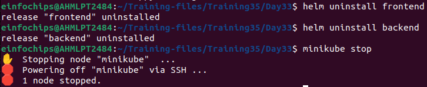
