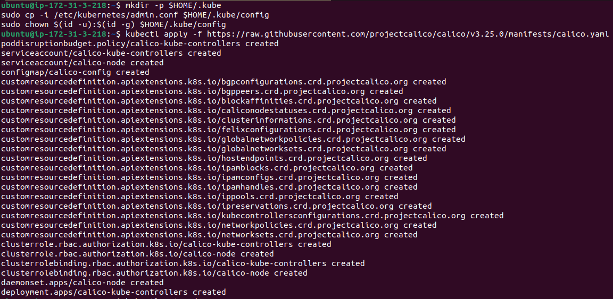

# Task 1: Deploying a Kubeadm Cluster

## Log in to the Nodes:

**Master Node**


**Worker Node**


## For All Nodes

+ disable swap

```bash
sudo swapoff -a
sudo sed -i '/swap/s/^/#/' /etc/fstab
```
 
+ Create the .conf file to load the modules at bootup

```bash
cat <<EOF | sudo tee /etc/modules-load.d/k8s.conf
overlay
br_netfilter
EOF
```

```bash
sudo modprobe overlay
sudo modprobe br_netfilter
```
 
+ sysctl params required by setup, params persist across reboots

```bash
cat <<EOF | sudo tee /etc/sysctl.d/k8s.conf
net.bridge.bridge-nf-call-iptables  = 1
net.bridge.bridge-nf-call-ip6tables = 1
net.ipv4.ip_forward                 = 1
EOF
```

+ Apply sysctl params without reboot

```bash
sudo sysctl --system
```


 
+ Update the package repository 

```bash
sudo apt-get update
```

+ Install containerd

```bash
sudo apt update -y ; sudo apt-get install containerd -y
sudo mkdir -p /etc/containerd
containerd config default | sudo tee /etc/containerd/config.toml 
sudo sed -i "s/SystemdCgroup = false/SystemdCgroup = true/g" /etc/containerd/config.toml 
sudo systemctl restart containerd
```


+ Update the apt package index and install packages needed to use the Kubernetes apt repository:

```bash
sudo apt-get update
```

+ apt-transport-https may be a dummy package; if so, you can skip that package

```bash
sudo apt-get install -y apt-transport-https ca-certificates curl gpg
```


+ Download the public signing key for the Kubernetes package repositories. The same signing key is used for all repositories so you can disregard the version in the URL:

```bash
curl -fsSL https://pkgs.k8s.io/core:/stable:/v1.30/deb/Release.key | sudo gpg --dearmor -o /etc/apt/keyrings/kubernetes-apt-keyring.gpg
```

+ This overwrites any existing configuration in /etc/apt/sources.list.d/kubernetes.list

```bash
echo 'deb [signed-by=/etc/apt/keyrings/kubernetes-apt-keyring.gpg] https://pkgs.k8s.io/core:/stable:/v1.30/deb/ /' | sudo tee /etc/apt/sources.list.d/kubernetes.list
```

+ Update the apt package index, install kubelet, kubeadm and kubectl, and pin their version:

```bash
sudo apt-get update
sudo apt-get install -y kubelet kubeadm kubectl
sudo apt-mark hold kubelet kubeadm kubectl
```


 
+ Enable the kubelet service before running kubeadm:

```bash
sudo systemctl enable --now kubelet
```

## FOR MASTER NODE
 
+ Initiate the Cluster

```bash
sudo kubeadm init --pod-network-cidr 192.168.0.0/16
```


 
**Your Kubernetes control-plane has initialized successfully!**

+ To start using your cluster, you need to run the following as a regular user:

```bash
mkdir -p $HOME/.kube
sudo cp -i /etc/kubernetes/admin.conf $HOME/.kube/config
sudo chown $(id -u):$(id -g) $HOME/.kube/config
```
 
+ Install the Calico Network Add-On
On the Control Plane Node, Install Calico Networking:

```bash
kubectl apply -f https://raw.githubusercontent.com/projectcalico/calico/v3.25.0/manifests/calico.yaml
```



+ On the Control Plane Node:

```bash
kubeadm token create --print-join-command
```

Copy the output of this command, which will look something like:

```bash
kubeadm join <CONTROL_NODE_IP>:6443 --token <TOKEN> --discovery-token-ca-cert-hash sha256:<HASH>
```

On the Worker Node, run the join command:

```bash
sudo kubeadm join <CONTROL_NODE_IP>:6443 --token <TOKEN> --discovery-token-ca-cert-hash sha256:<HASH>
```


## Verify the Cluster Status

Back on the Control Plane Node, check the status of the nodes:

```bash
kubectl get nodes
```


# Task 2: Installing Grafana

## 1. Installing Grafana

+ Download the Grafana GPG key with wget, then pipe the output to apt-key.

```bash 
wget -q -O - https://packages.grafana.com/gpg.key | sudo apt-key add -
```

+ Add the Grafana repository to your APT sources

```bash
sudo add-apt-repository "deb https://packages.grafana.com/oss/deb stable main"
```

+ Refresh your APT cache to update your package lists

```bash
sudo apt update
```

+ You can now proceed with the installation

```bash
sudo apt install grafana
```

+ Once Grafana is installed, use systemctl to start the Grafana server

```bash
sudo systemctl start grafana-server
```

+ Next, verify that Grafana is running

```bash
sudo systemctl status grafana-server
```


**Grafana default port is 3000.**

+ Now check whether Garfana is running on it's default port:

http://localhost:3000


