**Project Steps**

1. **Set Up Git Version Control**
1. **Initialize a Git Repository**

Create a new directory for your project: mkdir nodejs-k8s-project

cd nodejs-k8s-project

Initialize a Git repository: git init

2. **Create a Node.js Application**

Initialize a Node.js project: npm init -y

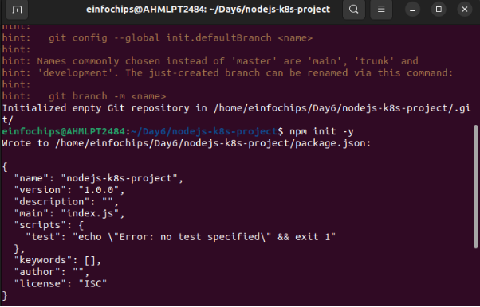

Install Express.js: npm install express

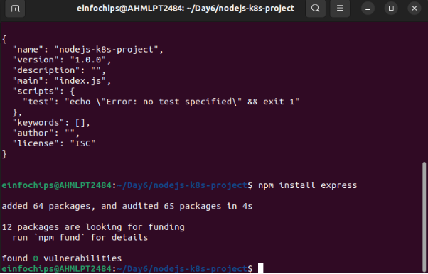

Create an  index.js file with the following content: const express = require('express');

const app = express(); const port = 3000; app.get('/', (req, res) => {     res.send('Hello, Kubernetes!'); });

app.listen(port, () => {     console.log(`App running at http://localhost:${port}`);

});

Create a  .gitignore file to ignore  node\_modules : node\_modules

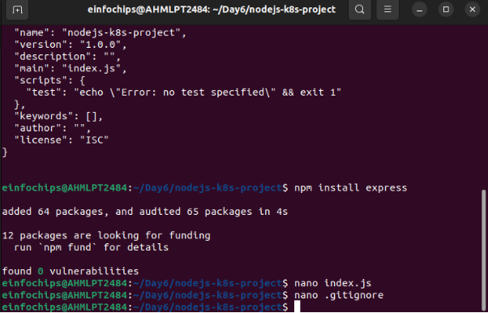

3. **Commit the Initial Code**

Add files to Git: git add .

Commit the changes:

git commit -m "Initial commit with Node.js app"

2. **Branching and Fast-Forward Merge**
1. **Create a New Branch**

Create and switch to a new branch  feature/add-route : git checkout -b feature/add-route

2. **Implement a New Route**

Modify index.js to add a new route: app.get('/newroute', (req, res) => {

`    `res.send('This is a new route!'); });

Commit the changes: git add .

git commit -m "Add new route"

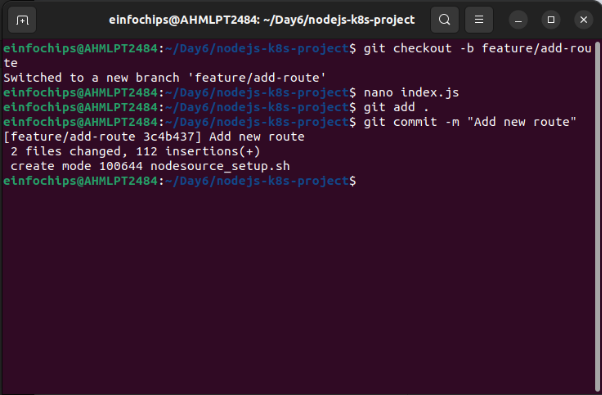

3. **Merge the Branch Using Fast-Forward**

Switch back to the  main branch: git checkout main

Merge the  feature/add-route branch using fast-forward: git merge --ff-only feature/add-route

Delete the feature branch:

git branch -d feature/add-route

3. **Containerize the Node.js Application**
1. **Create a Dockerfile**

Create a  Dockerfile with the following content: FROM node:14

WORKDIR /app

COPY package\*.json ./ RUN npm install

COPY . .

EXPOSE 3000

CMD ["node", "index.js"]

2. **Build and Test the Docker Image**

Build the Docker image: docker build -t nodejs-k8s-app .

Run the Docker container to test: docker run -p 3000:3000 nodejs-k8s-app

1\. Access  http://localhost:3000 to see the app running.

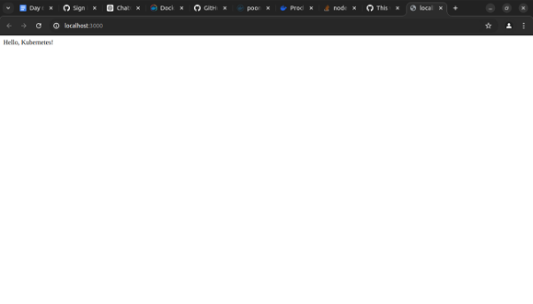

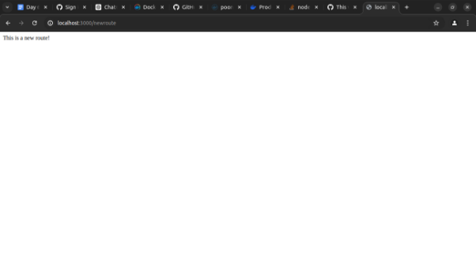

**4. Deploying to Minikube Kubernetes**

1. **Start Minikube**

Start Minikube: minikube start

2. **Create Kubernetes Deployment and Service Manifests** Create a  deployment.yaml file:

   apiVersion: apps/v1

   kind: Deployment metadata:

   `  `name: nodejs-app spec:

   `  `replicas: 2

   `  `selector:

   `    `matchLabels:       app: nodejs-app   template:

   `    `metadata:       labels:         app: nodejs-app     spec:

   `      `containers:

- name: nodejs-app

`        `image: nodejs-k8s-app:latest         ports:

- containerPort: 3000

Create a  service.yaml file for ClusterIP: apiVersion: v1

kind: Service metadata:

`  `name: nodejs-service spec:

`  `selector:

`    `app: nodejs-app   ports:

- protocol: TCP

`    `port: 80     targetPort: 3000   type: ClusterIP

Create a  service-nodeport.yaml file for NodePort: apiVersion: v1

kind: Service

metadata:

`  `name: nodejs-service-nodeport spec:

`  `selector:

`    `app: nodejs-app   ports:

- protocol: TCP

`    `port: 80     targetPort: 3000     nodePort: 30001   type: NodePort

3. **Apply Manifests to Minikube**

Apply the deployment:

kubectl apply -f deployment.yaml

Apply the ClusterIP service: kubectl apply -f service.yaml

Apply the NodePort service:

kubectl apply -f service-nodeport.yaml

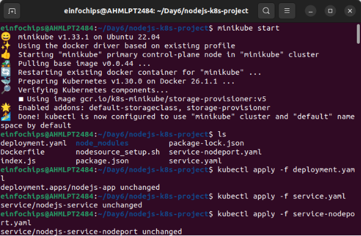

4. **Access the Application**

Get the Minikube IP: minikube ip

1\. Access the application using the NodePort: curl http://<minikube-ip>:30001

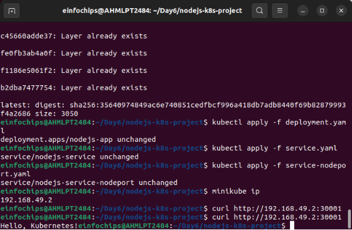

**Making Changes to the App and Redeploying Using Kubernetes**

6. **Making Changes to the Node.js Application**
1. **Create a New Branch for Changes**

Create and switch to a new branch  feature/update-message : git checkout -b feature/update-message

2. **Update the Application**

Modify index.js to change the message: const express = require('express');

const app = express(); const port = 3000;

app.get('/', (req, res) => {     res.send('Hello, Kubernetes! Updated version.'); });

app.get('/newroute', (req, res) => {     res.send('This is a new route!'); });

app.listen(port, () => {

`    `console.log(`App running at http://localhost:${port}`); });

3. **Commit the Changes**

Add and commit the changes: git add .

git commit -m "Update main route message"

7. **Merge the Changes and Rebuild the Docker Image**
1. **Merge the Feature Branch**

Switch back to the  main branch: git checkout main

Merge the  feature/update-message branch: git merge --ff-only feature/update-message

Delete the feature branch:

git branch -d feature/update-message

2. **Rebuild the Docker Image**

Rebuild the Docker image with a new tag: docker build -t nodejs-k8s-app:v2 .

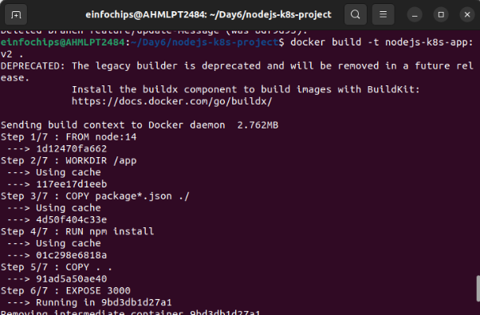

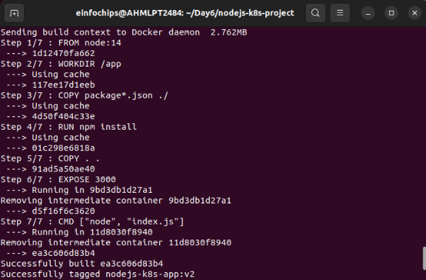

8. **Update Kubernetes Deployment**
1. **Update the Deployment Manifest**

Modify deployment.yaml to use the new image version: apiVersion: apps/v1

kind: Deployment

metadata:

`  `name: nodejs-app spec:

`  `replicas: 2   selector:

`    `matchLabels:       app: nodejs-app   template:

`    `metadata:       labels:         app: nodejs-app     spec:

`      `containers:

- name: nodejs-app

`        `image: nodejs-k8s-app:v2

`        `ports:

- containerPort: 3000
2. **Apply the Updated Manifest**

Apply the updated deployment: kubectl apply -f deployment.yaml

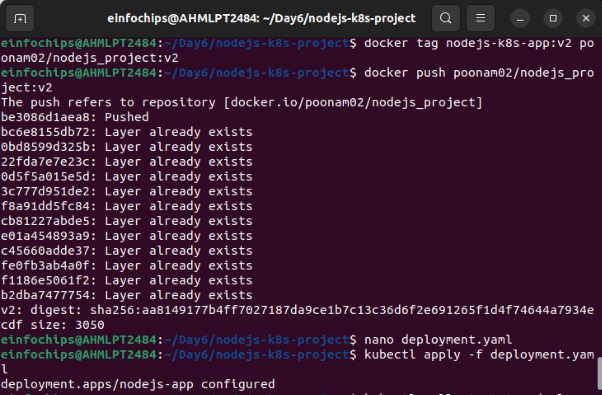

3. **Verify the Update**

Check the status of the deployment:

kubectl rollout status deployment/nodejs-app

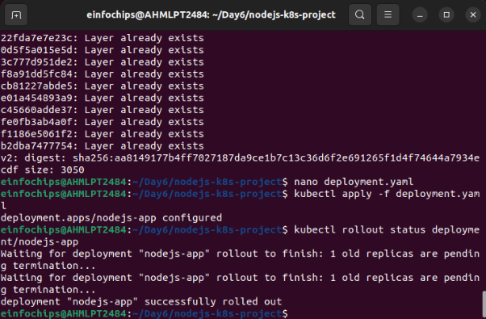

9. **Access the Updated Application**
1. **Access Through ClusterIP Service**

Forward the port to access the ClusterIP service: kubectl port-forward service/nodejs-service 8080:80

1\. Open your browser and navigate to  http://localhost:8080 to see the updated message.

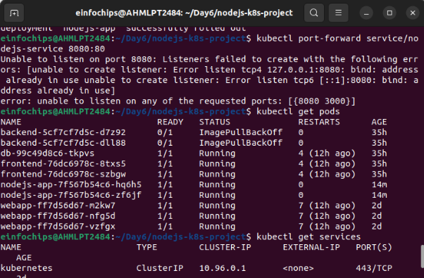

Didn’t run on 8080 so changed the port to 8085.

Output:

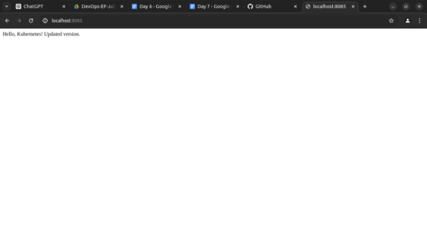

2. **Access Through NodePort Service**

   1\. Access the application using the NodePort: curl http://<minikube-ip>:30001

