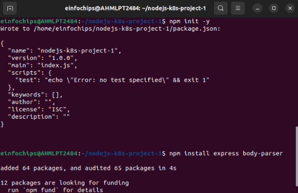
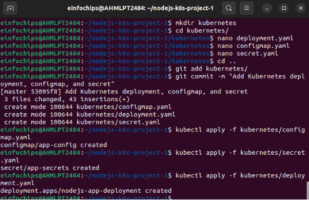

**Project**

1. **Setup Minikube and Git Repository**

**Start Minikube** : minikube start

**1.2 Set Up Git Repository**

**Create a new directory for your project** :

mkdir nodejs-k8s-project cd nodejs-k8s-project

**Initialize Git repository** : git init

**Create a  .gitignore file**:

node\_modules/ .env

**Add and commit initial changes** :

git add .

git commit -m "Initial commit"

2. **Develop a Node.js Application**
1. **Create the Node.js App**

**Initialize the Node.js project** : npm init -y

**Install necessary packages** : npm install express body-parser

**Create  app.js** :

const express = require('express'); const bodyParser = require('body-parser'); const app = express(); const PORT = process.env.PORT || 3000;

app.use(bodyParser.json());

app.get('/', (req, res) => {   res.send('Hello, World!'); });

app.listen(PORT, () => {

`  `console.log(`Server is running on port ${PORT}`); });

**Update  package.json** to include a start script:

"scripts": {   "start": "node app.js" }

2. **Commit the Node.js Application Add and commit changes** :

   git add .

   git commit -m "Add Node.js application code"

3. **Create Dockerfile and Docker Compose**
1. **Create a  Dockerfile Add Dockerfile** :
- Use official Node.js image FROM node:18
- Set the working directory WORKDIR /usr/src/app
- Copy package.json and package-lock.json COPY package\*.json ./
- Install dependencies RUN npm install
- Copy the rest of the application code COPY . .
- Expose the port on which the app runs EXPOSE 3000
- Command to run the application CMD [ "npm", "start" ]

  **Create a  .dockerignore file**:

  node\_modules .npm

2. **Create  docker-compose.yml (optional for local testing) Add docker-compose.yml** :

   version: '3' services:

   `  `app:

   `    `build: .

   `    `ports:

- "3000:3000"

**Add and commit changes** :

git add Dockerfile docker-compose.yml git commit -m "Add Dockerfile and Docker Compose configuration"

4. **Build and Push Docker Image**
1. **Build Docker Image**

**Build the Docker image** : docker build -t nodejs-app:latest .

2. **Push Docker Image to Docker Hub Tag and push the image** :

   docker tag nodejs-app:latest your-dockerhub-username/nodejs-app:latest docker push your-dockerhub-username/nodejs-app:latest

**Add and commit changes** :

git add .

git commit -m "Build and push Docker image"

5. **Create Kubernetes Configurations**
1. **Create Kubernetes Deployment**

**Create  kubernetes/deployment.yaml** :

apiVersion: apps/v1 kind: Deployment

metadata:

`  `name: nodejs-app-deployment spec:

`  `replicas: 2   selector:

`    `matchLabels:       app: nodejs-app   template:

`    `metadata:       labels:         app: nodejs-app     spec:

`      `containers:

- name: nodejs-app

`        `image: your-dockerhub-username/nodejs-app:latest         ports:

- containerPort: 3000

`        `env:

- name: PORT

`          `valueFrom:             configMapKeyRef:               name: app-config               key: PORT

- name: NODE\_ENV

`          `valueFrom:             secretKeyRef:               name: app-secrets               key: NODE\_ENV

2. **Create ConfigMap and Secret**

**Create  kubernetes/configmap.yaml** :

apiVersion: v1 kind: ConfigMap metadata:

`  `name: app-config data:

`  `PORT: "3000"

**Create  kubernetes/secret.yaml** :

apiVersion: v1

kind: Secret

metadata:

`  `name: app-secrets

type: Opaque

data:

`  `NODE\_ENV: cHJvZHVjdGlvbmFs # Base64 encoded value for "production"

**Add and commit Kubernetes configurations** :

git add kubernetes/

git commit -m "Add Kubernetes deployment, configmap, and secret"

3. **Apply Kubernetes Configurations Apply the ConfigMap and Secret** :

   kubectl apply -f kubernetes/configmap.yaml kubectl apply -f kubernetes/secret.yaml

   **Apply the Deployment** :

   kubectl apply -f kubernetes/deployment.yaml

