**Project Overview**

To deploy a simple static web application on a Kubernetes cluster using Minikube, set up advanced ingress networking with URL rewriting and sticky sessions, and configure horizontal pod autoscaling to manage traffic efficiently. The project will be divided into stages, with each stage focusing on specific aspects of Kubernetes ingress, URL rewriting, sticky sessions, and autoscaling.

**Requirements and Deliverables**

**Stage 1: Setting Up the Kubernetes Cluster and Static Web App**

1. **Set Up Minikube:**
- Ensure Minikube is installed and running on the local Ubuntu machine.
- Verify the Kubernetes cluster is functioning correctly.

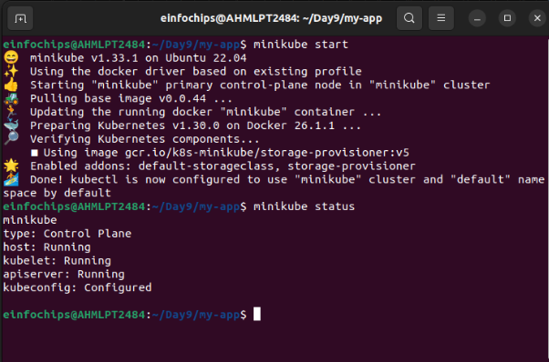

2. **Deploy Static Web App:**
- Create a Dockerfile for a simple static web application (e.g., an HTML page served by Nginx).
- Build a Docker image for the static web application.
- Push the Docker image to Docker Hub or a local registry.

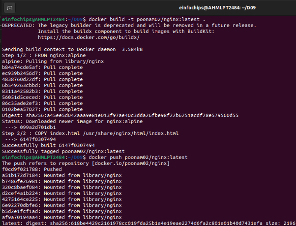

3. **Kubernetes Deployment:**
- Write a Kubernetes deployment manifest to deploy the static web application.
- Write a Kubernetes service manifest to expose the static web application within the cluster.
- Apply the deployment and service manifests to the Kubernetes cluster.

**Deliverables:**

- Dockerfile for the static web app

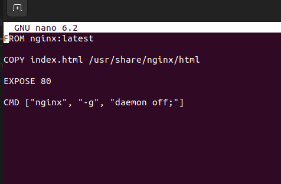

- Docker image URL https://hub.docker.com/repository/docker/poonam02/nginx/general
- Kubernetes deployment and service YAML files
1. Frontend deployment and service yaml file

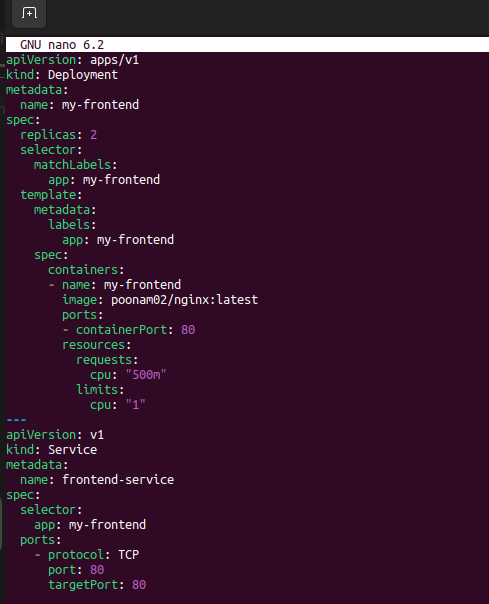

2. Backend deployment and service yaml file

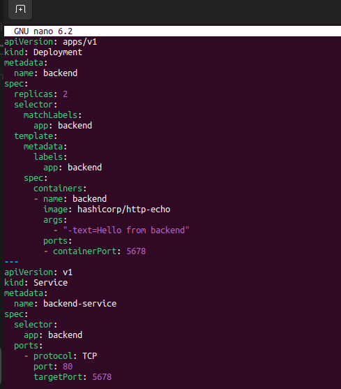

**Stage 2: Configuring Ingress Networking**

4. **Install and Configure Ingress Controller:**
- Install an ingress controller (e.g., Nginx Ingress Controller) in the Minikube cluster.

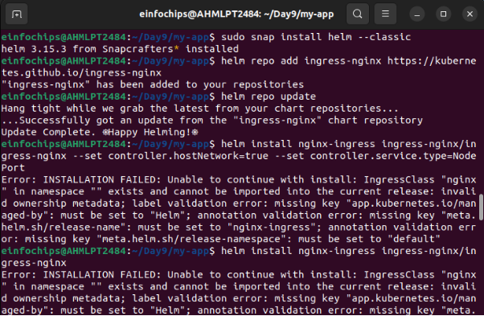

- Verify the ingress controller is running and accessible.

5. **Create Ingress Resource:**
- Write an ingress resource manifest to route external traffic to the static web application.

- Configure advanced ingress rules for path-based routing and host-based routing (use at least two different hostnames and paths).

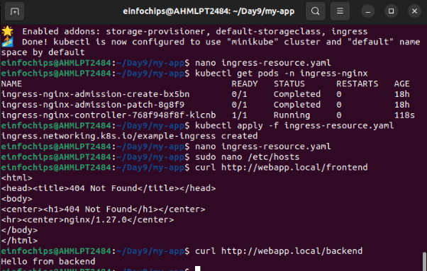

- Implement TLS termination for secure connections.
- Configure URL rewriting in the ingress resource to modify incoming URLs before they reach the backend services.
- Enable sticky sessions to ensure that requests from the same client are directed to the same backend pod.

**Deliverables:**

- Ingress controller installation commands/scripts
- Ingress resource YAML file with advanced routing, TLS configuration, URL rewriting, and sticky sessions

Ingress resource.yaml file

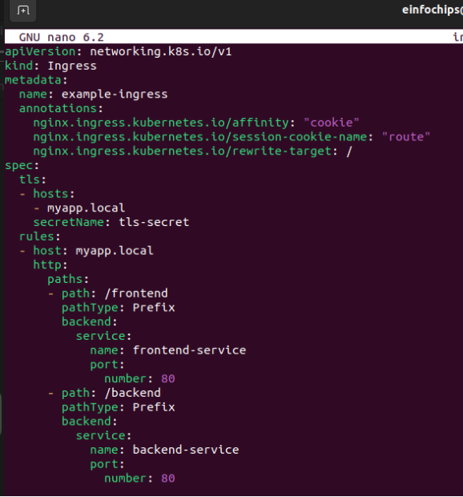

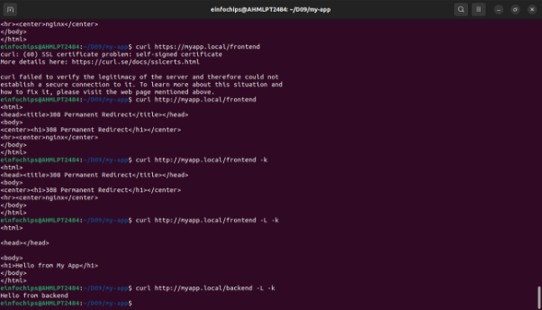

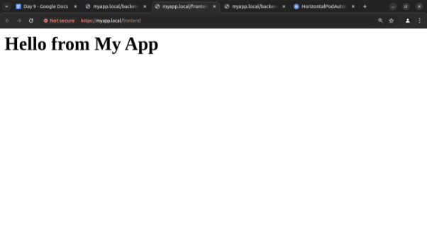

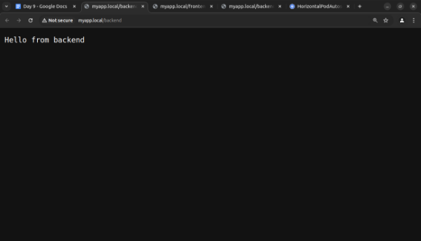

**Stage 3: Implementing Horizontal Pod Autoscaling**

6. **Configure Horizontal Pod Autoscaler:**
- Write a horizontal pod autoscaler (HPA) manifest to automatically scale the static web application pods based on CPU utilization.
- Set thresholds for minimum and maximum pod replicas.
7. **Stress Testing:**
- Perform stress testing to simulate traffic and validate the HPA configuration.
- Monitor the scaling behavior and ensure the application scales up and down based on the load.

**Deliverables:**

- Horizontal pod autoscaler YAML file

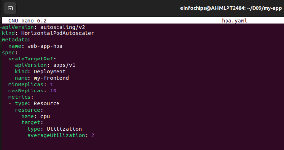

- Documentation or screenshots of the stress testing process and scaling behavior

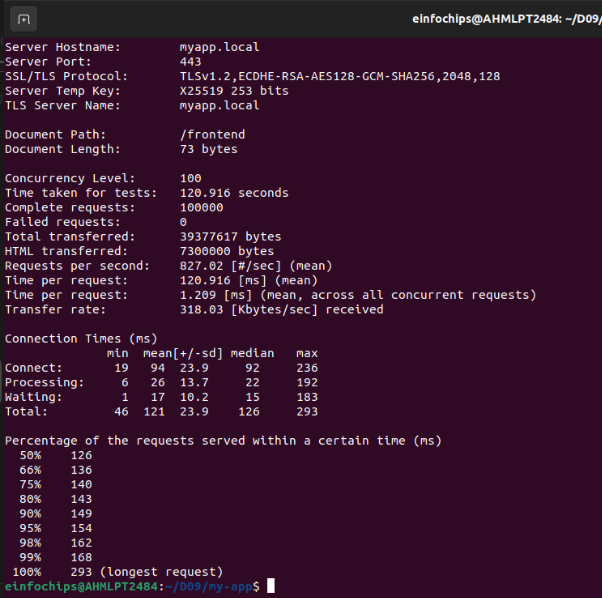

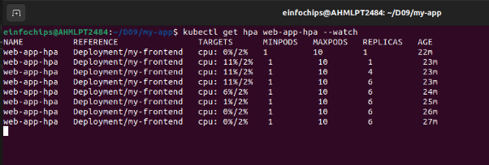

**Stage 4: Final Validation and Cleanup**

8. **Final Validation:**
- Validate the ingress networking, URL rewriting, and sticky sessions configurations by accessing the web application through different hostnames and paths.
- Verify the application's availability and performance during different load conditions.
9. **Cleanup:**
- Provide commands or scripts to clean up the Kubernetes resources created during the project (deployments, services, ingress, HPA).

**Deliverables:**

- Final validation report documenting the testing process and results
- Cleanup commands/scripts

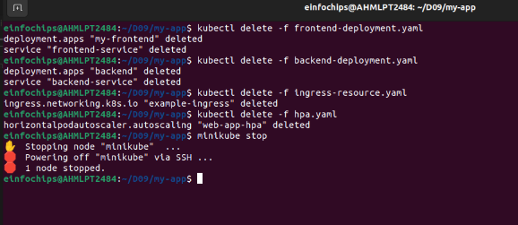
